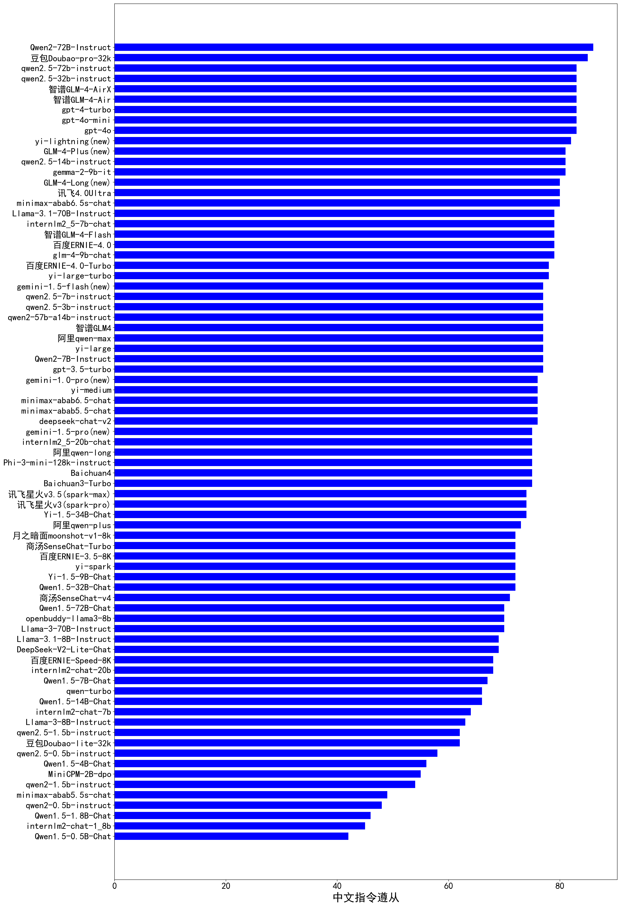

| 类别 | 大模型                         | 中文指令遵从 | 排名 |
|-----|------------------------------|---------|----|
|商用|Doubao-1.5-pro-32k-250115(new)|89.4|1|
|商用|gemini-1.5-flash-8b|84.7|2|
|商用|Doubao-1.5-lite-32k-250115(new)|84.7|3|
|商用|gemini-2.0-flash-thinking-exp-01-21|84.7|4|
|商用|qwen2.5-max|84.3|5|
|开源|deepseek-chat-v3|84.0|6|
|商用|SenseChat-5-1202|83.9|7|
|商用|360gpt2-pro|83.9|8|
|商用|360gpt-pro|83.5|9|
|开源|Llama-3.3-70B-Instruct-fp8|83.5|10|
|商用|chatgpt-4o-latest(new)|83.5|11|
|商用|step-1-8k|83.1|12|
|商用|360gpt-turbo|83.1|13|
|开源|gemma-2-27b-it|83.1|14|
|开源|qwen2.5-72b-instruct|83.0|15|
|商用|abab7-chat-preview|83.0|16|
|商用|gpt-4o-mini-2024-07-18|83.0|17|
|商用|GLM-4-Air|83.0|18|
|商用|GLM-4-AirX|83.0|19|
|开源|qwen2.5-32b-instruct|83.0|20|
|商用|kimi-latest-8k(new)|82.6|21|
|商用|o1-mini|82.2|22|
|商用|SenseChat-5|82.0|23|
|商用|yi-lightning|82.0|24|
|商用|Claude-3.5-Sonnet|81.8|25|
|商用|MiniMax-Text-01|81.4|26|
|商用|SenseChat-5-beta(new)|81.4|27|
|开源|DeepSeek-R1|81.1|28|
|开源|qwen2.5-14b-instruct|81.0|29|
|开源|gemma-2-9b-it|81.0|30|
|商用|GLM-4-Plus|81.0|31|
|开源|DeepSeek-R1-Distill-Qwen-14B|80.9|32|
|开源|Llama-3.3-70B-Instruct|80.9|33|
|商用|360zhinao2-o1(new)|80.5|34|
|开源|Hermes-3-Llama-3.1-405B|80.1|35|
|商用|GLM-4-Long|80.0|36|
|商用|abab6.5s-chat|80.0|37|
|商用|xunfei-4.0Ultra|80.0|38|
|商用|GLM-4-FlashX|79.7|39|
|商用|gemini-2.0-flash-001|79.2|40|
|开源|glm-4-9b-chat|79.0|41|
|开源|internlm2_5-7b-chat|79.0|42|
|商用|hunyuan-large|79.0|43|
|商用|GLM-4-Flash|79.0|44|
|商用|ERNIE-4.0|79.0|45|
|开源|DeepSeek-R1-Distill-Qwen-32B|78.8|46|
|开源|DeepSeek-R1-Distill-Llama-8B|78.8|47|
|商用|360gpt2-o1|78.8|48|
|商用|ministral-8b|78.6|49|
|商用|SenseChat-Turbo-1202|78.4|50|
|商用|Baichuan4-Turbo|78.0|51|
|商用|ERNIE-4.0-Turbo-8K|78.0|52|
|商用|hunyuan-turbo|78.0|53|
|商用|gemini-2.0-flash-exp|78.0|54|
|商用|ministral-3b|77.1|55|
|商用|gemini-1.5-flash|77.0|56|
|开源|qwen2.5-3b-instruct|77.0|57|
|开源|qwen2.5-7b-instruct|77.0|58|
|开源|Meta-Llama-3.1-405B-Instruct|76.7|59|
|商用|step-1-flash|76.7|60|
|商用|ERNIE-Speed-Pro-128K|76.7|61|
|商用|gemini-2.0-pro-exp-02-05|76.3|62|
|开源|Llama-3.1-Nemotron-70B-Instruct-fp8|75.8|63|
|商用|Baichuan4-Air|75.4|64|
|商用|qwen-long|75.0|65|
|商用|Baichuan4|75.0|66|
|开源|phi-4|75.0|67|
|开源|Mistral-Nemo-Instruct-2407|75.0|68|
|开源|internlm2_5-20b-chat|75.0|69|
|商用|gemini-1.5-pro|75.0|70|
|商用|mistral-large|74.6|71|
|开源|Llama-3.2-3B-Instruct|74.6|72|
|商用|hunyuan-standard|74.0|73|
|商用|xunfei-spark-pro|74.0|74|
|开源|Yi-1.5-34B-Chat|74.0|75|
|商用|xunfei-spark-max|74.0|76|
|开源|DeepSeek-R1-Distill-Llama-70B|73.3|77|
|商用|qwen-plus|73.0|78|
|开源|Yi-1.5-9B-Chat|72.0|79|
|商用|ERNIE-3.5-8K|72.0|80|
|商用|moonshot-v1-8k|72.0|81|
|商用|SenseChat-Turbo|72.0|82|
|开源|DeepSeek-R1-Distill-Qwen-7B|71.6|83|
|商用|ERNIE-Lite-Pro-128K|71.2|84|
|商用|SenseChat-v4|71.0|85|
|开源|Llama-3.1-8B-Instruct|69.0|86|
|开源|Mistral-7B-Instruct-v0.3|68.2|87|
|商用|ERNIE-Speed-8K|68.0|88|
|开源|Meta-Llama-3.1-8B-Instruct-fp8|67.4|89|
|商用|ERNIE-Lite-8K|66.1|90|
|商用|qwen-turbo|66.0|91|
|商用|mistral-small|65.3|92|
|商用|o3-mini|64.4|93|
|开源|DeepSeek-R1-Distill-Qwen-1.5B|64.4|94|
|开源|Mixtral-8x7B-Instruct-v0.1|64.4|95|
|开源|qwen2.5-1.5b-instruct|62.0|96|
|开源|Llama-3.2-1B-Instruct|61.0|97|
|开源|qwq-32b-preview|60.6|98|
|开源|qwen2.5-math-72b-instruct|59.7|99|
|开源|qwen2.5-0.5b-instruct|58.0|100|
|商用|GLM-Zero-Preview|54.2|101|
|商用|ERNIE-Tiny-8K|50.4|102|

