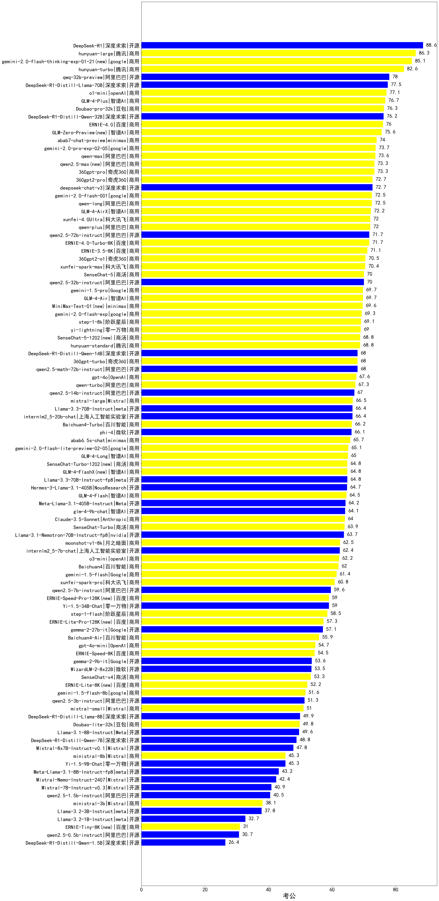

| 类别 | 大模型                         | 考公 | 排名 |
|-----|------------------------------|---------|----|
|开源|DeepSeek-R1|88.6|1|
|商用|gemini-2.0-flash-thinking-exp-01-21|85.1|2|
|商用|Doubao-1.5-pro-32k-250115(new)|78.3|3|
|开源|qwq-32b-preview|78.0|4|
|开源|DeepSeek-R1-Distill-Llama-70B|77.5|5|
|商用|o1-mini|77.1|6|
|商用|GLM-4-Plus|76.7|7|
|商用|Doubao-pro-32k-240615|76.3|8|
|开源|DeepSeek-R1-Distill-Qwen-32B|76.2|9|
|商用|hunyuan-turbo|76.2|10|
|商用|ERNIE-4.0|76.0|11|
|商用|hunyuan-large|75.7|12|
|商用|GLM-Zero-Preview|75.6|13|
|商用|abab7-chat-preview|74.0|14|
|商用|360zhinao2-o1(new)|74.0|15|
|商用|gemini-2.0-pro-exp-02-05|73.7|16|
|商用|qwen-max-2024-09-19|73.6|17|
|商用|360gpt-pro|73.3|18|
|商用|qwen2.5-max|73.3|19|
|开源|deepseek-chat-v3|72.7|20|
|商用|360gpt2-pro|72.7|21|
|商用|gemini-2.0-flash-001|72.5|22|
|商用|qwen-long|72.5|23|
|商用|GLM-4-AirX|72.2|24|
|商用|xunfei-4.0Ultra|72.0|25|
|商用|qwen-plus|72.0|26|
|开源|qwen2.5-72b-instruct|71.7|27|
|商用|ERNIE-4.0-Turbo-8K|71.7|28|
|商用|ERNIE-3.5-8K|71.1|29|
|商用|Doubao-1.5-lite-32k-250115(new)|70.7|30|
|商用|360gpt2-o1|70.5|31|
|商用|xunfei-spark-max|70.4|32|
|开源|qwen2.5-32b-instruct|70.0|33|
|商用|SenseChat-5|70.0|34|
|商用|gemini-1.5-pro|69.7|35|
|商用|GLM-4-Air|69.7|36|
|商用|MiniMax-Text-01|69.6|37|
|商用|gemini-2.0-flash-exp|69.3|38|
|商用|step-1-8k|69.1|39|
|商用|yi-lightning|69.0|40|
|商用|SenseChat-5-1202|68.8|41|
|商用|hunyuan-standard|68.8|42|
|开源|DeepSeek-R1-Distill-Qwen-14B|68.0|43|
|开源|qwen2.5-math-72b-instruct|68.0|44|
|商用|360gpt-turbo|68.0|45|
|商用|gpt-4o-2024-08-06|67.6|46|
|商用|qwen-turbo|67.3|47|
|开源|qwen2.5-14b-instruct|67.0|48|
|商用|mistral-large|66.5|49|
|开源|internlm2_5-20b-chat|66.4|50|
|开源|Llama-3.3-70B-Instruct|66.4|51|
|商用|Baichuan4-Turbo|66.2|52|
|开源|phi-4|66.1|53|
|商用|abab6.5s-chat|65.7|54|
|商用|gemini-2.0-flash-lite-preview-02-05|65.1|55|
|商用|GLM-4-Long|65.0|56|
|开源|Llama-3.3-70B-Instruct-fp8|64.8|57|
|商用|SenseChat-Turbo-1202|64.8|58|
|商用|GLM-4-FlashX|64.8|59|
|开源|Hermes-3-Llama-3.1-405B|64.7|60|
|商用|GLM-4-Flash|64.5|61|
|开源|Meta-Llama-3.1-405B-Instruct|64.2|62|
|开源|glm-4-9b-chat|64.1|63|
|商用|Claude-3.5-Sonnet|64.0|64|
|商用|kimi-latest-8k(new)|64.0|65|
|商用|SenseChat-5-beta(new)|64.0|66|
|商用|chatgpt-4o-latest(new)|64.0|67|
|商用|SenseChat-Turbo|63.9|68|
|开源|Llama-3.1-Nemotron-70B-Instruct-fp8|63.7|69|
|商用|moonshot-v1-8k|62.5|70|
|开源|internlm2_5-7b-chat|62.4|71|
|商用|o3-mini|62.2|72|
|商用|Baichuan4|62.0|73|
|商用|gemini-1.5-flash|61.4|74|
|商用|xunfei-spark-pro|60.8|75|
|开源|qwen2.5-7b-instruct|59.6|76|
|开源|Yi-1.5-34B-Chat|59.0|77|
|商用|ERNIE-Speed-Pro-128K|59.0|78|
|商用|step-1-flash|58.5|79|
|商用|ERNIE-Lite-Pro-128K|57.3|80|
|开源|gemma-2-27b-it|57.1|81|
|商用|Baichuan4-Air|55.9|82|
|商用|gpt-4o-mini-2024-07-18|54.7|83|
|商用|ERNIE-Speed-8K|54.5|84|
|开源|gemma-2-9b-it|53.6|85|
|开源|WizardLM-2-8x22B|53.5|86|
|商用|SenseChat-v4|53.3|87|
|商用|ERNIE-Lite-8K|52.2|88|
|商用|gemini-1.5-flash-8b|51.6|89|
|开源|qwen2.5-3b-instruct|51.3|90|
|商用|mistral-small|51.0|91|
|开源|DeepSeek-R1-Distill-Llama-8B|49.9|92|
|商用|Doubao-lite-32k-240428|49.8|93|
|开源|Llama-3.1-8B-Instruct|49.6|94|
|开源|DeepSeek-R1-Distill-Qwen-7B|48.8|95|
|开源|Mixtral-8x7B-Instruct-v0.1|47.8|96|
|开源|Yi-1.5-9B-Chat|45.3|97|
|商用|ministral-8b|45.3|98|
|开源|Meta-Llama-3.1-8B-Instruct-fp8|43.2|99|
|开源|Mistral-Nemo-Instruct-2407|42.4|100|
|开源|Mistral-7B-Instruct-v0.3|40.9|101|
|开源|qwen2.5-1.5b-instruct|40.5|102|
|商用|ministral-3b|38.1|103|
|开源|Llama-3.2-3B-Instruct|37.8|104|
|开源|Llama-3.2-1B-Instruct|32.7|105|
|商用|ERNIE-Tiny-8K|31.0|106|
|开源|qwen2.5-0.5b-instruct|30.7|107|
|开源|DeepSeek-R1-Distill-Qwen-1.5B|26.4|108|
|商用|o1-preview|/|109|

