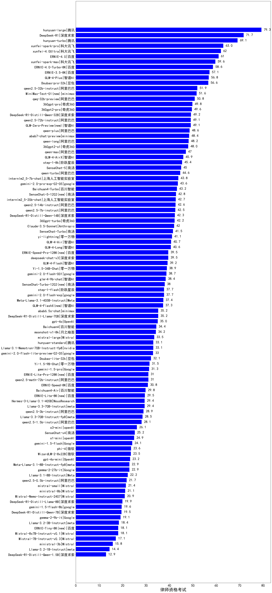

| 类别 | 大模型                         | 律师资格考试 | 排名 |
|-----|------------------------------|---------|----|
|商用|hunyuan-large|79.3|1|
|商用|hunyuan-turbo|69.1|2|
|商用|xunfei-spark-pro|63.0|3|
|商用|xunfei-4.0Ultra|62.0|4|
|商用|ERNIE-4.0|61.0|5|
|商用|xunfei-spark-max|59.6|6|
|商用|ERNIE-4.0-Turbo-8K|58.6|7|
|商用|ERNIE-3.5-8K|57.1|8|
|商用|GLM-4-Plus|56.8|9|
|商用|Doubao-pro-32k|56.6|10|
|开源|qwen2.5-32b-instruct|51.9|11|
|开源|qwq-32b-preview|51.5|12|
|商用|360gpt-pro|49.8|13|
|商用|360gpt2-pro|49.6|14|
|开源|qwen2.5-72b-instruct|49.1|15|
|商用|qwen-plus|48.6|16|
|商用|abab7-chat-preview|48.4|17|
|商用|qwen-long|48.2|18|
|商用|360gpt2-o1|48.0|19|
|商用|qwen-max|47.0|20|
|商用|GLM-4-AirX|45.9|21|
|商用|step-1-8k|45.4|22|
|商用|SenseChat-5|45.0|23|
|商用|qwen-turbo|44.6|24|
|开源|internlm2_5-7b-chat|43.8|25|
|商用|Baichuan4-Turbo|43.2|26|
|开源|internlm2_5-20b-chat|42.7|27|
|开源|qwen2.5-14b-instruct|42.6|28|
|开源|qwen2.5-7b-instruct|42.5|29|
|商用|360gpt-turbo|42.2|30|
|商用|Claude-3.5-Sonnet|42.0|31|
|商用|SenseChat-Turbo|41.5|32|
|商用|yi-lightning|41.1|33|
|商用|GLM-4-Air|40.7|34|
|商用|GLM-4-Long|40.6|35|
|开源|deepseek-chat-v3|39.5|36|
|商用|GLM-4-Flash|39.2|37|
|开源|Yi-1.5-34B-Chat|38.9|38|
|开源|glm-4-9b-chat|38.4|39|
|商用|GLM4|38.0|40|
|商用|gemini-2.0-flash-exp|37.7|41|
|商用|step-1-flash|37.7|42|
|开源|Meta-Llama-3.1-405B-Instruct|37.4|43|
|商用|abab6.5s-chat|35.2|44|
|商用|gpt-4o|35.0|45|
|商用|Baichuan4|34.4|46|
|商用|moonshot-v1-8k|34.2|47|
|商用|mistral-large|33.5|48|
|商用|hunyuan-standard|33.1|49|
|开源|Llama-3.1-Nemotron-70B-Instruct-fp8|33.1|50|
|商用|Doubao-lite-32k|32.1|51|
|开源|Yi-1.5-9B-Chat|31.5|52|
|商用|gemini-1.5-pro|31.3|53|
|开源|Llama-3.1-70B-Instruct|31.2|54|
|商用|ERNIE-Speed-8K|30.8|55|
|商用|Baichuan4-Air|29.8|56|
|开源|Meta-Llama-3.1-70B-Instruct-fp8|29.6|57|
|开源|Llama-3.3-70B-Instruct|29.4|58|
|开源|Hermes-3-Llama-3.1-405B|29.4|59|
|开源|qwen2.5-3b-instruct|28.9|60|
|开源|Llama-3.3-70B-Instruct-fp8|28.5|61|
|开源|qwen2.5-1.5b-instruct|28.1|62|
|商用|SenseChat-v4|25.2|63|
|商用|o1-mini|25.1|64|
|商用|gemini-1.0-pro|24.2|65|
|商用|gemini-1.5-flash|24.1|66|
|开源|phi-4|23.6|67|
|开源|WizardLM-2-8x22B|23.5|68|
|商用|gpt-4o-mini|23.2|69|
|开源|Meta-Llama-3.1-8B-Instruct-fp8|22.9|70|
|开源|gemma-2-27b-it|22.9|71|
|开源|Llama-3.1-8B-Instruct|22.2|72|
|开源|qwen2.5-0.5b-instruct|21.7|73|
|商用|mistral-small|21.4|74|
|商用|ministral-8b|21.1|75|
|开源|Mistral-Nemo-Instruct-2407|20.9|76|
|商用|gemini-1.5-flash-8b|19.6|77|
|开源|gemma-2-9b-it|19.1|78|
|开源|Llama-3.2-3B-Instruct|18.4|79|
|开源|Mixtral-8x7B-Instruct-v0.1|18.1|80|
|开源|Mistral-7B-Instruct-v0.3|17.1|81|
|商用|ministral-3b|15.8|82|
|开源|Llama-3.2-1B-Instruct|14.4|83|
|开源|qwen2.5-math-72b-instruct|/|84|
|商用|o1-preview|/|85|

