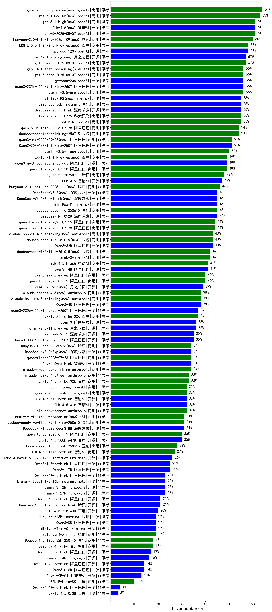

|类别|机构|大模型|【livecodebench】准确率|平均耗时|平均消耗token|花费/千次（元）|排名（准确率）|
|---|---|-----|-------------------|-------|-----------|-----------|-----------|
|商用|google|gemini-3-pro-preview(new)|64.0%|/|/|/|1|
|商用|openAI|gpt-5.1-medium(new)|63.0%|/|/|/|2|
|商用|openAI|gpt-5.1-high(new)|61.0%|/|/|/|3|
|商用|openAI|gpt-5-2025-08-07|61.0%|/|/|/|4|
|开源|智谱AI|GLM-4.6(new)|61.0%|/|/|/|5|
|商用|腾讯|hunyuan-2.0-thinking-20251109(new)|60.0%|/|/|/|6|
|开源|openAI|gpt-oss-120b|58.0%|/|/|/|7|
|商用|百度|ERNIE-5.0-Thinking-Preview(new)|58.0%|/|/|/|8|
|商用|openAI|gpt-5-mini-2025-08-07|57.0%|/|/|/|9|
|开源|月之暗面|Kimi-K2-Thinking(new)|57.0%|/|/|/|10|
|商用|google|gemini-2.5-pro|56.0%|/|/|/|11|
|开源|阿里巴巴|qwen3-235b-a22b-thinking-2507|56.0%|/|/|/|12|
|商用|XAI|grok-4-1-fast-reasoning(new)|56.0%|/|/|/|13|
|商用|openAI|gpt-5-nano-2025-08-07|56.0%|/|/|/|14|
|开源|openAI|gpt-oss-20b|56.0%|/|/|/|15|
|商用|openAI|o4-mini|55.0%|/|/|/|16|
|开源|深度求索|DeepSeek-V3.1-Think|55.0%|/|/|/|17|
|开源|豆包|Seed-OSS-36B-Instruct|55.0%|/|/|/|18|
|商用|科大讯飞|xunfei-spark-x1-0725|55.0%|/|/|/|19|
|开源|minimax|MiniMax-M2(new)|55.0%|/|/|/|20|
|商用|阿里巴巴|qwen-plus-think-2025-07-28|54.0%|/|/|/|21|
|商用|豆包|doubao-seed-1-6-thinking-250715|54.0%|/|/|/|22|
|开源|阿里巴巴|Qwen3-30B-A3B-Thinking-2507|51.0%|/|/|/|23|
|商用|阿里巴巴|qwen3-max-2025-09-23(new)|51.0%|/|/|/|24|
|商用|google|gemini-2.5-flash|50.0%|/|/|/|25|
|商用|百度|ERNIE-X1.1-Preview(new)|49.0%|/|/|/|26|
|商用|阿里巴巴|qwen-plus-2025-07-28|49.0%|/|/|/|27|
|开源|阿里巴巴|qwen3-next-80b-a3b-instruct|49.0%|/|/|/|28|
|商用|腾讯|hunyuan-t1-20250711|48.0%|/|/|/|29|
|开源|智谱AI|GLM-4.5|47.0%|/|/|/|30|
|商用|腾讯|hunyuan-2.0-instruct-20251111(new)|46.0%|/|/|/|31|
|开源|深度求索|DeepSeek-V3.2-Exp-Think(new)|45.0%|/|/|/|32|
|商用|豆包|doubao-seed-1-6-250615|45.0%|/|/|/|33|
|开源|minimax|MiniMax-M1|45.0%|/|/|/|34|
|开源|深度求索|DeepSeek-V3.2(new)|45.0%|/|/|/|35|
|开源|深度求索|DeepSeek-R1-0528|45.0%|/|/|/|36|
|商用|阿里巴巴|qwen-flash-think-2025-07-28|44.0%|/|/|/|37|
|商用|阿里巴巴|qwen-turbo-think-2025-07-15|44.0%|/|/|/|38|
|商用|anthropic|claude-sonnet-4.5-thinking(new)|43.0%|/|/|/|39|
|开源|阿里巴巴|Qwen3-32B|43.0%|/|/|/|40|
|商用|豆包|doubao-seed-1-6-251015(new)|43.0%|/|/|/|41|
|商用|XAI|grok-3-mini|42.0%|/|/|/|42|
|商用|豆包|doubao-seed-1-6-lite-251015(new)|42.0%|/|/|/|43|
|开源|阿里巴巴|Qwen3-14B|41.0%|/|/|/|44|
|商用|智谱AI|GLM-4.5-Flash|41.0%|/|/|/|45|
|商用|阿里巴巴|qwen3-max-preview|40.0%|/|/|/|46|
|商用|阿里巴巴|qwen-long-2025-01-25|40.0%|/|/|/|47|
|开源|月之暗面|kimi-k2-0905(new)|39.0%|/|/|/|48|
|开源|阿里巴巴|Qwen3-4B|38.0%|/|/|/|49|
|商用|anthropic|claude-haiku-4.5-thinking(new)|38.0%|/|/|/|50|
|商用|anthropic|claude-sonnet-4.5(new)|38.0%|/|/|/|51|
|商用|百度|ERNIE-X1-Turbo-32K|37.0%|/|/|/|52|
|开源|阿里巴巴|qwen3-235b-a22b-instruct-2507|37.0%|/|/|/|53|
|开源|阶跃星辰|step-3|36.0%|/|/|/|54|
|开源|月之暗面|kimi-k2-0711-preview|36.0%|/|/|/|55|
|开源|深度求索|DeepSeek-V3.1|35.0%|/|/|/|56|
|开源|阿里巴巴|Qwen3-30B-A3B-Instruct-2507|35.0%|/|/|/|57|
|商用|阿里巴巴|qwen-flash-2025-07-28|34.0%|/|/|/|58|
|开源|智谱AI|GLM-4.5-nothink|34.0%|/|/|/|59|
|开源|深度求索|DeepSeek-V3.2-Exp(new)|34.0%|/|/|/|60|
|商用|anthropic|claude-4-sonnet-thinking|34.0%|/|/|/|61|
|商用|腾讯|hunyuan-turbos-20250926(new)|34.0%|/|/|/|62|
|商用|百度|ERNIE-4.5-Turbo-32K|33.0%|/|/|/|63|
|商用|anthropic|claude-haiku-4.5(new)|33.0%|/|/|/|64|
|商用|anthropic|claude-4-sonnet|32.0%|/|/|/|65|
|商用|openAI|gpt-5.1(new)|32.0%|/|/|/|66|
|商用|google|gemini-2.5-flash-lite|32.0%|/|/|/|67|
|开源|智谱AI|GLM-4.5-Air|32.0%|/|/|/|68|
|开源|智谱AI|GLM-4.5-Air-nothink|32.0%|/|/|/|69|
|商用|XAI|grok-4-1-fast-non-reasoning(new)|31.0%|/|/|/|70|
|商用|豆包|doubao-seed-1-6-flash-thinking-250615|31.0%|/|/|/|71|
|开源|深度求索|DeepSeek-R1-0528-Qwen3-8B|31.0%|/|/|/|72|
|商用|阿里巴巴|qwen-turbo-2025-07-15|30.0%|/|/|/|73|
|开源|百度|ERNIE-4.5-300B-A47B|30.0%|/|/|/|74|
|商用|豆包|doubao-seed-1-6-flash-250615|28.0%|/|/|/|75|
|商用|智谱AI|GLM-4.5-Flash-nothink|27.0%|/|/|/|76|
|开源|meta|Llama-4-Maverick-17B-128E-Instruct-FP8|26.0%|/|/|/|77|
|开源|阿里巴巴|Qwen3-14B-nothink|25.0%|/|/|/|78|
|开源|阿里巴巴|Qwen3-1.7B|25.0%|/|/|/|79|
|开源|meta|Llama-4-Scout-17B-16E-Instruct|23.0%|/|/|/|80|
|开源|阿里巴巴|Qwen3-32B-nothink|23.0%|/|/|/|81|
|开源|google|gemma-3-12b-it|23.0%|/|/|/|82|
|开源|google|gemma-3-27b-it|23.0%|/|/|/|83|
|开源|腾讯|Hunyuan-A13B-Instruct-nothink|21.0%|/|/|/|84|
|开源|阿里巴巴|Qwen3-4B-nothink|21.0%|/|/|/|85|
|开源|百度|ERNIE-4.5-21B-A3B|20.0%|/|/|/|86|
|开源|腾讯|Hunyuan-A13B-Instruct|19.0%|/|/|/|87|
|开源|阿里巴巴|Qwen3-8B|19.0%|/|/|/|88|
|商用|百川智能|Baichuan4-Air|19.0%|/|/|/|89|
|开源|minimax|MiniMax-Text-01|19.0%|/|/|/|90|
|商用|百川智能|Baichuan4-Turbo|18.0%|/|/|/|91|
|商用|豆包|Doubao-1.5-lite-32k-250115|18.0%|/|/|/|92|
|开源|阿里巴巴|Qwen3-8B-nothink|17.0%|/|/|/|93|
|开源|google|gemma-3-4b-it|16.0%|/|/|/|94|
|开源|阿里巴巴|Qwen3-1.7B-nothink|14.0%|/|/|/|95|
|开源|阿里巴巴|Qwen3-0.6B|14.0%|/|/|/|96|
|开源|智谱AI|GLM-4-9B-0414|13.0%|/|/|/|97|
|商用|百度|ERNIE-Lite-8K|10.0%|/|/|/|98|
|开源|阿里巴巴|Qwen3-0.6B-nothink|4.0%|/|/|/|99|
|开源|百度|ERNIE-4.5-0.3B|3.0%|/|/|/|100|
|商用|XAI|grok-4-0709|/%|/|/|/|101|
|开源|智谱AI|GLM-4.7(new)|/%|/|/|/|102|
|开源|小米|MiMo-V2-Flash-think(new)|/%|/|/|/|103|
|开源|小米|MiMo-V2-Flash(new)|/%|/|/|/|104|
|商用|豆包|doubao-seed-1-8-251215(new)|/%|/|/|/|105|
|商用|google|gemini-3-flash-preview(new)|/%|/|/|/|106|
|商用|openAI|gpt-5.2-medium(new)|/%|/|/|/|107|
|商用|openAI|gpt-5.2-high(new)|/%|/|/|/|108|
|商用|阿里巴巴|qwen-plus-think-2025-12-01(new)|/%|/|/|/|109|
|商用|阿里巴巴|qwen-plus-2025-12-01(new)|/%|/|/|/|110|
|商用|openAI|gpt-5.2(new)|/%|/|/|/|111|
|开源|Mistral|Ministral-3-8B-Instruct-2512(new)|/%|/|/|/|112|
|开源|Mistral|Ministral-3-3B-Instruct-2512(new)|/%|/|/|/|113|
|开源|Mistral|Ministral-3-14B-Instruct-2512(new)|/%|/|/|/|114|
|开源|Mistral|mistral-large-2512(new)|/%|/|/|/|115|
|开源|阿里巴巴|qwen3-next-80b-a3b-thinking(new)|/%|/|/|/|116|
|开源|深度求索|DeepSeek-V3.2-Think(new)|/%|/|/|/|117|
|商用|openAI|gpt-5-nano-high(new)|/%|/|/|/|118|
|商用|openAI|gpt-5-mini-high(new)|/%|/|/|/|119|
|商用|Mistral|mistral-medium-2508|/%|/|/|/|120|
|商用|anthropic|claude-opus-4.5(new)|/%|/|/|/|121|
|商用|360|360zhinao2-o1|/%|/|/|/|122|
|开源|Mistral|Magistral-Small-2507|/%|/|/|/|123|
|开源|Mistral|Mistral-Small-3.2-24B-Instruct-2506|/%|/|/|/|124|
|商用|minimax|MiniMax-M2.1(new)|/%|/|/|/|125|

