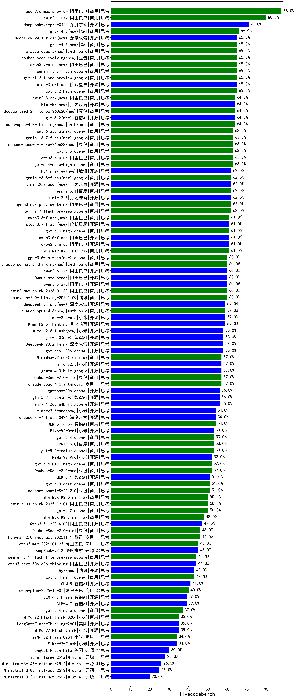

|类别|机构|大模型|【livecodebench】准确率|平均耗时|平均消耗token|花费/千次（元）|排名（准确率）|
|---|---|-----|-------------------|-------|-----------|-----------|-----------|
|商用|阿里巴巴|qwen3.6-max-preview|88.0%|/|/|/|1|
|商用|阿里巴巴|qwen3.7-max|80.0%|/|/|/|2|
|开源|深度求索|deepseek-v4-pro-0424|71.0%|/|/|/|3|
|商用|XAI|grok-4.5|66.0%|/|/|/|4|
|商用|豆包|doubao-seed-evolving|65.0%|/|/|/|5|
|开源|阶跃星辰|step-3.5-flash|65.0%|/|/|/|6|
|商用|anthropic|claude-opus-5(new)|65.0%|/|/|/|7|
|商用|XAI|grok-4.6(new)|65.0%|/|/|/|8|
|商用|阿里巴巴|qwen3.7-plus|65.0%|/|/|/|9|
|商用|google|gemini-3.5-flash|65.0%|/|/|/|10|
|开源|深度求索|deepseek-v4.1-flash(new)|65.0%|/|/|/|11|
|商用|google|gemini-3.1-pro-preview|65.0%|/|/|/|12|
|开源|智谱AI|glm-5.2|64.0%|/|/|/|13|
|商用|阿里巴巴|qwen3.8-max(new)|64.0%|/|/|/|14|
|开源|月之暗面|kimi-k3(new)|64.0%|/|/|/|15|
|商用|anthropic|claude-opus-4.8-thinking|64.0%|/|/|/|16|
|商用|豆包|doubao-seed-2-1-turbo-260628|64.0%|/|/|/|17|
|商用|openAI|gpt-5.5|63.0%|/|/|/|18|
|商用|XAI|grok-4.7(new)|63.0%|/|/|/|19|
|商用|豆包|doubao-seed-2-1-pro-260628|63.0%|/|/|/|20|
|商用|openAI|gpt-5.4-nano-high|63.0%|/|/|/|21|
|商用|google|gemini-3.7-flash(new)|63.0%|/|/|/|22|
|商用|openAI|gpt-6-astra(new)|63.0%|/|/|/|23|
|商用|openAI|gpt-6-luna(new)|63.0%|/|/|/|24|
|商用|阿里巴巴|qwen3.6-plus|63.0%|/|/|/|25|
|开源|月之暗面|kimi-k2.7-code|62.0%|/|/|/|26|
|商用|google|gemini-3.8-flash(new)|62.0%|/|/|/|27|
|商用|百度|ernie-5.1|62.0%|/|/|/|28|
|开源|腾讯|hy4-preview(new)|62.0%|/|/|/|29|
|商用|openAI|gpt-6-sol(new)|62.0%|/|/|/|30|
|开源|月之暗面|kimi-k2.6|62.0%|/|/|/|31|
|开源|阿里巴巴|qwen3.5-plus|61.0%|/|/|/|32|
|商用|阿里巴巴|qwen3.8-flash(new)|61.0%|/|/|/|33|
|商用|openAI|gpt-5.4-high|61.0%|/|/|/|34|
|开源|阿里巴巴|qwen3.5-flash|61.0%|/|/|/|35|
|开源|阶跃星辰|step-3.7-flash|61.0%|/|/|/|36|
|商用|阿里巴巴|qwen3-max-think-2026-01-23|60.0%|/|/|/|37|
|开源|阿里巴巴|Qwen3.6-35B-A3B|60.0%|/|/|/|38|
|商用|openAI|gpt-5.6-sol-pro|60.0%|/|/|/|39|
|商用|anthropic|claude-sonnet-5-thinking|60.0%|/|/|/|40|
|开源|阿里巴巴|Qwen3.5-27B|60.0%|/|/|/|41|
|开源|阿里巴巴|qwen3.6-27b|60.0%|/|/|/|42|
|开源|月之暗面|Kimi-K2.5-Thinking|59.0%|/|/|/|43|
|商用|anthropic|claude-opus-4.8|59.0%|/|/|/|44|
|开源|小米|mimo-v2.5-pro|59.0%|/|/|/|45|
|开源|深度求索|deepseek-v4-pro(new)|59.0%|/|/|/|46|
|开源|智谱AI|glm-5.3(new)|58.0%|/|/|/|47|
|开源|小米|mimo-v2.6-flash(new)|58.0%|/|/|/|48|
|开源|深度求索|DeepSeek-V3.2-Think|58.0%|/|/|/|49|
|开源|openAI|gpt-oss-120b|58.0%|/|/|/|50|
|商用|豆包|Doubao-Seed-2.0-lite|57.0%|/|/|/|51|
|商用|minimax|MiniMax-M3|57.0%|/|/|/|52|
|开源|google|gemma-4-31b-it|57.0%|/|/|/|53|
|商用|anthropic|claude-opus-4.6|57.0%|/|/|/|54|
|开源|小米|mimo-v2.5|57.0%|/|/|/|55|
|开源|openAI|gpt-oss-20b|56.0%|/|/|/|56|
|开源|智谱AI|glm-5.3-flash(new)|56.0%|/|/|/|57|
|开源|google|gemma-4-26b-a4b-it|56.0%|/|/|/|58|
|开源|小米|mimo-v2.6-pro(new)|54.0%|/|/|/|59|
|开源|深度求索|deepseek-v4-flash-0424|54.0%|/|/|/|60|
|商用|智谱AI|GLM-5-Turbo|54.0%|/|/|/|61|
|商用|百度|ERNIE-5.0|53.0%|/|/|/|62|
|开源|小米|MiMo-V2-Omni|53.0%|/|/|/|63|
|商用|openAI|gpt-5.4|53.0%|/|/|/|64|
|商用|openAI|gpt-5.4-mini-high|52.0%|/|/|/|65|
|开源|小米|MiMo-V2-Pro|52.0%|/|/|/|66|
|商用|豆包|Doubao-Seed-2.0-pro|52.0%|/|/|/|67|
|商用|openAI|gpt-5.3-chat|51.0%|/|/|/|68|
|开源|智谱AI|GLM-5.1|51.0%|/|/|/|69|
|商用|minimax|MiniMax-M2.5|50.0%|/|/|/|70|
|商用|minimax|MiniMax-M2.7|48.0%|/|/|/|71|
|开源|阿里巴巴|Qwen3.5-122B-A10B|47.0%|/|/|/|72|
|商用|豆包|Doubao-Seed-2.0-mini|46.0%|/|/|/|73|
|开源|深度求索|DeepSeek-V3.2|45.0%|/|/|/|74|
|商用|阿里巴巴|qwen3-max-2026-01-23|45.0%|/|/|/|75|
|商用|google|gemini-3.1-flash-lite-preview|44.0%|/|/|/|76|
|商用|openAI|gpt-5.4-mini|43.0%|/|/|/|77|
|开源|腾讯|hy3|43.0%|/|/|/|78|
|开源|智谱AI|GLM-5|41.0%|/|/|/|79|
|商用|openAI|gpt-5.4-nano|37.0%|/|/|/|80|
|商用|小米|MiMo-V2-Flash-think-0204|35.0%|/|/|/|81|
|商用|小米|MiMo-V2-Flash-0204|34.0%|/|/|/|82|
|开源|美团|LongCat-Flash-Lite|30.0%|/|/|/|83|

