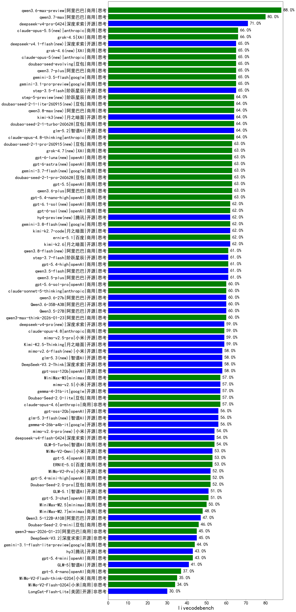

|类别|机构|大模型|【livecodebench】准确率|平均耗时|平均消耗token|花费/千次（元）|排名（准确率）|
|---|---|-----|-------------------|-------|-----------|-----------|-----------|
|商用|阿里巴巴|qwen3.6-max-preview|88.0%|/|/|/|1|
|商用|阿里巴巴|qwen3.7-max|80.0%|/|/|/|2|
|开源|深度求索|deepseek-v4-pro-0424|71.0%|/|/|/|3|
|商用|anthropic|claude-sonnet-5.5(new)|66.0%|/|/|/|4|
|商用|XAI|grok-4.5|66.0%|/|/|/|5|
|商用|anthropic|claude-opus-5.5(new)|66.0%|/|/|/|6|
|商用|XAI|grok-4.6|65.0%|/|/|/|7|
|商用|anthropic|claude-opus-5|65.0%|/|/|/|8|
|商用|豆包|doubao-seed-evolving|65.0%|/|/|/|9|
|商用|google|gemini-3.1-pro-preview|65.0%|/|/|/|10|
|开源|深度求索|deepseek-v4.1-flash(new)|65.0%|/|/|/|11|
|商用|google|gemini-3.5-flash|65.0%|/|/|/|12|
|商用|阿里巴巴|qwen3.7-plus|65.0%|/|/|/|13|
|开源|月之暗面|kimi-k3|64.0%|/|/|/|14|
|商用|anthropic|claude-opus-4.8-thinking|64.0%|/|/|/|15|
|商用|阿里巴巴|qwen3.8-max|64.0%|/|/|/|16|
|商用|豆包|doubao-seed-2-1-lite-260915(new)|64.0%|/|/|/|17|
|商用|阶跃星辰|step-5-preview(new)|64.0%|/|/|/|18|
|商用|豆包|doubao-seed-2-1-turbo-260628|64.0%|/|/|/|19|
|开源|智谱AI|glm-5.2|64.0%|/|/|/|20|
|商用|google|gemini-3.7-flash|63.0%|/|/|/|21|
|商用|豆包|doubao-seed-2-1-pro-260628|63.0%|/|/|/|22|
|商用|openAI|gpt-5.5|63.0%|/|/|/|23|
|商用|openAI|gpt-6-luna(new)|63.0%|/|/|/|24|
|商用|XAI|grok-4.7(new)|63.0%|/|/|/|25|
|商用|阿里巴巴|qwen3.6-plus|63.0%|/|/|/|26|
|商用|豆包|doubao-seed-2-1-pro-260915(new)|63.0%|/|/|/|27|
|商用|anthropic|claude-haiku-5.5(new)|63.0%|/|/|/|28|
|商用|openAI|gpt-6-astra(new)|63.0%|/|/|/|29|
|商用|google|gemini-3.8-flash(new)|62.0%|/|/|/|30|
|商用|百度|ernie-5.1|62.0%|/|/|/|31|
|开源|腾讯|hy4-preview(new)|62.0%|/|/|/|32|
|开源|月之暗面|kimi-k2.6|62.0%|/|/|/|33|
|商用|openAI|gpt-6-sol(new)|62.0%|/|/|/|34|
|开源|月之暗面|kimi-k2.7-code|62.0%|/|/|/|35|
|商用|openAI|gpt-6.1-sol(new)|62.0%|/|/|/|36|
|商用|阿里巴巴|qwen3.8-flash(new)|61.0%|/|/|/|37|
|商用|google|gemini-4-argon(new)|61.0%|/|/|/|38|
|商用|minimax|MiniMax-M3.1-Flash(new)|61.0%|/|/|/|39|
|开源|阶跃星辰|step-3.7-flash|61.0%|/|/|/|40|
|商用|openAI|gpt-5.6-sol-pro|60.0%|/|/|/|41|
|商用|anthropic|claude-sonnet-5-thinking|60.0%|/|/|/|42|
|开源|阿里巴巴|Qwen3.5-27B|60.0%|/|/|/|43|
|开源|阿里巴巴|Qwen3.6-35B-A3B|60.0%|/|/|/|44|
|开源|阿里巴巴|qwen3.6-27b|60.0%|/|/|/|45|
|开源|小米|mimo-v2.5-pro|59.0%|/|/|/|46|
|开源|深度求索|deepseek-v4-pro|59.0%|/|/|/|47|
|商用|anthropic|claude-opus-4.8|59.0%|/|/|/|48|
|开源|深度求索|DeepSeek-V3.2-Think|58.0%|/|/|/|49|
|开源|智谱AI|glm-5.3(new)|58.0%|/|/|/|50|
|开源|小米|mimo-v2.6-flash(new)|58.0%|/|/|/|51|
|开源|openAI|gpt-oss-120b|58.0%|/|/|/|52|
|开源|小米|mimo-v2.5|57.0%|/|/|/|53|
|开源|google|gemma-4-31b-it|57.0%|/|/|/|54|
|商用|minimax|MiniMax-M3|57.0%|/|/|/|55|
|开源|openAI|gpt-oss-20b|56.0%|/|/|/|56|
|开源|智谱AI|glm-5.3-flash(new)|56.0%|/|/|/|57|
|开源|google|gemma-4-26b-a4b-it|56.0%|/|/|/|58|
|开源|深度求索|deepseek-v4-flash-0424|54.0%|/|/|/|59|
|开源|小米|mimo-v2.6-pro(new)|54.0%|/|/|/|60|
|商用|百度|ERNIE-5.0|53.0%|/|/|/|61|
|开源|智谱AI|GLM-5.1|51.0%|/|/|/|62|
|商用|minimax|MiniMax-M2.7|48.0%|/|/|/|63|
|开源|阿里巴巴|Qwen3.5-122B-A10B|47.0%|/|/|/|64|
|开源|深度求索|DeepSeek-V3.2|45.0%|/|/|/|65|
|商用|google|gemini-3.1-flash-lite-preview|44.0%|/|/|/|66|
|开源|腾讯|hy3|43.0%|/|/|/|67|

