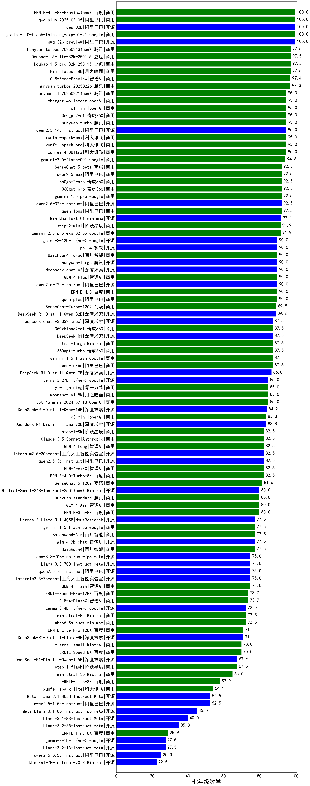
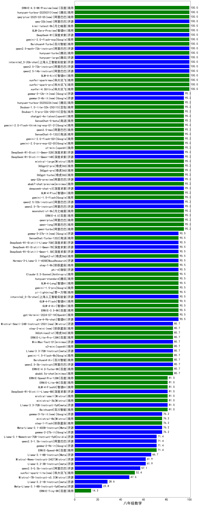

| 类别 | 大模型           |七年级数学|八年级数学|九年级数学|初中数学|排名|
|-----|-----------------|--------|---------|--------|------|----|
|商用|qwq-plus-2025-03-05(new)|100.0|100.0|100.0|100.0|1|
|开源|qwq-32b(new)|100.0|100.0|100.0|100.0|2|
|商用|gemini-2.0-flash-thinking-exp-01-21|100.0|95.2|100.0|98.4|3|
|商用|GLM-Zero-Preview|97.4|100.0|94.3|97.2|4|
|开源|qwen2.5-math-72b-instruct|97.5|100.0|91.7|96.4|5|
|开源|qwq-32b-preview|100.0|95.2|91.7|95.6|6|
|商用|gemini-2.0-flash-exp|97.5|100.0|88.9|95.5|7|
|商用|kimi-latest-8k|97.5|100.0|88.9|95.5|8|
|商用|o1-mini|95.0|95.2|94.4|94.9|9|
|商用|Doubao-1.5-lite-32k-250115|97.5|95.2|91.7|94.8|10|
|商用|Doubao-1.5-pro-32k-250115|97.5|95.2|91.7|94.8|11|
|商用|xunfei-spark-pro|95.0|100.0|88.9|94.6|12|
|开源|DeepSeek-R1|87.5|100.0|95.0|94.2|13|
|商用|hunyuan-large|90.0|100.0|91.7|93.9|14|
|商用|hunyuan-turbo|95.0|100.0|86.1|93.7|15|
|开源|qwen2.5-14b-instruct|95.0|100.0|86.1|93.7|16|
|商用|xunfei-spark-max|95.0|100.0|86.1|93.7|17|
|商用|xunfei-4.0Ultra|95.0|100.0|86.1|93.7|18|
|商用|hunyuan-turbos-20250226(new)|97.3|95.2|88.2|93.6|19|
|商用|qwen2.5-max|92.5|95.2|91.7|93.1|20|
|商用|gemini-1.5-pro|92.5|90.5|94.4|92.5|21|
|商用|360gpt-pro|92.5|95.2|88.9|92.2|22|
|商用|360gpt2-pro|92.5|95.2|88.9|92.2|23|
|商用|Baichuan4-Turbo|90.0|100.0|86.1|92.0|24|
|商用|gemini-2.0-pro-exp-02-05|91.9|95.2|88.2|91.8|25|
|商用|360gpt2-o1|95.0|90.5|88.9|91.5|26|
|开源|deepseek-chat-v3|90.0|95.2|88.9|91.4|27|
|商用|qwen-plus|90.0|95.2|88.9|91.4|28|
|商用|qwen-long|92.5|95.2|86.1|91.3|29|
|开源|qwen2.5-72b-instruct|90.0|100.0|83.3|91.1|30|
|商用|gemini-2.0-flash-001|94.6|95.2|82.4|90.7|31|
|商用|SenseChat-5-beta|92.5|95.2|83.3|90.3|32|
|开源|qwen2.5-32b-instruct|92.5|95.2|83.3|90.3|33|
|商用|chatgpt-4o-latest|95.0|95.2|80.6|90.3|34|
|开源|DeepSeek-R1-Distill-Qwen-32B|89.2|95.2|86.1|90.2|35|
|商用|qwen-turbo|87.5|95.2|86.1|89.6|36|
|商用|GLM-4-Plus|90.0|95.2|83.3|89.5|37|
|商用|gemini-1.5-flash|87.5|95.2|83.3|88.7|38|
|商用|mistral-large|87.5|95.2|83.3|88.7|39|
|商用|360gpt-turbo|87.5|95.2|83.3|88.7|40|
|商用|ERNIE-4.0|90.0|95.2|80.6|88.6|41|
|开源|DeepSeek-R1-Distill-Qwen-14B|84.2|95.2|86.1|88.5|42|
|商用|MiniMax-Text-01|92.1|85.7|85.7|87.8|43|
|开源|DeepSeek-R1-Distill-Llama-70B|83.8|90.5|88.6|87.6|44|
|开源|DeepSeek-R1-Distill-Qwen-7B|86.8|90.5|83.3|86.9|45|
|开源|internlm2_5-20b-chat|82.5|100.0|77.8|86.8|46|
|商用|SenseChat-5-1202|81.6|95.2|82.9|86.6|47|
|商用|360zhinao2-o1|87.5|85.7|86.1|86.4|48|
|开源|phi-4|90.0|90.5|77.8|86.1|49|
|商用|abab7-chat-preview|82.5|95.2|80.6|86.1|50|
|商用|SenseChat-Turbo-1202|89.5|90.5|77.1|85.7|51|
|商用|moonshot-v1-8k|85.0|95.2|75.0|85.1|52|
|商用|o3-mini|83.8|85.7|84.8|84.8|53|
|商用|step-1-8k|82.5|90.5|80.6|84.5|54|
|商用|GLM-4-AirX|82.5|100.0|69.4|84.0|55|
|商用|yi-lightning|85.0|90.5|75.0|83.5|56|
|商用|ERNIE-4.0-Turbo-8K|82.5|85.7|80.6|82.9|57|
|商用|step-2-mini(new)|91.9|85.7|70.6|82.7|58|
|商用|Claude-3.5-Sonnet|82.5|90.5|75.0|82.7|59|
|商用|ERNIE-3.5-8K|80.0|90.5|75.0|81.8|60|
|商用|gemini-1.5-flash-8b|77.5|85.7|80.6|81.3|61|
|开源|internlm2_5-7b-chat|75.0|90.5|77.8|81.1|62|
|商用|gpt-4o-mini-2024-07-18|85.0|90.5|66.7|80.7|63|
|开源|Hermes-3-Llama-3.1-405B|77.5|90.5|72.2|80.1|64|
|商用|hunyuan-standard|80.0|90.5|69.4|80.0|65|
|开源|qwen2.5-7b-instruct|75.0|95.2|69.4|79.9|66|
|商用|GLM-4-Long|82.5|90.5|63.9|79.0|67|
|商用|GLM-4-Flash|75.0|90.5|69.4|78.3|68|
|商用|GLM-4-Air|80.0|90.5|63.9|78.1|69|
|商用|Baichuan4-Air|77.5|85.7|69.4|77.5|70|
|商用|ERNIE-Speed-Pro-128K|73.7|81.0|74.3|76.3|71|
|商用|mistral-small|70.0|81.0|77.8|76.3|72|
|商用|abab6.5s-chat|72.5|85.7|69.4|75.9|73|
|开源|Llama-3.3-70B-Instruct|75.0|85.7|66.7|75.8|74|
|开源|Yi-1.5-34B-Chat|80.0|85.7|61.1|75.6|75|
|开源|qwen2.5-3b-instruct|82.5|85.7|58.3|75.5|76|
|商用|GLM-4-FlashX|73.7|81.0|71.4|75.4|77|
|商用|Baichuan4|77.5|81.0|66.7|75.1|78|
|开源|DeepSeek-R1-Distill-Qwen-1.5B|67.6|90.5|65.7|74.6|79|
|开源|glm-4-9b-chat|77.5|90.5|55.6|74.5|80|
|开源|DeepSeek-R1-Distill-Llama-8B|71.1|81.0|63.9|72.0|81|
|开源|Llama-3.3-70B-Instruct-fp8|75.0|81.0|55.6|70.5|82|
|商用|ERNIE-Lite-Pro-128K|71.1|85.7|51.4|69.4|83|
|商用|step-1-flash|67.5|76.2|63.9|69.2|84|
|商用|ministral-8b|72.5|76.2|58.3|69.0|85|
|开源|gemma-2-9b-it|72.5|71.4|58.3|67.4|86|
|开源|gemma-2-27b-it|67.5|76.2|55.6|66.4|87|
|商用|ERNIE-Lite-8K|57.9|81.0|60.0|66.3|88|
|商用|ERNIE-Speed-8K|70.0|71.4|55.6|65.7|89|
|商用|ministral-3b|65.0|81.0|47.2|64.4|90|
|开源|Meta-Llama-3.1-405B-Instruct|52.5|76.2|63.9|64.2|91|
|开源|Llama-3.1-Nemotron-70B-Instruct-fp8|62.5|71.4|58.3|64.1|92|
|开源|qwen2.5-1.5b-instruct|52.5|71.4|44.4|56.1|93|
|开源|Yi-1.5-9B-Chat|55.0|61.9|47.2|54.7|94|
|商用|xunfei-spark-lite(new)|54.1|52.4|55.9|54.1|95|
|开源|Mistral-Nemo-Instruct-2407|42.5|61.9|52.8|52.4|96|
|开源|Llama-3.1-8B-Instruct|40.0|66.7|44.4|50.4|97|
|开源|Llama-3.2-3B-Instruct|35.0|61.9|41.7|46.2|98|
|开源|qwen2.5-0.5b-instruct|25.0|57.1|27.8|36.6|99|
|开源|Meta-Llama-3.1-8B-Instruct-fp8|45.0|23.8|30.6|33.1|100|
|开源|Mistral-7B-Instruct-v0.3|22.5|47.6|25.0|31.7|101|
|开源|Llama-3.2-1B-Instruct|27.5|28.6|13.9|23.3|102|
|商用|ERNIE-Tiny-8K|28.9|14.3|11.4|18.2|103|

    
    
    
