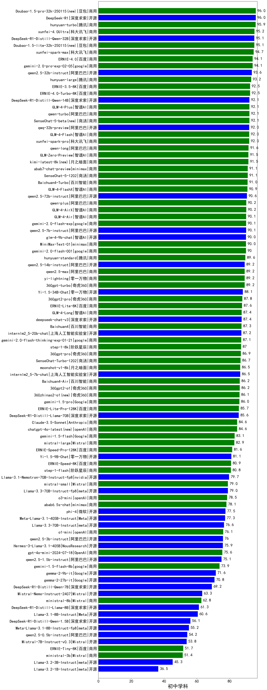

| 类别 | 大模型                         | 初中学科 | 排名 |
|-----|------------------------------|---------|----|
|商用|Doubao-1.5-pro-32k-250115(new)|96.0|1|
|开源|DeepSeek-R1|96.0|2|
|商用|hunyuan-turbo|95.9|3|
|商用|xunfei-4.0Ultra|95.2|4|
|开源|DeepSeek-R1-Distill-Qwen-32B|95.1|5|
|商用|Doubao-1.5-lite-32k-250115(new)|95.1|6|
|商用|xunfei-spark-max|94.7|7|
|商用|ERNIE-4.0|94.1|8|
|商用|gemini-2.0-pro-exp-02-05|94.1|9|
|开源|qwen2.5-32b-instruct|93.6|10|
|商用|hunyuan-large|93.2|11|
|商用|ERNIE-3.5-8K|92.5|12|
|商用|ERNIE-4.0-Turbo-8K|92.5|13|
|开源|DeepSeek-R1-Distill-Qwen-14B|92.1|14|
|商用|GLM-4-Plus|92.1|15|
|商用|qwen-turbo|92.1|16|
|商用|SenseChat-5-beta(new)|92.1|17|
|开源|qwq-32b-preview|92.0|18|
|商用|GLM-4-Flash|92.0|19|
|商用|xunfei-spark-pro|92.0|20|
|商用|qwen-long|91.6|21|
|商用|GLM-Zero-Preview|91.5|22|
|商用|kimi-latest-8k(new)|91.5|23|
|商用|abab7-chat-preview|91.1|24|
|商用|SenseChat-5-1202|91.1|25|
|商用|Baichuan4-Turbo|91.0|26|
|商用|GLM-4-FlashX|90.9|27|
|开源|qwen2.5-72b-instruct|90.6|28|
|商用|qwen-plus|90.2|29|
|商用|GLM-4-AirX|90.2|30|
|商用|GLM-4-Air|90.1|31|
|商用|gemini-2.0-flash-exp|90.1|32|
|开源|qwen2.5-7b-instruct|90.1|33|
|开源|glm-4-9b-chat|90.0|34|
|商用|MiniMax-Text-01|90.0|35|
|商用|gemini-2.0-flash-001|90.0|36|
|商用|hunyuan-standard|89.6|37|
|开源|qwen2.5-14b-instruct|89.2|38|
|商用|qwen2.5-max|89.2|39|
|商用|yi-lightning|89.2|40|
|商用|360gpt-turbo|89.2|41|
|开源|Yi-1.5-34B-Chat|88.1|42|
|商用|360gpt2-pro|87.8|43|
|商用|ERNIE-Lite-8K|87.6|44|
|商用|GLM-4-Long|87.4|45|
|开源|deepseek-chat-v3|87.4|46|
|商用|Baichuan4|87.3|47|
|商用|SenseChat-Turbo|87.3|48|
|开源|internlm2_5-20b-chat|87.2|49|
|商用|SenseChat-5|87.2|50|
|商用|gemini-2.0-flash-thinking-exp-01-21|87.1|51|
|商用|step-1-8k|87.0|52|
|商用|360gpt-pro|86.9|53|
|商用|SenseChat-Turbo-1202|86.7|54|
|商用|moonshot-v1-8k|86.5|55|
|开源|internlm2_5-7b-chat|86.5|56|
|商用|Baichuan4-Air|86.2|57|
|商用|360gpt2-o1|86.2|58|
|商用|360zhinao2-o1(new)|86.1|59|
|商用|gemini-1.5-pro|86.0|60|
|商用|ERNIE-Lite-Pro-128K|85.7|61|
|开源|DeepSeek-R1-Distill-Llama-70B|85.6|62|
|商用|Claude-3.5-Sonnet|84.6|63|
|商用|chatgpt-4o-latest(new)|84.6|64|
|商用|gemini-1.5-flash|83.1|65|
|商用|mistral-large|82.9|66|
|商用|ERNIE-Speed-Pro-128K|81.6|67|
|开源|Yi-1.5-9B-Chat|81.1|68|
|商用|ERNIE-Speed-8K|80.9|69|
|商用|step-1-flash|80.8|70|
|开源|Llama-3.1-Nemotron-70B-Instruct-fp8|79.7|71|
|商用|mistral-small|79.0|72|
|开源|Llama-3.3-70B-Instruct-fp8|79.0|73|
|商用|o3-mini|78.5|74|
|商用|abab6.5s-chat|78.1|75|
|开源|phi-4|77.5|76|
|开源|Meta-Llama-3.1-405B-Instruct|77.3|77|
|开源|Llama-3.3-70B-Instruct|76.6|78|
|商用|o1-mini|76.1|79|
|开源|qwen2.5-3b-instruct|76.0|80|
|开源|Hermes-3-Llama-3.1-405B|75.9|81|
|商用|SenseChat-v4|75.7|82|
|商用|gpt-4o-mini-2024-07-18|75.6|83|
|开源|qwen2.5-1.5b-instruct|75.1|84|
|商用|gemini-1.5-flash-8b|73.9|85|
|开源|gemma-2-9b-it|71.6|86|
|开源|gemma-2-27b-it|70.8|87|
|开源|DeepSeek-R1-Distill-Qwen-7B|69.2|88|
|开源|Mistral-Nemo-Instruct-2407|63.3|89|
|开源|Mixtral-8x7B-Instruct-v0.1|63.3|90|
|商用|ministral-8b|62.8|91|
|开源|DeepSeek-R1-Distill-Llama-8B|61.3|92|
|开源|Llama-3.1-8B-Instruct|60.6|93|
|开源|DeepSeek-R1-Distill-Qwen-1.5B|56.1|94|
|开源|Meta-Llama-3.1-8B-Instruct-fp8|55.2|95|
|开源|qwen2.5-0.5b-instruct|54.2|96|
|开源|Mistral-7B-Instruct-v0.3|53.8|97|
|商用|ERNIE-Tiny-8K|51.7|98|
|商用|ministral-3b|51.4|99|
|开源|Llama-3.2-3B-Instruct|45.3|100|
|开源|Llama-3.2-1B-Instruct|36.5|101|
|开源|qwen2.5-math-72b-instruct|/|102|

