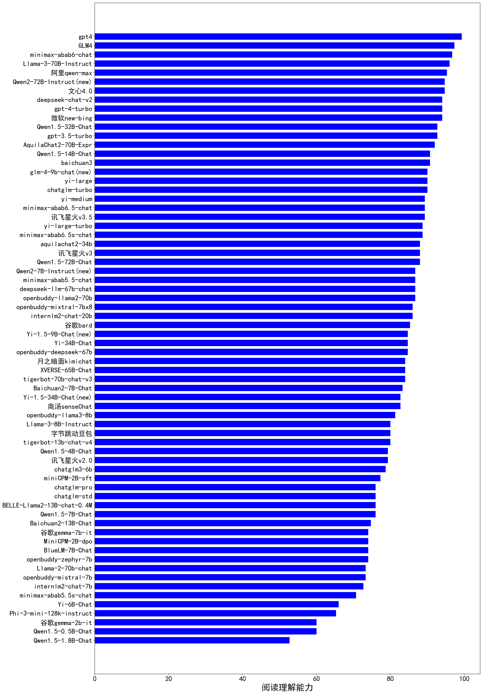

| 类别 | 大模型                         | 阅读理解能力 | 排名 |
|-----|------------------------------|---------|----|
|商用|gpt-4o|98.0|1|
|商用|百度ERNIE-3.5-8K|98.0|2|
|商用|豆包Doubao-pro-32k|96.7|3|
|开源|Llama-3-70B-Instruct|96.0|4|
|商用|百度ERNIE-4.0-Turbo|96.0|5|
|开源|qwen2.5-32b-instruct|96.0|6|
|商用|讯飞4.0Ultra|96.0|7|
|商用|GLM-4-Plus|95.3|8|
|商用|yi-lightning|95.3|9|
|开源|Qwen2-72B-Instruct|94.7|10|
|商用|Baichuan3-Turbo|94.7|11|
|商用|阿里qwen-max|94.7|12|
|商用|百度ERNIE-4.0|94.7|13|
|开源|deepseek-chat-v2|94.0|14|
|开源|qwen2.5-14b-instruct|94.0|15|
|开源|qwen2.5-7b-instruct|93.3|16|
|商用|gemini-1.5-pro|93.3|17|
|商用|Baichuan4|93.3|18|
|商用|智谱GLM-4-Air|92.7|19|
|商用|gemini-1.5-flash|92.7|20|
|商用|gemini-1.0-pro|92.7|21|
|商用|智谱GLM-4-AirX|92.7|22|
|开源|Llama-3.1-70B-Instruct|92.0|23|
|开源|qwen2.5-72b-instruct|92.0|24|
|商用|智谱GLM4|90.0|25|
|商用|阿里qwen-plus|90.0|26|
|开源|internlm2_5-7b-chat|90.0|27|
|开源|glm-4-9b-chat|90.0|28|
|商用|阿里qwen-long|90.0|29|
|商用|GLM-4-Long|89.3|30|
|开源|qwen2-57b-a14b-instruct|89.3|31|
|商用|gpt-4o-mini|89.3|32|
|商用|讯飞星火v3.5(spark-max)|89.3|33|
|商用|minimax-abab6.5-chat|89.3|34|
|商用|豆包Doubao-lite-32k|88.7|35|
|开源|gemma-2-9b-it|88.7|36|
|商用|minimax-abab6.5s-chat|88.7|37|
|商用|阿里qwen-turbo|88.0|38|
|商用|商汤SenseChat-v4|88.0|39|
|商用|百度ERNIE-Speed-8K|88.0|40|
|商用|讯飞星火v3(spark-pro)|88.0|41|
|商用|minimax-abab5.5-chat|86.7|42|
|开源|Qwen2-7B-Instruct|86.7|43|
|商用|智谱GLM-4-Flash|86.0|44|
|开源|internlm2_5-20b-chat|86.0|45|
|开源|Yi-1.5-9B-Chat|84.7|46|
|商用|月之暗面moonshot-v1-8k|84.0|47|
|开源|Yi-1.5-34B-Chat|82.7|48|
|开源|Llama-3.1-8B-Instruct|82.0|49|
|开源|DeepSeek-V2-Lite-Chat|81.3|50|
|开源|Llama-3-8B-Instruct|80.0|51|
|开源|qwen2.5-3b-instruct|78.7|52|
|商用|商汤SenseChat-Turbo|76.7|53|
|开源|MiniCPM-2B-dpo|74.0|54|
|开源|qwen2.5-1.5b-instruct|72.7|55|
|商用|minimax-abab5.5s-chat|70.7|56|
|开源|qwen2-1.5b-instruct|68.0|57|
|开源|qwen2.5-0.5b-instruct|63.3|58|
|开源|internlm2-chat-1_8b|63.3|59|
|开源|qwen2-0.5b-instruct|62.0|60|
|开源|deepseek-chat-v2.5|/|61|

