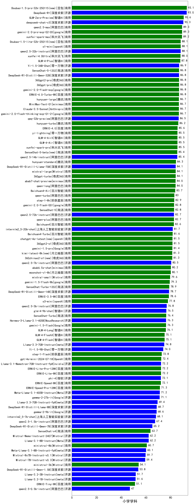

| 类别 | 大模型                         | 小学学科 | 排名 |
|-----|------------------------------|---------|----|
|商用|qwq-plus-2025-03-05(new)|94.5|1|
|商用|Doubao-1.5-pro-32k-250115|93.1|2|
|开源|DeepSeek-R1|93.0|3|
|开源|qwq-32b(new)|93.0|4|
|商用|GLM-Zero-Preview|90.6|5|
|开源|deepseek-chat-v3|90.3|6|
|商用|hunyuan-turbos-20250226(new)|89.3|7|
|商用|gemini-2.0-pro-exp-02-05|89.3|8|
|商用|qwen2.5-max|89.3|9|
|商用|xunfei-spark-max|89.2|10|
|开源|qwen2.5-32b-instruct|88.1|11|
|商用|Doubao-1.5-lite-32k-250115|88.1|12|
|商用|o1-mini|88.1|13|
|商用|xunfei-4.0Ultra|88.0|14|
|商用|GLM-4-Plus|87.8|15|
|开源|Yi-1.5-34B-Chat|86.9|16|
|商用|360gpt2-pro|86.8|17|
|商用|gemini-2.0-flash-exp|86.8|18|
|商用|SenseChat-5-1202|86.8|19|
|开源|DeepSeek-R1-Distill-Qwen-32B|86.8|20|
|商用|360gpt-pro|86.8|21|
|商用|ERNIE-4.0-Turbo-8K|86.8|22|
|商用|hunyuan-large|86.7|23|
|商用|MiniMax-Text-01|86.7|24|
|商用|Claude-3.5-Sonnet|86.7|25|
|商用|gemini-2.0-flash-thinking-exp-01-21|86.7|26|
|开源|qwq-32b-preview|86.5|27|
|商用|hunyuan-turbo|86.2|28|
|商用|ERNIE-4.0|85.6|29|
|商用|yi-lightning|85.5|30|
|商用|GLM-4-Air|85.5|31|
|商用|xunfei-spark-pro|85.5|32|
|商用|GLM-4-AirX|85.5|33|
|商用|SenseChat-5-beta|85.4|34|
|开源|qwen2.5-14b-instruct|85.4|35|
|商用|hunyuan-standard|84.3|36|
|开源|DeepSeek-R1-Distill-Llama-70B|84.1|37|
|商用|mistral-large|84.1|38|
|商用|360gpt-turbo|84.1|39|
|商用|abab7-chat-preview|84.0|40|
|商用|qwen-long|84.0|41|
|商用|step-2-mini(new)|83.8|42|
|商用|Baichuan4-Air|83.7|43|
|商用|qwen-turbo|83.0|44|
|商用|step-1-8k|82.9|45|
|商用|gemini-2.0-flash-001|82.8|46|
|开源|qwen2.5-72b-instruct|82.7|47|
|商用|qwen-plus|82.7|48|
|商用|Baichuan4|82.6|49|
|开源|internlm2_5-20b-chat|81.7|50|
|商用|Baichuan4-Turbo|81.6|51|
|商用|360gpt2-o1|81.5|52|
|商用|chatgpt-4o-latest|81.5|53|
|商用|gemini-1.5-pro|81.4|54|
|商用|kimi-latest-8k|81.3|55|
|商用|360zhinao2-o1|81.3|56|
|开源|qwen2.5-7b-instruct|80.5|57|
|商用|abab6.5s-chat|80.2|58|
|商用|moonshot-v1-8k|80.1|59|
|商用|mistral-small|79.6|60|
|商用|gemini-1.5-flash-8b|79.3|61|
|商用|SenseChat-Turbo-1202|78.9|62|
|开源|DeepSeek-R1-Distill-Qwen-14B|78.7|63|
|商用|ERNIE-3.5-8K|78.6|64|
|商用|o3-mini|77.8|65|
|开源|qwen2.5-3b-instruct|76.8|66|
|开源|glm-4-9b-chat|76.5|67|
|开源|Hermes-3-Llama-3.1-405B|76.3|68|
|商用|gemini-1.5-flash|76.3|69|
|商用|GLM-4-Long|76.1|70|
|商用|GLM-4-Flash|75.1|71|
|商用|GLM-4-FlashX|75.1|72|
|开源|Llama-3.3-70B-Instruct|74.8|73|
|开源|Yi-1.5-9B-Chat|74.0|74|
|商用|step-1-flash|72.8|75|
|商用|gpt-4o-mini-2024-07-18|72.4|76|
|开源|Llama-3.1-Nemotron-70B-Instruct-fp8|72.2|77|
|商用|ERNIE-Lite-Pro-128K|72.2|78|
|商用|ERNIE-Lite-8K|72.2|79|
|开源|phi-4|72.1|80|
|商用|ERNIE-Speed-8K|72.1|81|
|商用|ERNIE-Speed-Pro-128K|71.3|82|
|开源|Meta-Llama-3.1-405B-Instruct|71.2|83|
|开源|gemma-2-27b-it|71.1|84|
|开源|Llama-3.3-70B-Instruct-fp8|69.4|85|
|开源|DeepSeek-R1-Distill-Llama-8B|68.7|86|
|开源|gemma-2-9b-it|68.6|87|
|开源|internlm2_5-7b-chat|68.1|88|
|开源|qwen2.5-1.5b-instruct|67.4|89|
|开源|DeepSeek-R1-Distill-Qwen-7B|65.2|90|
|开源|Mistral-Nemo-Instruct-2407|62.2|91|
|开源|Llama-3.1-8B-Instruct|62.2|92|
|商用|ministral-8b|60.7|93|
|开源|Meta-Llama-3.1-8B-Instruct-fp8|60.1|94|
|开源|Mistral-7B-Instruct-v0.3|59.4|95|
|商用|xunfei-spark-lite(new)|56.3|96|
|商用|ministral-3b|54.1|97|
|开源|DeepSeek-R1-Distill-Qwen-1.5B|53.8|98|
|开源|Llama-3.2-3B-Instruct|51.7|99|
|开源|Llama-3.2-1B-Instruct|51.6|100|
|商用|ERNIE-Tiny-8K|51.1|101|
|开源|qwen2.5-0.5b-instruct|47.0|102|
|开源|qwen2.5-math-72b-instruct|/|103|

