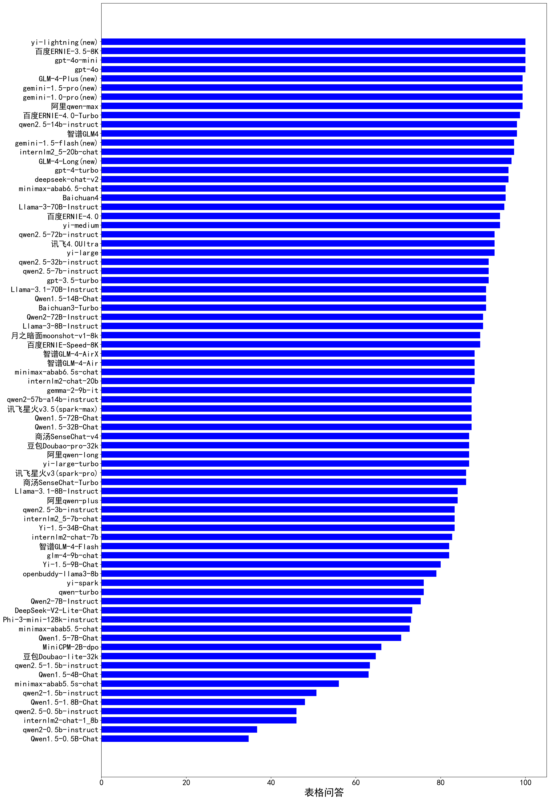

| 类别 | 大模型                         | 数据分析能力 | 排名 |
|-----|------------------------------|---------|----|
|商用|gpt-4o|100.0|1|
|商用|gpt-4o-mini|100.0|2|
|商用|360gpt-turbo(new)|100.0|3|
|商用|gemini-2.0-flash-exp(new)|100.0|4|
|商用|ERNIE-3.5-8K|100.0|5|
|商用|Baichuan4-Turbo|100.0|6|
|商用|yi-lightning|100.0|7|
|开源|deepseek-chat-v3|100.0|8|
|商用|step-1-8k(new)|100.0|9|
|商用|360gpt-pro(new)|100.0|10|
|商用|360gpt2-pro(new)|100.0|11|
|商用|step-1-flash(new)|100.0|12|
|开源|Llama-3.3-70B-Instruct(new)|99.3|13|
|商用|gemini-1.5-flash-8b(new)|99.3|14|
|商用|gemini-1.5-pro|99.3|15|
|商用|Claude-3.5-Sonnet|99.3|16|
|商用|qwen-max|99.3|17|
|商用|GLM-4-Plus|99.3|18|
|商用|gemini-1.0-pro|99.3|19|
|商用|ERNIE-4.0-Turbo-8K|98.7|20|
|开源|Meta-Llama-3.1-405B-Instruct|98.7|21|
|开源|qwen2.5-14b-instruct|98.0|22|
|商用|GLM4|98.0|23|
|商用|SenseChat-5|97.3|24|
|商用|hunyuan-turbo|97.3|25|
|商用|Baichuan4-Air|97.3|26|
|开源|internlm2_5-20b-chat|97.3|27|
|商用|abab7-chat-preview|97.3|28|
|商用|gemini-1.5-flash|97.3|29|
|开源|phi-4(new)|97.3|30|
|商用|hunyuan-large|96.7|31|
|开源|gemma-2-27b-it|96.7|32|
|商用|GLM-4-Long|96.7|33|
|商用|Baichuan4|95.3|34|
|商用|ERNIE-4.0|94.0|35|
|开源|qwen2.5-72b-instruct|92.7|36|
|商用|xunfei-4.0Ultra|92.7|37|
|开源|qwen2.5-7b-instruct|91.3|38|
|开源|qwen2.5-32b-instruct|91.3|39|
|开源|Llama-3.1-70B-Instruct|90.7|40|
|商用|moonshot-v1-8k|89.3|41|
|商用|ERNIE-Speed-8K|89.3|42|
|商用|abab6.5s-chat|88.0|43|
|商用|GLM-4-Air|88.0|44|
|商用|GLM-4-AirX|88.0|45|
|开源|gemma-2-9b-it|87.3|46|
|商用|xunfei-spark-max|87.3|47|
|商用|Doubao-pro-32k|86.7|48|
|商用|qwen-long|86.7|49|
|商用|SenseChat-v4|86.7|50|
|商用|SenseChat-Turbo|86.0|51|
|商用|xunfei-spark-pro|86.0|52|
|商用|hunyuan-standard|85.3|53|
|开源|Llama-3.1-8B-Instruct|84.0|54|
|商用|qwen-plus|84.0|55|
|开源|internlm2_5-7b-chat|83.3|56|
|开源|Yi-1.5-34B-Chat|83.3|57|
|开源|qwen2.5-3b-instruct|83.3|58|
|开源|glm-4-9b-chat|82.0|59|
|商用|GLM-4-Flash|82.0|60|
|开源|Yi-1.5-9B-Chat|80.0|61|
|商用|qwen-turbo|76.0|62|
|商用|Doubao-lite-32k|64.7|63|
|开源|qwen2.5-1.5b-instruct|63.3|64|
|开源|qwen2.5-0.5b-instruct|46.0|65|
|开源|qwen2.5-math-72b-instruct|/|66|
|开源|qwq-32b-preview|/|67|
|商用|o1-preview|/|68|
|商用|o1-mini|/|69|

