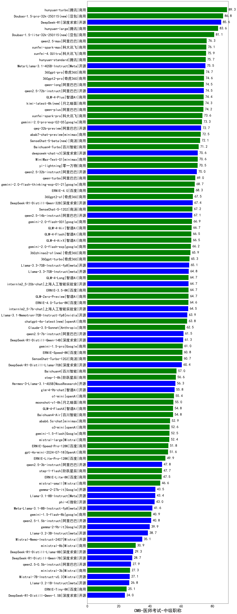

| 类别 | 大模型                         | CMB-医师考试-中级职称 | 排名 |
|-----|------------------------------|---------|----|
|商用|hunyuan-turbo|89.3|1|
|商用|Doubao-1.5-pro-32k-250115(new)|86.8|2|
|开源|DeepSeek-R1|85.6|3|
|商用|hunyuan-large|83.6|4|
|商用|Doubao-1.5-lite-32k-250115(new)|81.1|5|
|商用|qwen2.5-max|76.3|6|
|商用|xunfei-spark-max|76.1|7|
|商用|xunfei-4.0Ultra|75.9|8|
|商用|hunyuan-standard|75.7|9|
|开源|Meta-Llama-3.1-405B-Instruct|75.5|10|
|商用|360gpt-pro|74.7|11|
|商用|360gpt2-pro|74.6|12|
|商用|qwen-long|74.5|13|
|开源|qwen2.5-72b-instruct|74.5|14|
|商用|GLM-4-Plus|74.4|15|
|商用|kimi-latest-8k(new)|74.3|16|
|商用|qwen-plus|74.2|17|
|商用|xunfei-spark-pro|73.6|18|
|商用|gemini-2.0-pro-exp-02-05|73.3|19|
|开源|qwq-32b-preview|72.7|20|
|商用|abab7-chat-preview|72.5|21|
|商用|SenseChat-5-beta(new)|72.1|22|
|商用|Baichuan4-Turbo|71.2|23|
|开源|deepseek-chat-v3|70.6|24|
|商用|MiniMax-Text-01|70.6|25|
|商用|yi-lightning|70.5|26|
|开源|qwen2.5-32b-instruct|70.0|27|
|商用|qwen-turbo|69.0|28|
|商用|gemini-2.0-flash-thinking-exp-01-21|68.7|29|
|商用|ERNIE-4.0|68.3|30|
|商用|360gpt2-o1|67.5|31|
|开源|DeepSeek-R1-Distill-Qwen-32B|67.4|32|
|商用|SenseChat-5-1202|67.2|33|
|开源|qwen2.5-14b-instruct|67.1|34|
|商用|gemini-2.0-flash-001|66.9|35|
|商用|GLM-4-Air|66.7|36|
|商用|GLM-4-Flash|66.5|37|
|商用|GLM-4-AirX|66.5|38|
|商用|gemini-2.0-flash-exp|66.2|39|
|商用|360zhinao2-o1(new)|65.9|40|
|商用|360gpt-turbo|65.3|41|
|开源|Llama-3.3-70B-Instruct-fp8|65.1|42|
|开源|Llama-3.3-70B-Instruct|64.8|43|
|商用|GLM-4-Long|64.7|44|
|开源|internlm2_5-20b-chat|64.7|45|
|商用|ERNIE-3.5-8K|64.7|46|
|商用|GLM-Zero-Preview|64.7|47|
|商用|ERNIE-4.0-Turbo-8K|64.6|48|
|开源|internlm2_5-7b-chat|64.5|49|
|开源|Llama-3.1-Nemotron-70B-Instruct-fp8|63.9|50|
|商用|chatgpt-4o-latest(new)|63.8|51|
|商用|Claude-3.5-Sonnet|62.5|52|
|开源|qwen2.5-7b-instruct|61.5|53|
|开源|DeepSeek-R1-Distill-Qwen-14B|61.3|54|
|商用|gemini-1.5-pro|61.0|55|
|商用|ERNIE-Speed-8K|60.8|56|
|商用|SenseChat-Turbo-1202|60.7|57|
|开源|DeepSeek-R1-Distill-Llama-70B|60.4|58|
|商用|Baichuan4|57.0|59|
|商用|step-1-8k|56.6|60|
|开源|Hermes-3-Llama-3.1-405B|56.3|61|
|开源|glm-4-9b-chat|55.8|62|
|商用|o1-mini|55.4|63|
|商用|moonshot-v1-8k|55.0|64|
|商用|GLM-4-FlashX|54.8|65|
|商用|Baichuan4-Air|54.8|66|
|商用|abab6.5s-chat|52.9|67|
|商用|o3-mini|52.6|68|
|商用|gemini-1.5-flash|52.5|69|
|商用|mistral-large|52.4|70|
|商用|ERNIE-Speed-Pro-128K|51.8|71|
|商用|gpt-4o-mini-2024-07-18|51.6|72|
|商用|ERNIE-Lite-Pro-128K|49.9|73|
|开源|qwen2.5-3b-instruct|47.8|74|
|商用|step-1-flash|47.7|75|
|商用|ERNIE-Lite-8K|47.5|76|
|商用|mistral-small|46.6|77|
|开源|gemma-2-27b-it|43.5|78|
|开源|Llama-3.1-8B-Instruct|43.4|79|
|开源|phi-4|43.0|80|
|开源|Meta-Llama-3.1-8B-Instruct-fp8|41.6|81|
|商用|gemini-1.5-flash-8b|40.9|82|
|开源|qwen2.5-1.5b-instruct|40.8|83|
|开源|gemma-2-9b-it|39.9|84|
|开源|Llama-3.2-3B-Instruct|38.7|85|
|开源|Mistral-Nemo-Instruct-2407|35.1|86|
|商用|ministral-8b|30.9|87|
|开源|DeepSeek-R1-Distill-Llama-8B|29.3|88|
|开源|DeepSeek-R1-Distill-Qwen-7B|28.7|89|
|开源|qwen2.5-0.5b-instruct|27.9|90|
|商用|ministral-3b|27.3|91|
|开源|Mistral-7B-Instruct-v0.3|27.1|92|
|开源|Llama-3.2-1B-Instruct|26.8|93|
|商用|ERNIE-Tiny-8K|25.1|94|
|开源|DeepSeek-R1-Distill-Qwen-1.5B|24.0|95|
|开源|Yi-1.5-34B-Chat|/|96|
|开源|Yi-1.5-9B-Chat|/|97|
|开源|qwen2.5-math-72b-instruct|/|98|

