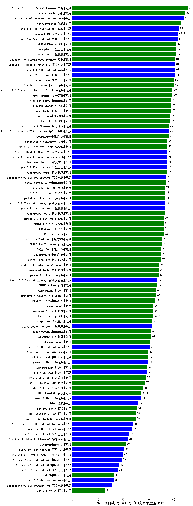

| 类别 | 大模型                         | CMB-医师考试-中级职称-核医学主治医师 | 排名 |
|-----|------------------------------|---------|----|
|商用|Doubao-1.5-pro-32k-250115(new)|91.0|1|
|商用|hunyuan-turbo|89.0|2|
|开源|Meta-Llama-3.1-405B-Instruct|88.0|3|
|商用|hunyuan-large|86.0|4|
|开源|Llama-3.3-70B-Instruct-fp8|84.0|5|
|开源|DeepSeek-R1|83.3|6|
|开源|qwen2.5-72b-instruct|83.0|7|
|商用|GLM-4-Plus|82.0|8|
|商用|qwen-long|82.0|9|
|商用|qwen-plus|82.0|10|
|开源|qwq-32b-preview|81.0|11|
|开源|Llama-3.3-70B-Instruct|81.0|12|
|商用|Doubao-1.5-lite-32k-250115(new)|81.0|13|
|开源|DeepSeek-R1-Distill-Qwen-14B|81.0|14|
|商用|qwen2.5-max|80.0|15|
|商用|Claude-3.5-Sonnet|80.0|16|
|商用|gemini-2.0-flash-thinking-exp-01-21|79.0|17|
|商用|yi-lightning|79.0|18|
|商用|MiniMax-Text-01|78.0|19|
|商用|hunyuan-standard|78.0|20|
|商用|qwen-turbo|78.0|21|
|商用|GLM-4-Air|77.0|22|
|商用|360gpt-pro|77.0|23|
|开源|Llama-3.1-Nemotron-70B-Instruct-fp8|76.0|24|
|商用|kimi-latest-8k(new)|76.0|25|
|商用|360gpt2-pro|76.0|26|
|商用|gemini-2.0-pro-exp-02-05|75.0|27|
|商用|SenseChat-5-beta(new)|75.0|28|
|开源|DeepSeek-R1-Distill-Qwen-32B|75.0|29|
|开源|Hermes-3-Llama-3.1-405B|75.0|30|
|商用|xunfei-spark-max|75.0|31|
|开源|qwen2.5-32b-instruct|75.0|32|
|开源|deepseek-chat-v3|75.0|33|
|商用|abab7-chat-preview|74.0|34|
|开源|DeepSeek-R1-Distill-Llama-70B|74.0|35|
|开源|qwen2.5-14b-instruct|73.0|36|
|商用|xunfei-spark-pro|73.0|37|
|商用|GLM-Zero-Preview|73.0|38|
|商用|gemini-2.0-flash-exp|73.0|39|
|商用|SenseChat-5-1202|73.0|40|
|开源|internlm2_5-20b-chat|73.0|41|
|商用|gemini-1.5-pro|72.0|42|
|商用|GLM-4-AirX|72.0|43|
|商用|ERNIE-4.0|72.0|44|
|商用|gemini-2.0-flash-001|72.0|45|
|商用|ERNIE-4.0-Turbo-8K|71.0|46|
|商用|360zhinao2-o1(new)|71.0|47|
|商用|360gpt-turbo|70.0|48|
|商用|xunfei-4.0Ultra|70.0|49|
|商用|360gpt2-o1|70.0|50|
|商用|chatgpt-4o-latest(new)|68.0|51|
|商用|gemini-1.5-flash|68.0|52|
|商用|Baichuan4-Turbo|68.0|53|
|开源|internlm2_5-7b-chat|67.0|54|
|商用|ERNIE-3.5-8K|67.0|55|
|商用|GLM-4-Long|66.0|56|
|商用|gpt-4o-mini-2024-07-18|66.0|57|
|商用|mistral-large|65.0|58|
|商用|o1-mini|64.0|59|
|商用|Baichuan4-Air|64.0|60|
|商用|GLM-4-Flash|63.8|61|
|商用|step-1-8k|63.0|62|
|开源|qwen2.5-7b-instruct|63.0|63|
|商用|abab6.5s-chat|62.0|64|
|商用|Baichuan4|62.0|65|
|开源|Llama-3.1-8B-Instruct|61.0|66|
|商用|o3-mini|61.0|67|
|商用|SenseChat-Turbo-1202|60.0|68|
|商用|mistral-small|60.0|69|
|开源|gemma-2-27b-it|60.0|70|
|开源|glm-4-9b-chat|59.0|71|
|商用|GLM-4-FlashX|59.0|72|
|商用|moonshot-v1-8k|58.0|73|
|商用|ERNIE-Lite-Pro-128K|57.0|74|
|商用|step-1-flash|56.0|75|
|商用|ERNIE-Speed-8K|54.5|76|
|开源|gemma-2-9b-it|54.0|77|
|开源|phi-4|52.0|78|
|商用|ERNIE-Lite-8K|51.0|79|
|商用|gemini-1.5-flash-8b|50.0|80|
|商用|ERNIE-Speed-Pro-128K|50.0|81|
|开源|Meta-Llama-3.1-8B-Instruct-fp8|48.0|82|
|开源|Llama-3.2-3B-Instruct|47.0|83|
|开源|qwen2.5-3b-instruct|45.0|84|
|开源|DeepSeek-R1-Distill-Llama-8B|44.0|85|
|商用|ministral-8b|42.0|86|
|开源|qwen2.5-1.5b-instruct|41.0|87|
|开源|DeepSeek-R1-Distill-Qwen-7B|40.0|88|
|开源|Mistral-Nemo-Instruct-2407|39.0|89|
|开源|Mistral-7B-Instruct-v0.3|37.0|90|
|开源|qwen2.5-0.5b-instruct|36.0|91|
|开源|Llama-3.2-1B-Instruct|33.0|92|
|商用|ministral-3b|33.0|93|
|开源|DeepSeek-R1-Distill-Qwen-1.5B|31.0|94|
|商用|ERNIE-Tiny-8K|26.0|95|
|开源|Yi-1.5-34B-Chat|/|96|
|开源|Yi-1.5-9B-Chat|/|97|
|开源|qwen2.5-math-72b-instruct|/|98|

