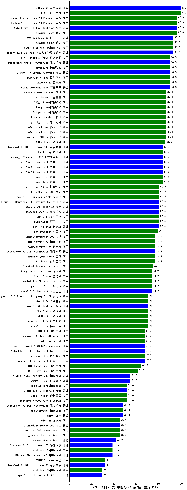

| 类别 | 大模型                         | CMB-医师考试-中级职称-结核病主治医师 | 排名 |
|-----|------------------------------|---------|----|
|商用|ERNIE-4.0|100.0|1|
|开源|DeepSeek-R1|100.0|2|
|开源|Meta-Llama-3.1-405B-Instruct|96.8|3|
|商用|Doubao-1.5-pro-32k-250115(new)|96.8|4|
|商用|hunyuan-large|96.8|5|
|商用|Doubao-1.5-lite-32k-250115(new)|96.8|6|
|商用|abab7-chat-preview|93.5|7|
|商用|hunyuan-turbo|93.5|8|
|开源|qwq-32b-preview|93.5|9|
|开源|internlm2_5-7b-chat|93.5|10|
|开源|qwen2.5-7b-instruct|90.3|11|
|商用|kimi-latest-8k(new)|90.3|12|
|开源|Llama-3.3-70B-Instruct-fp8|90.3|13|
|商用|Baichuan4-Turbo|90.3|14|
|开源|DeepSeek-R1-Distill-Qwen-32B|90.3|15|
|商用|360gpt2-o1|90.3|16|
|商用|GLM-4-Plus|90.3|17|
|商用|yi-lightning|87.1|18|
|商用|360gpt2-pro|87.1|19|
|商用|360gpt-pro|87.1|20|
|商用|xunfei-4.0Ultra|87.1|21|
|商用|xunfei-spark-pro|87.1|22|
|商用|xunfei-spark-max|87.1|23|
|商用|360gpt-turbo|87.1|24|
|商用|qwen2.5-max|87.1|25|
|商用|SenseChat-5-beta(new)|87.1|26|
|商用|hunyuan-standard|87.1|27|
|商用|GLM-4-Flash|86.2|28|
|开源|qwen2.5-32b-instruct|83.9|29|
|开源|qwen2.5-14b-instruct|83.9|30|
|商用|qwen-plus|83.9|31|
|商用|qwen-long|83.9|32|
|开源|qwen2.5-72b-instruct|83.9|33|
|开源|internlm2_5-20b-chat|83.9|34|
|商用|GLM-4-Long|83.9|35|
|开源|DeepSeek-R1-Distill-Qwen-14B|83.9|36|
|开源|glm-4-9b-chat|80.6|37|
|商用|qwen-turbo|80.6|38|
|商用|360zhinao2-o1(new)|80.6|39|
|商用|ERNIE-3.5-8K|80.6|40|
|商用|gemini-2.0-pro-exp-02-05|80.6|41|
|商用|SenseChat-5-1202|80.6|42|
|开源|Llama-3.3-70B-Instruct|80.6|43|
|开源|deepseek-chat-v3|80.6|44|
|开源|Llama-3.1-Nemotron-70B-Instruct-fp8|80.6|45|
|商用|ERNIE-Speed-8K|79.3|46|
|商用|MiniMax-Text-01|77.4|47|
|商用|SenseChat-Turbo-1202|77.4|48|
|商用|ERNIE-4.0-Turbo-8K|77.4|49|
|商用|Baichuan4|77.4|50|
|开源|DeepSeek-R1-Distill-Llama-70B|77.4|51|
|商用|GLM-Zero-Preview|77.4|52|
|商用|Claude-3.5-Sonnet|75.0|53|
|商用|chatgpt-4o-latest(new)|74.2|54|
|开源|qwen2.5-3b-instruct|74.2|55|
|商用|gemini-1.5-pro|74.2|56|
|商用|gemini-2.0-flash-exp|74.2|57|
|商用|GLM-4-FlashX|74.2|58|
|商用|GLM-4-Air|71.0|59|
|商用|GLM-4-AirX|71.0|60|
|商用|moonshot-v1-8k|71.0|61|
|商用|abab6.5s-chat|71.0|62|
|商用|gemini-2.0-flash-thinking-exp-01-21|71.0|63|
|商用|step-1-8k|71.0|64|
|开源|Llama-3.1-8B-Instruct|71.0|65|
|开源|qwen2.5-1.5b-instruct|67.7|66|
|商用|Baichuan4-Air|67.7|67|
|商用|gemini-2.0-flash-001|67.7|68|
|商用|o1-mini|67.7|69|
|开源|Meta-Llama-3.1-8B-Instruct-fp8|67.7|70|
|商用|ERNIE-Lite-8K|67.7|71|
|开源|Hermes-3-Llama-3.1-405B|67.7|72|
|商用|ERNIE-Speed-Pro-128K|64.5|73|
|商用|ERNIE-Lite-Pro-128K|61.3|74|
|开源|Mistral-Nemo-Instruct-2407|54.8|75|
|开源|gemma-2-27b-it|54.8|76|
|商用|step-1-flash|51.6|77|
|商用|mistral-large|51.6|78|
|开源|Llama-3.2-1B-Instruct|51.6|79|
|商用|gpt-4o-mini-2024-07-18|51.6|80|
|开源|phi-4|48.4|81|
|商用|mistral-small|48.4|82|
|开源|DeepSeek-R1-Distill-Qwen-1.5B|48.4|83|
|商用|o3-mini|45.2|84|
|商用|gemini-1.5-flash-8b|45.2|85|
|开源|Llama-3.2-3B-Instruct|45.2|86|
|商用|gemini-1.5-flash|45.2|87|
|开源|gemma-2-9b-it|41.9|88|
|开源|Mistral-7B-Instruct-v0.3|38.7|89|
|开源|DeepSeek-R1-Distill-Qwen-7B|38.7|90|
|商用|ministral-8b|38.7|91|
|开源|DeepSeek-R1-Distill-Llama-8B|32.3|92|
|商用|ERNIE-Tiny-8K|32.3|93|
|开源|qwen2.5-0.5b-instruct|29.0|94|
|商用|ministral-3b|29.0|95|
|开源|Yi-1.5-34B-Chat|/|96|
|开源|Yi-1.5-9B-Chat|/|97|
|开源|qwen2.5-math-72b-instruct|/|98|

