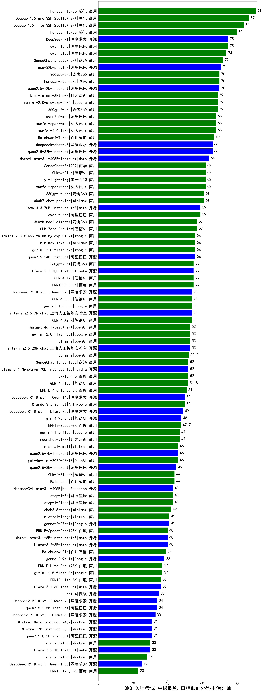

| 类别 | 大模型                         | CMB-医师考试-中级职称-口腔颌面外科主治医师 | 排名 |
|-----|------------------------------|---------|----|
|商用|hunyuan-turbo|91.0|1|
|商用|Doubao-1.5-pro-32k-250115(new)|87.0|2|
|商用|Doubao-1.5-lite-32k-250115(new)|84.0|3|
|商用|hunyuan-large|80.0|4|
|商用|qwen-long|75.0|5|
|开源|DeepSeek-R1|75.0|6|
|商用|qwen-plus|74.0|7|
|商用|SenseChat-5-beta(new)|72.0|8|
|开源|qwq-32b-preview|71.0|9|
|开源|qwen2.5-72b-instruct|70.0|10|
|商用|hunyuan-standard|70.0|11|
|商用|360gpt-pro|70.0|12|
|商用|360gpt2-pro|69.0|13|
|商用|gemini-2.0-pro-exp-02-05|69.0|14|
|商用|kimi-latest-8k(new)|69.0|15|
|商用|xunfei-spark-max|68.0|16|
|商用|xunfei-4.0Ultra|68.0|17|
|商用|qwen2.5-max|68.0|18|
|商用|Baichuan4-Turbo|67.0|19|
|开源|deepseek-chat-v3|66.0|20|
|开源|qwen2.5-32b-instruct|66.0|21|
|开源|Meta-Llama-3.1-405B-Instruct|64.0|22|
|商用|xunfei-spark-pro|62.0|23|
|商用|yi-lightning|62.0|24|
|商用|GLM-4-Plus|62.0|25|
|商用|SenseChat-5-1202|62.0|26|
|商用|360gpt-turbo|61.0|27|
|商用|abab7-chat-preview|61.0|28|
|商用|qwen-turbo|59.0|29|
|开源|Llama-3.3-70B-Instruct-fp8|59.0|30|
|商用|GLM-Zero-Preview|57.0|31|
|商用|360zhinao2-o1(new)|57.0|32|
|商用|MiniMax-Text-01|56.0|33|
|开源|qwen2.5-14b-instruct|56.0|34|
|商用|gemini-2.0-flash-thinking-exp-01-21|56.0|35|
|商用|gemini-2.0-flash-exp|56.0|36|
|开源|Llama-3.3-70B-Instruct|55.0|37|
|商用|360gpt2-o1|55.0|38|
|商用|ERNIE-3.5-8K|55.0|39|
|商用|GLM-4-Air|55.0|40|
|商用|gemini-1.5-pro|54.0|41|
|开源|internlm2_5-7b-chat|54.0|42|
|开源|DeepSeek-R1-Distill-Qwen-32B|54.0|43|
|商用|GLM-4-Long|54.0|44|
|商用|GLM-4-AirX|54.0|45|
|开源|internlm2_5-20b-chat|53.0|46|
|商用|chatgpt-4o-latest(new)|53.0|47|
|商用|o1-mini|53.0|48|
|商用|gemini-2.0-flash-001|53.0|49|
|商用|o3-mini|52.2|50|
|商用|SenseChat-Turbo-1202|52.0|51|
|商用|ERNIE-4.0|52.0|52|
|开源|Llama-3.1-Nemotron-70B-Instruct-fp8|52.0|53|
|商用|GLM-4-Flash|51.8|54|
|商用|ERNIE-4.0-Turbo-8K|51.0|55|
|商用|Claude-3.5-Sonnet|50.0|56|
|开源|DeepSeek-R1-Distill-Qwen-14B|50.0|57|
|开源|DeepSeek-R1-Distill-Llama-70B|49.0|58|
|开源|glm-4-9b-chat|48.0|59|
|商用|ERNIE-Speed-8K|47.7|60|
|商用|moonshot-v1-8k|47.0|61|
|商用|gemini-1.5-flash|47.0|62|
|开源|qwen2.5-7b-instruct|46.0|63|
|商用|gpt-4o-mini-2024-07-18|46.0|64|
|商用|mistral-small|46.0|65|
|开源|qwen2.5-3b-instruct|45.0|66|
|商用|GLM-4-FlashX|44.0|67|
|商用|Baichuan4|44.0|68|
|商用|step-1-flash|43.0|69|
|商用|step-1-8k|43.0|70|
|开源|Hermes-3-Llama-3.1-405B|43.0|71|
|商用|abab6.5s-chat|42.0|72|
|商用|mistral-large|41.0|73|
|开源|gemma-2-27b-it|41.0|74|
|商用|ERNIE-Speed-Pro-128K|40.0|75|
|开源|Llama-3.2-3B-Instruct|40.0|76|
|开源|Meta-Llama-3.1-8B-Instruct-fp8|40.0|77|
|商用|Baichuan4-Air|39.0|78|
|开源|gemma-2-9b-it|38.0|79|
|商用|ERNIE-Lite-Pro-128K|37.0|80|
|商用|gemini-1.5-flash-8b|37.0|81|
|开源|Llama-3.1-8B-Instruct|36.0|82|
|商用|ERNIE-Lite-8K|36.0|83|
|开源|phi-4|35.0|84|
|开源|DeepSeek-R1-Distill-Qwen-7B|34.0|85|
|开源|qwen2.5-1.5b-instruct|34.0|86|
|开源|DeepSeek-R1-Distill-Llama-8B|33.0|87|
|开源|Mistral-Nemo-Instruct-2407|31.0|88|
|开源|qwen2.5-0.5b-instruct|31.0|89|
|开源|Mistral-7B-Instruct-v0.3|31.0|90|
|开源|Llama-3.2-1B-Instruct|30.0|91|
|商用|ministral-3b|30.0|92|
|商用|ministral-8b|28.0|93|
|开源|DeepSeek-R1-Distill-Qwen-1.5B|25.0|94|
|商用|ERNIE-Tiny-8K|23.0|95|
|开源|Yi-1.5-34B-Chat|/|96|
|开源|Yi-1.5-9B-Chat|/|97|
|开源|qwen2.5-math-72b-instruct|/|98|

