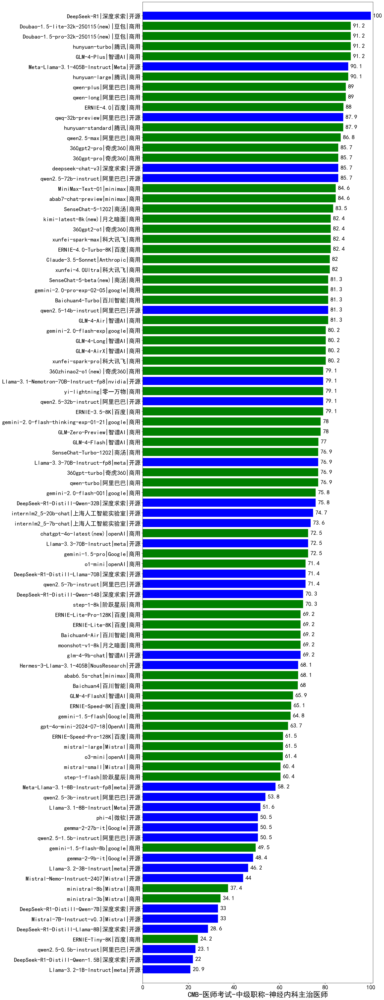

| 类别 | 大模型                         | CMB-医师考试-中级职称-神经内科主治医师 | 排名 |
|-----|------------------------------|---------|----|
|开源|DeepSeek-R1|100.0|1|
|商用|GLM-4-Plus|91.2|2|
|商用|hunyuan-turbo|91.2|3|
|商用|Doubao-1.5-pro-32k-250115(new)|91.2|4|
|商用|Doubao-1.5-lite-32k-250115(new)|91.2|5|
|商用|hunyuan-large|90.1|6|
|开源|Meta-Llama-3.1-405B-Instruct|90.1|7|
|商用|qwen-long|89.0|8|
|商用|qwen-plus|89.0|9|
|商用|ERNIE-4.0|88.0|10|
|开源|qwq-32b-preview|87.9|11|
|商用|hunyuan-standard|87.9|12|
|商用|qwen2.5-max|86.8|13|
|开源|qwen2.5-72b-instruct|85.7|14|
|商用|360gpt2-pro|85.7|15|
|开源|deepseek-chat-v3|85.7|16|
|商用|360gpt-pro|85.7|17|
|商用|abab7-chat-preview|84.6|18|
|商用|MiniMax-Text-01|84.6|19|
|商用|SenseChat-5-1202|83.5|20|
|商用|xunfei-spark-max|82.4|21|
|商用|ERNIE-4.0-Turbo-8K|82.4|22|
|商用|kimi-latest-8k(new)|82.4|23|
|商用|360gpt2-o1|82.4|24|
|商用|xunfei-4.0Ultra|82.0|25|
|商用|Claude-3.5-Sonnet|82.0|26|
|商用|Baichuan4-Turbo|81.3|27|
|商用|GLM-4-Air|81.3|28|
|商用|gemini-2.0-pro-exp-02-05|81.3|29|
|商用|SenseChat-5-beta(new)|81.3|30|
|开源|qwen2.5-14b-instruct|81.3|31|
|商用|GLM-4-Long|80.2|32|
|商用|xunfei-spark-pro|80.2|33|
|商用|GLM-4-AirX|80.2|34|
|商用|gemini-2.0-flash-exp|80.2|35|
|开源|Llama-3.1-Nemotron-70B-Instruct-fp8|79.1|36|
|商用|yi-lightning|79.1|37|
|商用|360zhinao2-o1(new)|79.1|38|
|商用|ERNIE-3.5-8K|79.1|39|
|开源|qwen2.5-32b-instruct|79.1|40|
|商用|gemini-2.0-flash-thinking-exp-01-21|78.0|41|
|商用|GLM-Zero-Preview|78.0|42|
|商用|GLM-4-Flash|77.0|43|
|开源|Llama-3.3-70B-Instruct-fp8|76.9|44|
|商用|qwen-turbo|76.9|45|
|商用|360gpt-turbo|76.9|46|
|商用|SenseChat-Turbo-1202|76.9|47|
|开源|DeepSeek-R1-Distill-Qwen-32B|75.8|48|
|商用|gemini-2.0-flash-001|75.8|49|
|开源|internlm2_5-20b-chat|74.7|50|
|开源|internlm2_5-7b-chat|73.6|51|
|商用|chatgpt-4o-latest(new)|72.5|52|
|开源|Llama-3.3-70B-Instruct|72.5|53|
|商用|gemini-1.5-pro|72.5|54|
|开源|DeepSeek-R1-Distill-Llama-70B|71.4|55|
|商用|o1-mini|71.4|56|
|开源|qwen2.5-7b-instruct|71.4|57|
|商用|step-1-8k|70.3|58|
|开源|DeepSeek-R1-Distill-Qwen-14B|70.3|59|
|商用|ERNIE-Lite-Pro-128K|69.2|60|
|商用|Baichuan4-Air|69.2|61|
|商用|ERNIE-Lite-8K|69.2|62|
|开源|glm-4-9b-chat|69.2|63|
|商用|moonshot-v1-8k|69.2|64|
|开源|Hermes-3-Llama-3.1-405B|68.1|65|
|商用|abab6.5s-chat|68.1|66|
|商用|Baichuan4|68.0|67|
|商用|GLM-4-FlashX|65.9|68|
|商用|ERNIE-Speed-8K|65.1|69|
|商用|gemini-1.5-flash|64.8|70|
|商用|gpt-4o-mini-2024-07-18|63.7|71|
|商用|ERNIE-Speed-Pro-128K|61.5|72|
|商用|mistral-large|61.5|73|
|商用|o3-mini|61.4|74|
|商用|mistral-small|60.4|75|
|商用|step-1-flash|60.4|76|
|开源|Meta-Llama-3.1-8B-Instruct-fp8|58.2|77|
|开源|qwen2.5-3b-instruct|53.8|78|
|开源|Llama-3.1-8B-Instruct|51.6|79|
|开源|qwen2.5-1.5b-instruct|50.5|80|
|开源|phi-4|50.5|81|
|开源|gemma-2-27b-it|50.5|82|
|商用|gemini-1.5-flash-8b|49.5|83|
|开源|gemma-2-9b-it|48.4|84|
|开源|Llama-3.2-3B-Instruct|46.2|85|
|开源|Mistral-Nemo-Instruct-2407|44.0|86|
|商用|ministral-8b|37.4|87|
|商用|ministral-3b|34.1|88|
|开源|Mistral-7B-Instruct-v0.3|33.0|89|
|开源|DeepSeek-R1-Distill-Qwen-7B|33.0|90|
|开源|DeepSeek-R1-Distill-Llama-8B|28.6|91|
|商用|ERNIE-Tiny-8K|24.2|92|
|开源|qwen2.5-0.5b-instruct|23.1|93|
|开源|DeepSeek-R1-Distill-Qwen-1.5B|22.0|94|
|开源|Llama-3.2-1B-Instruct|20.9|95|
|开源|Yi-1.5-34B-Chat|/|96|
|开源|Yi-1.5-9B-Chat|/|97|
|开源|qwen2.5-math-72b-instruct|/|98|

