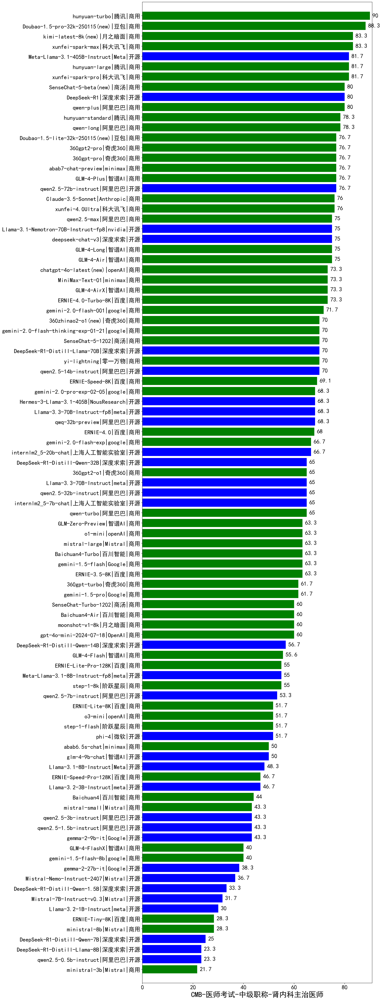

| 类别 | 大模型                         | CMB-医师考试-中级职称-肾内科主治医师 | 排名 |
|-----|------------------------------|---------|----|
|商用|hunyuan-turbo|90.0|1|
|商用|Doubao-1.5-pro-32k-250115(new)|88.3|2|
|商用|xunfei-spark-max|83.3|3|
|商用|kimi-latest-8k(new)|83.3|4|
|商用|hunyuan-large|81.7|5|
|开源|Meta-Llama-3.1-405B-Instruct|81.7|6|
|商用|xunfei-spark-pro|81.7|7|
|商用|qwen-plus|80.0|8|
|开源|DeepSeek-R1|80.0|9|
|商用|SenseChat-5-beta(new)|80.0|10|
|商用|hunyuan-standard|78.3|11|
|商用|qwen-long|78.3|12|
|开源|qwen2.5-72b-instruct|76.7|13|
|商用|360gpt2-pro|76.7|14|
|商用|Doubao-1.5-lite-32k-250115(new)|76.7|15|
|商用|360gpt-pro|76.7|16|
|商用|GLM-4-Plus|76.7|17|
|商用|abab7-chat-preview|76.7|18|
|商用|Claude-3.5-Sonnet|76.0|19|
|商用|xunfei-4.0Ultra|76.0|20|
|开源|Llama-3.1-Nemotron-70B-Instruct-fp8|75.0|21|
|开源|deepseek-chat-v3|75.0|22|
|商用|GLM-4-Air|75.0|23|
|商用|qwen2.5-max|75.0|24|
|商用|GLM-4-Long|75.0|25|
|商用|ERNIE-4.0-Turbo-8K|73.3|26|
|商用|MiniMax-Text-01|73.3|27|
|商用|chatgpt-4o-latest(new)|73.3|28|
|商用|GLM-4-AirX|73.3|29|
|商用|gemini-2.0-flash-001|71.7|30|
|商用|yi-lightning|70.0|31|
|商用|SenseChat-5-1202|70.0|32|
|商用|gemini-2.0-flash-thinking-exp-01-21|70.0|33|
|开源|qwen2.5-14b-instruct|70.0|34|
|商用|360zhinao2-o1(new)|70.0|35|
|开源|DeepSeek-R1-Distill-Llama-70B|70.0|36|
|商用|ERNIE-Speed-8K|69.1|37|
|开源|Llama-3.3-70B-Instruct-fp8|68.3|38|
|开源|qwq-32b-preview|68.3|39|
|商用|gemini-2.0-pro-exp-02-05|68.3|40|
|开源|Hermes-3-Llama-3.1-405B|68.3|41|
|商用|ERNIE-4.0|68.0|42|
|开源|internlm2_5-20b-chat|66.7|43|
|商用|gemini-2.0-flash-exp|66.7|44|
|商用|qwen-turbo|65.0|45|
|开源|qwen2.5-32b-instruct|65.0|46|
|开源|DeepSeek-R1-Distill-Qwen-32B|65.0|47|
|开源|internlm2_5-7b-chat|65.0|48|
|商用|360gpt2-o1|65.0|49|
|开源|Llama-3.3-70B-Instruct|65.0|50|
|商用|ERNIE-3.5-8K|63.3|51|
|商用|mistral-large|63.3|52|
|商用|GLM-Zero-Preview|63.3|53|
|商用|o1-mini|63.3|54|
|商用|Baichuan4-Turbo|63.3|55|
|商用|gemini-1.5-flash|63.3|56|
|商用|gemini-1.5-pro|61.7|57|
|商用|360gpt-turbo|61.7|58|
|商用|moonshot-v1-8k|60.0|59|
|商用|gpt-4o-mini-2024-07-18|60.0|60|
|商用|SenseChat-Turbo-1202|60.0|61|
|商用|Baichuan4-Air|60.0|62|
|开源|DeepSeek-R1-Distill-Qwen-14B|56.7|63|
|商用|GLM-4-Flash|55.6|64|
|商用|ERNIE-Lite-Pro-128K|55.0|65|
|商用|step-1-8k|55.0|66|
|开源|Meta-Llama-3.1-8B-Instruct-fp8|55.0|67|
|开源|qwen2.5-7b-instruct|53.3|68|
|商用|ERNIE-Lite-8K|51.7|69|
|开源|phi-4|51.7|70|
|商用|step-1-flash|51.7|71|
|商用|o3-mini|51.7|72|
|开源|glm-4-9b-chat|50.0|73|
|商用|abab6.5s-chat|50.0|74|
|开源|Llama-3.1-8B-Instruct|48.3|75|
|开源|Llama-3.2-3B-Instruct|46.7|76|
|商用|ERNIE-Speed-Pro-128K|46.7|77|
|商用|Baichuan4|44.0|78|
|开源|qwen2.5-3b-instruct|43.3|79|
|开源|qwen2.5-1.5b-instruct|43.3|80|
|商用|mistral-small|43.3|81|
|开源|gemma-2-9b-it|43.3|82|
|商用|gemini-1.5-flash-8b|40.0|83|
|商用|GLM-4-FlashX|40.0|84|
|开源|gemma-2-27b-it|38.3|85|
|开源|Mistral-Nemo-Instruct-2407|36.7|86|
|开源|DeepSeek-R1-Distill-Qwen-1.5B|33.3|87|
|开源|Mistral-7B-Instruct-v0.3|31.7|88|
|开源|Llama-3.2-1B-Instruct|30.0|89|
|商用|ministral-8b|28.3|90|
|商用|ERNIE-Tiny-8K|28.3|91|
|开源|DeepSeek-R1-Distill-Qwen-7B|25.0|92|
|开源|qwen2.5-0.5b-instruct|23.3|93|
|开源|DeepSeek-R1-Distill-Llama-8B|23.3|94|
|商用|ministral-3b|21.7|95|
|开源|Yi-1.5-34B-Chat|/|96|
|开源|Yi-1.5-9B-Chat|/|97|
|开源|qwen2.5-math-72b-instruct|/|98|

