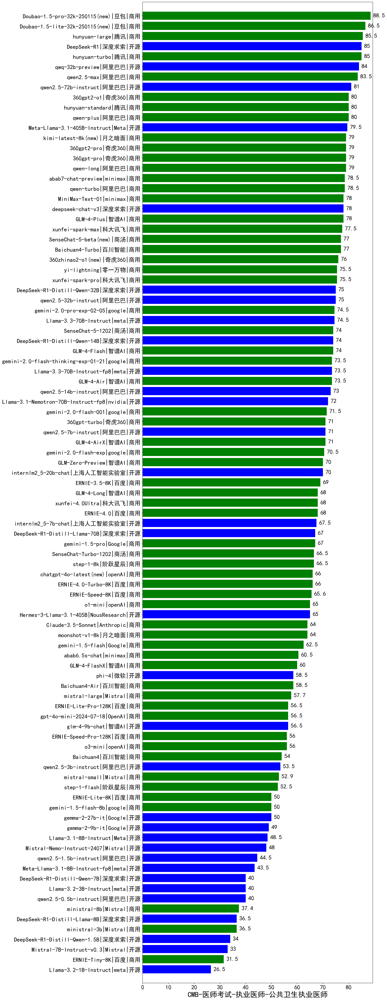

| 类别 | 大模型                         | CMB-医师考试-执业医师-公共卫生执业医师 | 排名 |
|-----|------------------------------|---------|----|
|商用|Doubao-1.5-pro-32k-250115(new)|88.5|1|
|商用|Doubao-1.5-lite-32k-250115(new)|86.5|2|
|商用|hunyuan-large|85.5|3|
|商用|hunyuan-turbo|85.0|4|
|开源|DeepSeek-R1|85.0|5|
|开源|qwq-32b-preview|84.0|6|
|商用|qwen2.5-max|83.5|7|
|开源|qwen2.5-72b-instruct|81.0|8|
|商用|hunyuan-standard|80.0|9|
|商用|360gpt2-o1|80.0|10|
|商用|qwen-plus|80.0|11|
|开源|Meta-Llama-3.1-405B-Instruct|79.5|12|
|商用|qwen-long|79.0|13|
|商用|kimi-latest-8k(new)|79.0|14|
|商用|360gpt2-pro|79.0|15|
|商用|360gpt-pro|79.0|16|
|商用|abab7-chat-preview|78.5|17|
|商用|qwen-turbo|78.5|18|
|商用|GLM-4-Plus|78.0|19|
|开源|deepseek-chat-v3|78.0|20|
|商用|MiniMax-Text-01|78.0|21|
|商用|xunfei-spark-max|77.5|22|
|商用|SenseChat-5-beta(new)|77.0|23|
|商用|Baichuan4-Turbo|77.0|24|
|商用|360zhinao2-o1(new)|76.0|25|
|商用|xunfei-spark-pro|75.5|26|
|商用|yi-lightning|75.5|27|
|开源|qwen2.5-32b-instruct|75.0|28|
|开源|DeepSeek-R1-Distill-Qwen-32B|75.0|29|
|商用|gemini-2.0-pro-exp-02-05|74.5|30|
|开源|Llama-3.3-70B-Instruct|74.5|31|
|商用|SenseChat-5-1202|74.0|32|
|商用|GLM-4-Flash|74.0|33|
|开源|DeepSeek-R1-Distill-Qwen-14B|74.0|34|
|商用|GLM-4-Air|73.5|35|
|开源|Llama-3.3-70B-Instruct-fp8|73.5|36|
|商用|gemini-2.0-flash-thinking-exp-01-21|73.5|37|
|开源|qwen2.5-14b-instruct|73.0|38|
|开源|Llama-3.1-Nemotron-70B-Instruct-fp8|72.0|39|
|商用|gemini-2.0-flash-001|71.5|40|
|商用|GLM-4-AirX|71.0|41|
|开源|qwen2.5-7b-instruct|71.0|42|
|商用|360gpt-turbo|71.0|43|
|商用|gemini-2.0-flash-exp|70.5|44|
|开源|internlm2_5-20b-chat|70.0|45|
|商用|GLM-Zero-Preview|70.0|46|
|商用|ERNIE-3.5-8K|69.0|47|
|商用|GLM-4-Long|68.0|48|
|商用|xunfei-4.0Ultra|68.0|49|
|商用|ERNIE-4.0|68.0|50|
|开源|internlm2_5-7b-chat|67.5|51|
|开源|DeepSeek-R1-Distill-Llama-70B|67.0|52|
|商用|gemini-1.5-pro|67.0|53|
|商用|step-1-8k|66.5|54|
|商用|SenseChat-Turbo-1202|66.5|55|
|商用|chatgpt-4o-latest(new)|66.0|56|
|商用|ERNIE-4.0-Turbo-8K|66.0|57|
|商用|ERNIE-Speed-8K|65.6|58|
|商用|o1-mini|65.0|59|
|开源|Hermes-3-Llama-3.1-405B|65.0|60|
|商用|moonshot-v1-8k|64.0|61|
|商用|Claude-3.5-Sonnet|64.0|62|
|商用|gemini-1.5-flash|62.5|63|
|商用|abab6.5s-chat|60.5|64|
|商用|GLM-4-FlashX|60.0|65|
|商用|Baichuan4-Air|58.5|66|
|开源|phi-4|58.5|67|
|商用|mistral-large|57.7|68|
|开源|glm-4-9b-chat|56.5|69|
|商用|gpt-4o-mini-2024-07-18|56.5|70|
|商用|ERNIE-Lite-Pro-128K|56.5|71|
|商用|o3-mini|56.0|72|
|商用|ERNIE-Speed-Pro-128K|56.0|73|
|商用|Baichuan4|54.0|74|
|开源|qwen2.5-3b-instruct|53.5|75|
|商用|mistral-small|52.9|76|
|商用|step-1-flash|52.5|77|
|商用|gemini-1.5-flash-8b|50.0|78|
|开源|gemma-2-27b-it|50.0|79|
|商用|ERNIE-Lite-8K|50.0|80|
|开源|gemma-2-9b-it|49.0|81|
|开源|Llama-3.1-8B-Instruct|48.5|82|
|开源|Mistral-Nemo-Instruct-2407|48.0|83|
|开源|qwen2.5-1.5b-instruct|44.5|84|
|开源|Meta-Llama-3.1-8B-Instruct-fp8|43.5|85|
|开源|qwen2.5-0.5b-instruct|40.0|86|
|开源|DeepSeek-R1-Distill-Qwen-7B|40.0|87|
|开源|Llama-3.2-3B-Instruct|40.0|88|
|商用|ministral-8b|37.4|89|
|开源|DeepSeek-R1-Distill-Llama-8B|36.5|90|
|商用|ministral-3b|36.5|91|
|开源|DeepSeek-R1-Distill-Qwen-1.5B|34.0|92|
|开源|Mistral-7B-Instruct-v0.3|33.0|93|
|商用|ERNIE-Tiny-8K|31.5|94|
|开源|Llama-3.2-1B-Instruct|26.5|95|
|开源|Yi-1.5-34B-Chat|/|96|
|开源|Yi-1.5-9B-Chat|/|97|
|开源|qwen2.5-math-72b-instruct|/|98|

