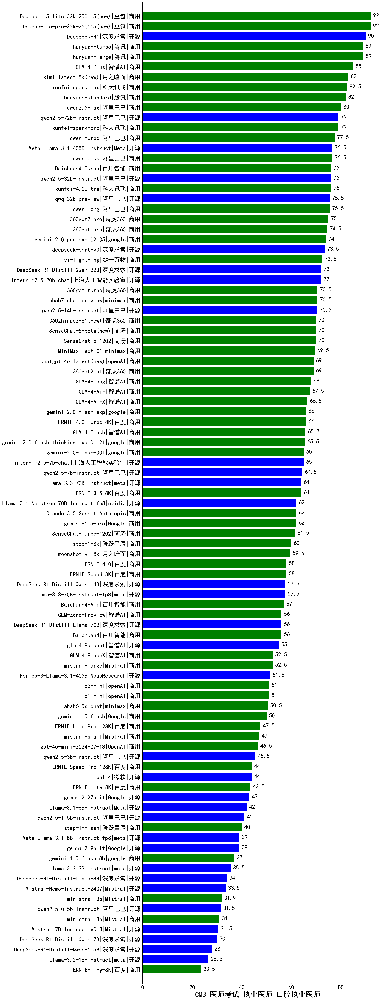

| 类别 | 大模型                         | CMB-医师考试-执业医师-口腔执业医师 | 排名 |
|-----|------------------------------|---------|----|
|商用|Doubao-1.5-lite-32k-250115(new)|92.0|1|
|商用|Doubao-1.5-pro-32k-250115(new)|92.0|2|
|开源|DeepSeek-R1|90.0|3|
|商用|hunyuan-turbo|89.0|4|
|商用|hunyuan-large|89.0|5|
|商用|GLM-4-Plus|85.0|6|
|商用|kimi-latest-8k(new)|83.0|7|
|商用|xunfei-spark-max|82.5|8|
|商用|hunyuan-standard|82.0|9|
|商用|qwen2.5-max|80.0|10|
|开源|qwen2.5-72b-instruct|79.0|11|
|商用|xunfei-spark-pro|79.0|12|
|商用|qwen-turbo|77.5|13|
|商用|qwen-plus|76.5|14|
|开源|Meta-Llama-3.1-405B-Instruct|76.5|15|
|商用|Baichuan4-Turbo|76.0|16|
|开源|qwen2.5-32b-instruct|76.0|17|
|商用|xunfei-4.0Ultra|76.0|18|
|开源|qwq-32b-preview|75.5|19|
|商用|qwen-long|75.5|20|
|商用|360gpt2-pro|75.0|21|
|商用|360gpt-pro|74.5|22|
|商用|gemini-2.0-pro-exp-02-05|74.0|23|
|开源|deepseek-chat-v3|73.5|24|
|商用|yi-lightning|72.5|25|
|开源|internlm2_5-20b-chat|72.0|26|
|开源|DeepSeek-R1-Distill-Qwen-32B|72.0|27|
|开源|qwen2.5-14b-instruct|70.5|28|
|商用|abab7-chat-preview|70.5|29|
|商用|360gpt-turbo|70.5|30|
|商用|SenseChat-5-1202|70.0|31|
|商用|SenseChat-5-beta(new)|70.0|32|
|商用|360zhinao2-o1(new)|70.0|33|
|商用|MiniMax-Text-01|69.5|34|
|商用|chatgpt-4o-latest(new)|69.0|35|
|商用|360gpt2-o1|69.0|36|
|商用|GLM-4-Long|68.0|37|
|商用|GLM-4-Air|67.5|38|
|商用|GLM-4-AirX|66.5|39|
|商用|ERNIE-4.0-Turbo-8K|66.0|40|
|商用|gemini-2.0-flash-exp|66.0|41|
|商用|GLM-4-Flash|65.7|42|
|商用|gemini-2.0-flash-thinking-exp-01-21|65.5|43|
|商用|gemini-2.0-flash-001|65.0|44|
|开源|internlm2_5-7b-chat|65.0|45|
|开源|qwen2.5-7b-instruct|64.5|46|
|商用|ERNIE-3.5-8K|64.0|47|
|开源|Llama-3.3-70B-Instruct|64.0|48|
|开源|Llama-3.1-Nemotron-70B-Instruct-fp8|62.0|49|
|商用|gemini-1.5-pro|62.0|50|
|商用|Claude-3.5-Sonnet|62.0|51|
|商用|SenseChat-Turbo-1202|61.5|52|
|商用|step-1-8k|60.0|53|
|商用|moonshot-v1-8k|59.5|54|
|商用|ERNIE-4.0|58.0|55|
|商用|ERNIE-Speed-8K|58.0|56|
|开源|DeepSeek-R1-Distill-Qwen-14B|57.5|57|
|开源|Llama-3.3-70B-Instruct-fp8|57.5|58|
|商用|Baichuan4-Air|57.0|59|
|开源|DeepSeek-R1-Distill-Llama-70B|56.0|60|
|商用|GLM-Zero-Preview|56.0|61|
|商用|Baichuan4|56.0|62|
|开源|glm-4-9b-chat|55.0|63|
|商用|mistral-large|52.5|64|
|商用|GLM-4-FlashX|52.5|65|
|开源|Hermes-3-Llama-3.1-405B|51.5|66|
|商用|o3-mini|51.0|67|
|商用|o1-mini|51.0|68|
|商用|abab6.5s-chat|50.5|69|
|商用|gemini-1.5-flash|50.0|70|
|商用|ERNIE-Lite-Pro-128K|47.5|71|
|商用|mistral-small|47.0|72|
|商用|gpt-4o-mini-2024-07-18|46.5|73|
|开源|qwen2.5-3b-instruct|45.5|74|
|商用|ERNIE-Speed-Pro-128K|44.0|75|
|开源|phi-4|44.0|76|
|商用|ERNIE-Lite-8K|43.5|77|
|开源|gemma-2-27b-it|43.0|78|
|开源|Llama-3.1-8B-Instruct|42.0|79|
|开源|qwen2.5-1.5b-instruct|41.0|80|
|商用|step-1-flash|40.0|81|
|开源|gemma-2-9b-it|39.0|82|
|开源|Meta-Llama-3.1-8B-Instruct-fp8|39.0|83|
|商用|gemini-1.5-flash-8b|37.0|84|
|开源|Llama-3.2-3B-Instruct|35.5|85|
|开源|DeepSeek-R1-Distill-Llama-8B|34.0|86|
|开源|Mistral-Nemo-Instruct-2407|33.5|87|
|商用|ministral-3b|31.9|88|
|开源|qwen2.5-0.5b-instruct|31.5|89|
|商用|ministral-8b|31.0|90|
|开源|Mistral-7B-Instruct-v0.3|30.5|91|
|开源|DeepSeek-R1-Distill-Qwen-7B|30.0|92|
|开源|DeepSeek-R1-Distill-Qwen-1.5B|28.0|93|
|开源|Llama-3.2-1B-Instruct|26.5|94|
|商用|ERNIE-Tiny-8K|23.5|95|
|开源|Yi-1.5-34B-Chat|/|96|
|开源|Yi-1.5-9B-Chat|/|97|
|开源|qwen2.5-math-72b-instruct|/|98|

