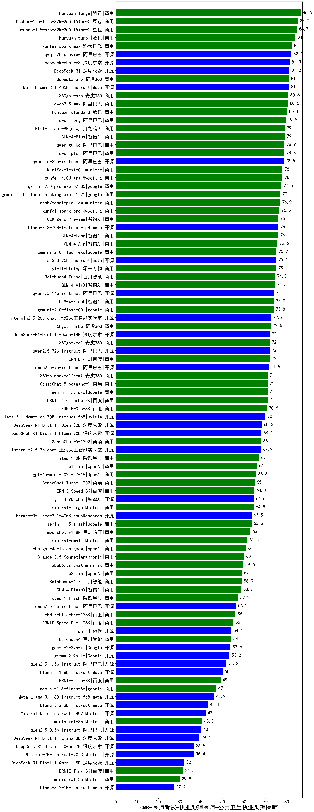

| 类别 | 大模型                         | CMB-医师考试-执业助理医师-公共卫生执业助理医师 | 排名 |
|-----|------------------------------|---------|----|
|商用|hunyuan-turbos-20250226(new)|88.3|1|
|商用|hunyuan-large|86.5|2|
|商用|Doubao-1.5-lite-32k-250115|85.2|3|
|商用|Doubao-1.5-pro-32k-250115|84.7|4|
|商用|hunyuan-turbo|84.0|5|
|商用|xunfei-spark-max|82.4|6|
|开源|qwq-32b-preview|82.1|7|
|开源|qwq-32b(new)|82.0|8|
|商用|qwq-plus-2025-03-05(new)|81.5|9|
|开源|deepseek-chat-v3|81.3|10|
|开源|DeepSeek-R1|81.2|11|
|开源|Meta-Llama-3.1-405B-Instruct|81.0|12|
|商用|360gpt2-pro|81.0|13|
|商用|360gpt-pro|80.6|14|
|商用|qwen2.5-max|80.5|15|
|商用|hunyuan-standard|80.1|16|
|商用|qwen-long|79.5|17|
|商用|kimi-latest-8k|79.0|18|
|商用|GLM-4-Plus|79.0|19|
|商用|qwen-turbo|78.9|20|
|商用|qwen-plus|78.8|21|
|开源|qwen2.5-32b-instruct|78.5|22|
|商用|xunfei-4.0Ultra|78.0|23|
|商用|MiniMax-Text-01|78.0|24|
|商用|gemini-2.0-pro-exp-02-05|77.5|25|
|商用|gemini-2.0-flash-thinking-exp-01-21|77.0|26|
|商用|abab7-chat-preview|76.9|27|
|商用|xunfei-spark-pro|76.5|28|
|商用|GLM-4-Long|76.0|29|
|商用|GLM-Zero-Preview|76.0|30|
|开源|Llama-3.3-70B-Instruct-fp8|76.0|31|
|商用|GLM-4-Air|75.6|32|
|商用|gemini-2.0-flash-exp|75.2|33|
|商用|yi-lightning|75.1|34|
|开源|Llama-3.3-70B-Instruct|75.1|35|
|商用|Baichuan4-Turbo|74.5|36|
|商用|GLM-4-AirX|74.5|37|
|开源|qwen2.5-14b-instruct|74.0|38|
|商用|GLM-4-Flash|73.9|39|
|商用|gemini-2.0-flash-001|73.8|40|
|开源|internlm2_5-20b-chat|72.7|41|
|商用|360gpt-turbo|72.5|42|
|开源|DeepSeek-R1-Distill-Qwen-14B|72.0|43|
|开源|qwen2.5-72b-instruct|72.0|44|
|商用|360gpt2-o1|72.0|45|
|商用|ERNIE-4.0|72.0|46|
|开源|qwen2.5-7b-instruct|71.5|47|
|商用|gemini-1.5-pro|71.0|48|
|商用|ERNIE-4.0-Turbo-8K|71.0|49|
|商用|SenseChat-5-beta|71.0|50|
|商用|360zhinao2-o1|71.0|51|
|商用|ERNIE-3.5-8K|70.6|52|
|开源|Llama-3.1-Nemotron-70B-Instruct-fp8|70.0|53|
|开源|DeepSeek-R1-Distill-Qwen-32B|68.3|54|
|开源|DeepSeek-R1-Distill-Llama-70B|68.1|55|
|商用|SenseChat-5-1202|68.0|56|
|开源|internlm2_5-7b-chat|67.9|57|
|商用|step-2-mini(new)|67.6|58|
|商用|step-1-8k|67.0|59|
|商用|o1-mini|66.0|60|
|商用|gpt-4o-mini-2024-07-18|65.6|61|
|商用|SenseChat-Turbo-1202|65.0|62|
|商用|ERNIE-Speed-8K|64.8|63|
|开源|glm-4-9b-chat|64.6|64|
|商用|mistral-large|64.5|65|
|商用|gemini-1.5-flash|63.5|66|
|开源|Hermes-3-Llama-3.1-405B|63.5|67|
|商用|moonshot-v1-8k|63.0|68|
|商用|mistral-small|61.5|69|
|商用|chatgpt-4o-latest|61.0|70|
|商用|Claude-3.5-Sonnet|60.0|71|
|商用|abab6.5s-chat|59.6|72|
|商用|o3-mini|59.0|73|
|商用|Baichuan4-Air|58.9|74|
|商用|GLM-4-FlashX|58.7|75|
|商用|step-1-flash|57.2|76|
|开源|qwen2.5-3b-instruct|56.2|77|
|商用|ERNIE-Lite-Pro-128K|56.0|78|
|商用|ERNIE-Speed-Pro-128K|55.0|79|
|开源|phi-4|54.1|80|
|商用|Baichuan4|54.0|81|
|开源|gemma-2-27b-it|53.6|82|
|开源|gemma-2-9b-it|53.2|83|
|开源|qwen2.5-1.5b-instruct|51.6|84|
|开源|Llama-3.1-8B-Instruct|50.0|85|
|商用|ERNIE-Lite-8K|49.0|86|
|商用|gemini-1.5-flash-8b|47.0|87|
|开源|Meta-Llama-3.1-8B-Instruct-fp8|45.9|88|
|商用|xunfei-spark-lite(new)|45.8|89|
|开源|Llama-3.2-3B-Instruct|43.1|90|
|开源|Mistral-Nemo-Instruct-2407|42.0|91|
|商用|ministral-8b|40.3|92|
|开源|qwen2.5-0.5b-instruct|40.0|93|
|开源|DeepSeek-R1-Distill-Llama-8B|39.1|94|
|开源|DeepSeek-R1-Distill-Qwen-7B|36.5|95|
|开源|Mistral-7B-Instruct-v0.3|36.4|96|
|开源|DeepSeek-R1-Distill-Qwen-1.5B|32.0|97|
|商用|ERNIE-Tiny-8K|31.5|98|
|商用|ministral-3b|29.9|99|
|开源|Llama-3.2-1B-Instruct|27.2|100|
|开源|Yi-1.5-9B-Chat|/|101|
|开源|Yi-1.5-34B-Chat|/|102|
|开源|qwen2.5-math-72b-instruct|/|103|

