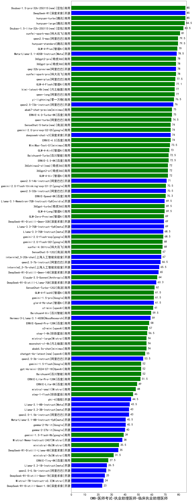

| 类别 | 大模型                         | CMB-医师考试-执业助理医师-临床执业助理医师 | 排名 |
|-----|------------------------------|---------|----|
|开源|DeepSeek-R1|85.0|1|
|商用|hunyuan-turbo|85.0|2|
|商用|Doubao-1.5-pro-32k-250115(new)|85.0|3|
|商用|hunyuan-large|84.5|4|
|商用|Doubao-1.5-lite-32k-250115(new)|83.5|5|
|商用|xunfei-spark-max|81.0|6|
|商用|qwen2.5-max|79.5|7|
|商用|hunyuan-standard|79.5|8|
|商用|GLM-4-Plus|79.0|9|
|开源|Meta-Llama-3.1-405B-Instruct|78.5|10|
|商用|360gpt2-pro|78.0|11|
|商用|360gpt-pro|78.0|12|
|开源|qwq-32b-preview|78.0|13|
|商用|xunfei-spark-pro|78.0|14|
|商用|qwen-plus|77.5|15|
|商用|GLM-4-Flash|77.1|16|
|商用|qwen-long|77.0|17|
|商用|kimi-latest-8k(new)|77.0|18|
|商用|yi-lightning|76.5|19|
|开源|qwen2.5-72b-instruct|76.0|20|
|商用|abab7-chat-preview|75.0|21|
|商用|ERNIE-4.0-Turbo-8K|75.0|22|
|商用|qwen-turbo|74.5|23|
|商用|gemini-2.0-pro-exp-02-05|74.0|24|
|开源|deepseek-chat-v3|74.0|25|
|商用|ERNIE-4.0|74.0|26|
|商用|SenseChat-5-beta(new)|74.0|27|
|商用|MiniMax-Text-01|73.5|28|
|商用|GLM-4-AirX|73.0|29|
|商用|ERNIE-3.5-8K|72.5|30|
|商用|Baichuan4-Turbo|72.5|31|
|商用|360gpt2-o1|72.0|32|
|商用|GLM-4-Air|72.0|33|
|商用|360zhinao2-o1(new)|72.0|34|
|开源|qwen2.5-14b-instruct|71.0|35|
|商用|gemini-2.0-flash-thinking-exp-01-21|70.5|36|
|开源|qwen2.5-32b-instruct|70.5|37|
|商用|ERNIE-Speed-8K|70.3|38|
|商用|360gpt-turbo|69.5|39|
|商用|GLM-4-Long|69.5|40|
|开源|Llama-3.1-Nemotron-70B-Instruct-fp8|69.5|41|
|开源|DeepSeek-R1-Distill-Qwen-32B|69.0|42|
|开源|Llama-3.3-70B-Instruct-fp8|69.0|43|
|商用|GLM-Zero-Preview|69.0|44|
|开源|Llama-3.3-70B-Instruct|68.5|45|
|商用|gemini-2.0-flash-exp|68.5|46|
|商用|gemini-2.0-flash-001|68.0|47|
|商用|xunfei-4.0Ultra|68.0|48|
|开源|internlm2_5-20b-chat|67.0|49|
|商用|SenseChat-5-1202|67.0|50|
|开源|qwen2.5-7b-instruct|66.5|51|
|开源|internlm2_5-7b-chat|65.5|52|
|开源|DeepSeek-R1-Distill-Qwen-14B|65.0|53|
|商用|Claude-3.5-Sonnet|64.0|54|
|开源|DeepSeek-R1-Distill-Llama-70B|63.3|55|
|商用|SenseChat-Turbo-1202|62.0|56|
|商用|GLM-4-FlashX|61.5|57|
|商用|gemini-1.5-pro|61.5|58|
|开源|glm-4-9b-chat|61.5|59|
|商用|o1-mini|61.0|60|
|商用|Baichuan4-Air|59.5|61|
|开源|Hermes-3-Llama-3.1-405B|59.0|62|
|商用|ERNIE-Speed-Pro-128K|58.0|63|
|商用|o3-mini|57.0|64|
|商用|step-1-8k|56.5|65|
|商用|moonshot-v1-8k|56.0|66|
|商用|abab6.5s-chat|56.0|67|
|商用|mistral-large|56.0|68|
|商用|chatgpt-4o-latest(new)|55.0|69|
|开源|qwen2.5-3b-instruct|53.5|70|
|商用|Baichuan4|52.0|71|
|商用|gpt-4o-mini-2024-07-18|52.0|72|
|商用|gemini-1.5-flash|52.0|73|
|商用|ERNIE-Lite-Pro-128K|51.5|74|
|商用|ERNIE-Lite-8K|49.0|75|
|商用|mistral-small|48.0|76|
|商用|step-1-flash|46.0|77|
|开源|phi-4|44.5|78|
|开源|Llama-3.1-8B-Instruct|43.5|79|
|开源|qwen2.5-1.5b-instruct|43.0|80|
|开源|Llama-3.2-3B-Instruct|43.0|81|
|开源|gemma-2-9b-it|40.5|82|
|开源|Meta-Llama-3.1-8B-Instruct-fp8|40.5|83|
|开源|gemma-2-27b-it|40.0|84|
|商用|gemini-1.5-flash-8b|39.0|85|
|开源|Mistral-Nemo-Instruct-2407|38.0|86|
|商用|ministral-8b|35.5|87|
|开源|DeepSeek-R1-Distill-Llama-8B|35.0|88|
|商用|ministral-3b|31.5|89|
|商用|ERNIE-Tiny-8K|27.5|90|
|开源|Llama-3.2-1B-Instruct|26.5|91|
|开源|qwen2.5-0.5b-instruct|26.0|92|
|开源|DeepSeek-R1-Distill-Qwen-7B|25.0|93|
|开源|Mistral-7B-Instruct-v0.3|24.0|94|
|开源|DeepSeek-R1-Distill-Qwen-1.5B|23.0|95|
|开源|Yi-1.5-34B-Chat|/|96|
|开源|Yi-1.5-9B-Chat|/|97|
|开源|qwen2.5-math-72b-instruct|/|98|

