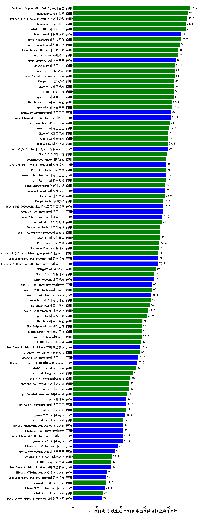

| 类别 | 大模型                         | CMB-医师考试-执业助理医师-中西医结合执业助理医师 | 排名 |
|-----|------------------------------|---------|----|
|商用|Doubao-1.5-pro-32k-250115(new)|97.5|1|
|商用|hunyuan-turbo|96.0|2|
|商用|Doubao-1.5-lite-32k-250115(new)|95.5|3|
|商用|hunyuan-large|94.2|4|
|商用|xunfei-4.0Ultra|94.0|5|
|开源|DeepSeek-R1|90.0|6|
|商用|xunfei-spark-max|89.9|7|
|商用|xunfei-spark-pro|89.0|8|
|商用|kimi-latest-8k(new)|88.0|9|
|商用|hunyuan-standard|88.0|10|
|开源|qwq-32b-preview|86.0|11|
|商用|qwen2.5-max|85.1|12|
|商用|abab7-chat-preview|85.0|13|
|商用|360gpt2-pro|85.0|14|
|商用|360gpt-pro|84.5|15|
|商用|qwen-plus|84.0|16|
|商用|ERNIE-4.0|84.0|17|
|商用|GLM-4-Plus|84.0|18|
|商用|Baichuan4-Turbo|82.5|19|
|商用|qwen-long|82.5|20|
|开源|qwen2.5-72b-instruct|82.0|21|
|开源|Meta-Llama-3.1-405B-Instruct|81.5|22|
|商用|MiniMax-Text-01|81.0|23|
|商用|qwen-turbo|80.5|24|
|商用|GLM-4-AirX|79.5|25|
|商用|GLM-4-Air|79.5|26|
|商用|GLM-4-Flash|79.2|27|
|开源|internlm2_5-7b-chat|79.0|28|
|商用|ERNIE-3.5-8K|78.5|29|
|商用|ERNIE-4.0-Turbo-8K|78.0|30|
|商用|360zhinao2-o1(new)|78.0|31|
|开源|DeepSeek-R1-Distill-Qwen-32B|78.0|32|
|开源|qwen2.5-14b-instruct|77.7|33|
|商用|yi-lightning|77.5|34|
|开源|deepseek-chat-v3|77.0|35|
|商用|SenseChat-5-beta(new)|77.0|36|
|商用|GLM-4-Long|76.5|37|
|开源|internlm2_5-20b-chat|75.5|38|
|商用|360gpt-turbo|75.5|39|
|开源|qwen2.5-32b-instruct|75.0|40|
|开源|qwen2.5-7b-instruct|74.5|41|
|商用|SenseChat-5-1202|74.0|42|
|商用|SenseChat-Turbo-1202|73.0|43|
|商用|step-1-8k|73.0|44|
|商用|gemini-2.0-pro-exp-02-05|73.0|45|
|商用|ERNIE-Speed-8K|72.2|46|
|商用|GLM-Zero-Preview|72.0|47|
|商用|gemini-2.0-flash-thinking-exp-01-21|71.0|48|
|开源|DeepSeek-R1-Distill-Qwen-14B|71.0|49|
|开源|Llama-3.1-Nemotron-70B-Instruct-fp8|70.9|50|
|商用|360gpt2-o1|69.0|51|
|商用|GLM-4-FlashX|68.0|52|
|开源|glm-4-9b-chat|67.5|53|
|商用|gemini-2.0-flash-exp|66.0|54|
|开源|Llama-3.3-70B-Instruct-fp8|66.0|55|
|开源|Llama-3.3-70B-Instruct|65.5|56|
|商用|moonshot-v1-8k|65.0|57|
|商用|Baichuan4-Air|64.0|58|
|商用|gemini-2.0-flash-001|62.5|59|
|商用|step-1-flash|61.5|60|
|商用|Baichuan4|58.0|61|
|商用|gemini-1.5-pro|57.5|62|
|商用|ERNIE-Lite-Pro-128K|57.5|63|
|商用|ERNIE-Speed-Pro-128K|57.5|64|
|商用|ERNIE-Lite-8K|57.0|65|
|开源|DeepSeek-R1-Distill-Llama-70B|56.2|66|
|商用|Claude-3.5-Sonnet|56.0|67|
|开源|qwen2.5-3b-instruct|54.5|68|
|开源|Hermes-3-Llama-3.1-405B|53.7|69|
|商用|abab6.5s-chat|53.0|70|
|商用|mistral-large|50.0|71|
|商用|gemini-1.5-flash|48.0|72|
|商用|o3-mini|47.0|73|
|商用|chatgpt-4o-latest(new)|47.0|74|
|商用|gpt-4o-mini-2024-07-18|45.0|75|
|开源|qwen2.5-1.5b-instruct|44.5|76|
|开源|phi-4|44.5|77|
|商用|o1-mini|44.0|78|
|开源|gemma-2-9b-it|43.5|79|
|商用|mistral-small|42.1|80|
|开源|Mistral-Nemo-Instruct-2407|42.0|81|
|开源|Llama-3.1-8B-Instruct|42.0|82|
|开源|Meta-Llama-3.1-8B-Instruct-fp8|41.5|83|
|开源|gemma-2-27b-it|41.5|84|
|开源|Llama-3.2-3B-Instruct|37.5|85|
|开源|qwen2.5-0.5b-instruct|35.0|86|
|商用|gemini-1.5-flash-8b|32.4|87|
|开源|DeepSeek-R1-Distill-Qwen-7B|32.0|88|
|商用|ERNIE-Tiny-8K|32.0|89|
|开源|Mistral-7B-Instruct-v0.3|28.5|90|
|开源|DeepSeek-R1-Distill-Llama-8B|27.5|91|
|商用|ministral-8b|27.5|92|
|开源|Llama-3.2-1B-Instruct|26.5|93|
|商用|ministral-3b|25.0|94|
|开源|DeepSeek-R1-Distill-Qwen-1.5B|24.3|95|
|开源|Yi-1.5-34B-Chat|/|96|
|开源|Yi-1.5-9B-Chat|/|97|
|开源|qwen2.5-math-72b-instruct|/|98|

