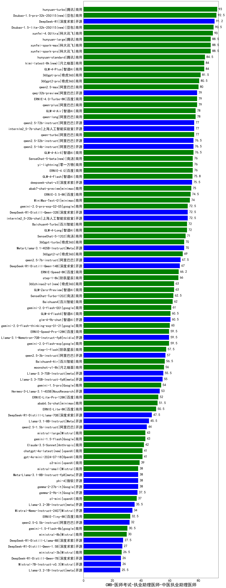

| 类别 | 大模型                         | CMB-医师考试-执业助理医师-中医执业助理医师 | 排名 |
|-----|------------------------------|---------|----|
|商用|hunyuan-turbo|93.0|1|
|商用|Doubao-1.5-pro-32k-250115(new)|92.5|2|
|开源|DeepSeek-R1|91.2|3|
|商用|Doubao-1.5-lite-32k-250115(new)|90.5|4|
|商用|xunfei-4.0Ultra|90.0|5|
|商用|hunyuan-large|88.5|6|
|商用|xunfei-spark-max|88.5|7|
|商用|xunfei-spark-pro|88.5|8|
|商用|hunyuan-standard|84.5|9|
|商用|kimi-latest-8k(new)|84.0|10|
|商用|GLM-4-Plus|84.0|11|
|商用|360gpt-pro|81.5|12|
|商用|360gpt2-pro|80.5|13|
|商用|qwen2.5-max|80.0|14|
|开源|qwq-32b-preview|79.0|15|
|商用|qwen-plus|79.0|16|
|商用|ERNIE-4.0-Turbo-8K|79.0|17|
|商用|qwen-long|78.0|18|
|商用|GLM-4-Air|78.0|19|
|开源|internlm2_5-7b-chat|77.0|20|
|开源|qwen2.5-72b-instruct|77.0|21|
|商用|qwen-turbo|77.0|22|
|开源|qwen2.5-32b-instruct|76.5|23|
|开源|qwen2.5-14b-instruct|76.5|24|
|商用|GLM-4-AirX|76.5|25|
|商用|SenseChat-5-beta(new)|76.0|26|
|商用|yi-lightning|76.0|27|
|商用|ERNIE-4.0|76.0|28|
|商用|GLM-4-Flash|75.8|29|
|开源|deepseek-chat-v3|75.5|30|
|商用|abab7-chat-preview|75.0|31|
|商用|ERNIE-3.5-8K|74.5|32|
|商用|MiniMax-Text-01|74.0|33|
|开源|internlm2_5-20b-chat|72.5|34|
|开源|DeepSeek-R1-Distill-Qwen-32B|72.5|35|
|商用|gemini-2.0-pro-exp-02-05|72.5|36|
|商用|Baichuan4-Turbo|72.0|37|
|商用|GLM-4-Long|72.0|38|
|商用|SenseChat-5-1202|71.0|39|
|开源|Meta-Llama-3.1-405B-Instruct|70.0|40|
|商用|360gpt-turbo|70.0|41|
|商用|360gpt2-o1|69.0|42|
|开源|qwen2.5-7b-instruct|67.5|43|
|开源|DeepSeek-R1-Distill-Qwen-14B|67.0|44|
|商用|ERNIE-Speed-8K|66.2|45|
|商用|step-1-8k|66.0|46|
|商用|360zhinao2-o1(new)|63.0|47|
|商用|GLM-Zero-Preview|63.0|48|
|商用|SenseChat-Turbo-1202|62.5|49|
|商用|Baichuan4|62.0|50|
|商用|gemini-2.0-flash-001|61.0|51|
|开源|glm-4-9b-chat|60.5|52|
|商用|GLM-4-FlashX|60.5|53|
|商用|gemini-2.0-flash-thinking-exp-01-21|60.0|54|
|开源|Llama-3.1-Nemotron-70B-Instruct-fp8|59.5|55|
|商用|gemini-2.0-flash-exp|59.5|56|
|商用|ERNIE-Speed-Pro-128K|59.5|57|
|商用|step-1-flash|57.5|58|
|开源|qwen2.5-3b-instruct|57.0|59|
|商用|Baichuan4-Air|56.5|60|
|商用|moonshot-v1-8k|56.0|61|
|开源|Llama-3.3-70B-Instruct|55.5|62|
|开源|Llama-3.3-70B-Instruct-fp8|55.0|63|
|商用|gemini-1.5-pro|54.0|64|
|开源|Hermes-3-Llama-3.1-405B|53.0|65|
|商用|ERNIE-Lite-Pro-128K|52.0|66|
|商用|abab6.5s-chat|51.5|67|
|商用|ERNIE-Lite-8K|50.5|68|
|开源|DeepSeek-R1-Distill-Llama-70B|47.5|69|
|开源|Llama-3.1-8B-Instruct|45.5|70|
|开源|qwen2.5-1.5b-instruct|44.0|71|
|商用|gemini-1.5-flash|43.0|72|
|商用|mistral-large|43.0|73|
|商用|Claude-3.5-Sonnet|42.0|74|
|商用|gpt-4o-mini-2024-07-18|41.0|75|
|商用|chatgpt-4o-latest(new)|41.0|76|
|商用|o3-mini|39.0|77|
|开源|Meta-Llama-3.1-8B-Instruct-fp8|38.0|78|
|开源|phi-4|38.0|79|
|开源|gemma-2-27b-it|38.0|80|
|商用|mistral-small|38.0|81|
|开源|gemma-2-9b-it|37.5|82|
|商用|o1-mini|37.0|83|
|开源|Llama-3.2-3B-Instruct|35.5|84|
|开源|Mistral-Nemo-Instruct-2407|34.0|85|
|商用|ERNIE-Tiny-8K|32.5|86|
|开源|qwen2.5-0.5b-instruct|32.0|87|
|商用|gemini-1.5-flash-8b|30.5|88|
|商用|ministral-8b|30.0|89|
|开源|DeepSeek-R1-Distill-Llama-8B|27.5|90|
|开源|DeepSeek-R1-Distill-Qwen-1.5B|27.0|91|
|商用|ministral-3b|26.5|92|
|开源|Mistral-7B-Instruct-v0.3|26.0|93|
|开源|DeepSeek-R1-Distill-Qwen-7B|26.0|94|
|开源|Llama-3.2-1B-Instruct|25.5|95|
|开源|Yi-1.5-34B-Chat|/|96|
|开源|Yi-1.5-9B-Chat|/|97|
|开源|qwen2.5-math-72b-instruct|/|98|

