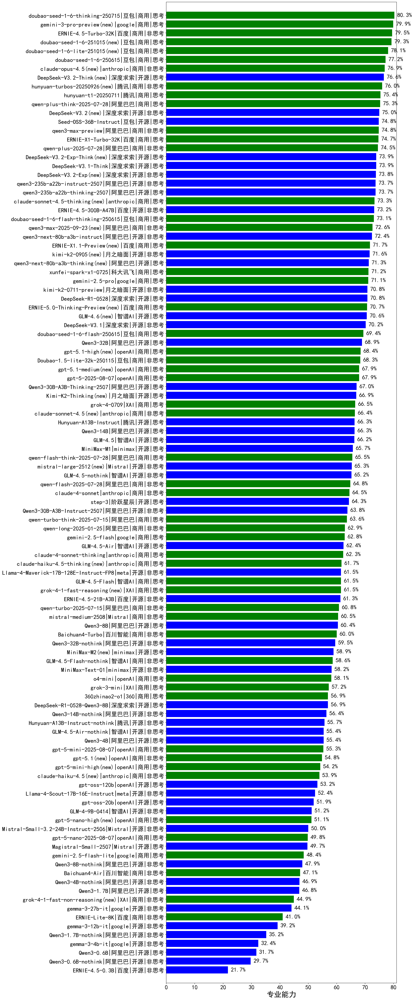

|类别|机构|大模型|【专业能力】准确率|平均耗时|平均消耗token|花费/千次（元）|排名（准确率）|
|---|---|-----|-------------------|-------|-----------|-----------|-----------|
|商用|豆包|doubao-seed-1-6-thinking-250715|80.3%|36s|1653|12.4|1|
|商用|百度|ERNIE-4.5-Turbo-32K|79.5%|40s|635|1.8|2|
|商用|豆包|doubao-seed-1-6-251015(new)|79.3%|34s|960|6.7|3|
|商用|豆包|doubao-seed-1-6-lite-251015(new)|78.1%|57s|1038|2.2|4|
|商用|豆包|doubao-seed-1-6-250615|77.2%|87s|505|3.1|5|
|商用|腾讯|hunyuan-turbos-20250926(new)|76.0%|17s|796|1.4|6|
|商用|腾讯|hunyuan-t1-20250711|75.4%|42s|1903|7.1|7|
|商用|阿里巴巴|qwen-plus-think-2025-07-28|75.3%|/|2984|23.0|8|
|开源|豆包|Seed-OSS-36B-Instruct|74.8%|144s|2289|8.9|9|
|商用|阿里巴巴|qwen3-max-preview|74.8%|24s|659|13.8|10|
|商用|百度|ERNIE-X1-Turbo-32K|74.7%|210s|2158|8.3|11|
|商用|阿里巴巴|qwen-plus-2025-07-28|74.5%|30s|808|1.5|12|
|开源|深度求索|DeepSeek-V3.2-Exp-Think(new)|73.9%|214s|1454|4.3|13|
|开源|深度求索|DeepSeek-V3.1-Think|73.9%|66s|1362|15.6|14|
|开源|深度求索|DeepSeek-V3.2-Exp(new)|73.8%|190s|494|1.4|15|
|开源|阿里巴巴|qwen3-235b-a22b-instruct-2507|73.7%|28s|799|5.7|16|
|开源|阿里巴巴|qwen3-235b-a22b-thinking-2507|73.7%|107s|2933|55.8|17|
|开源|百度|ERNIE-4.5-300B-A47B|73.2%|121s|511|3.4|18|
|商用|豆包|doubao-seed-1-6-flash-thinking-250615|73.1%|14s|937|1.2|19|
|开源|阿里巴巴|qwen3-next-80b-a3b-instruct|72.4%|21s|844|3.0|20|
|商用|科大讯飞|xunfei-spark-x1-0725|71.2%|/|1528|18.1|21|
|商用|google|gemini-2.5-pro|71.1%|38s|2622|182.9|22|
|开源|深度求索|DeepSeek-R1-0528|70.8%|216s|2388|37.0|23|
|开源|月之暗面|kimi-k2-0711-preview|70.8%|48s|726|10.4|24|
|开源|智谱AI|GLM-4.6(new)|70.6%|56s|2613|35.4|25|
|开源|深度求索|DeepSeek-V3.1|70.2%|24s|507|5.3|26|
|商用|豆包|doubao-seed-1-6-flash-250615|69.4%|5s|446|0.5|27|
|开源|阿里巴巴|Qwen3-32B|68.9%|104s|2843|11.0|28|
|商用|豆包|Doubao-1.5-lite-32k-250115|68.3%|8s|324|0.2|29|
|商用|openAI|gpt-5-2025-08-07|67.9%|43s|468|26.4|30|
|开源|阿里巴巴|Qwen3-30B-A3B-Thinking-2507|67.0%|84s|2908|7.9|31|
|商用|XAI|grok-4-0709|66.5%|316s|2057|214.1|32|
|开源|阿里巴巴|Qwen3-14B|66.3%|118s|4090|8.0|33|
|开源|腾讯|Hunyuan-A13B-Instruct|66.3%|94s|1401|5.3|34|
|开源|智谱AI|GLM-4.5|66.2%|79s|2204|29.4|35|
|开源|minimax|MiniMax-M1|65.7%|259s|4147|30.5|36|
|商用|阿里巴巴|qwen-flash-think-2025-07-28|65.5%|42s|2973|4.3|37|
|开源|智谱AI|GLM-4.5-nothink|65.2%|47s|1152|14.7|38|
|商用|阿里巴巴|qwen-flash-2025-07-28|64.8%|21s|897|1.2|39|
|商用|anthropic|claude-4-sonnet|64.5%|42s|623|53.5|40|
|开源|阶跃星辰|step-3|64.3%|145s|2676|10.4|41|
|开源|阿里巴巴|Qwen3-30B-A3B-Instruct-2507|63.8%|20s|855|2.3|42|
|商用|阿里巴巴|qwen-turbo-think-2025-07-15|63.6%|/|2828|8.2|43|
|商用|阿里巴巴|qwen-long-2025-01-25|62.9%|47s|454|0.8|44|
|商用|google|gemini-2.5-flash|62.8%|20s|2251|39.0|45|
|开源|智谱AI|GLM-4.5-Air|62.4%|51s|2272|13.0|46|
|商用|anthropic|claude-4-sonnet-thinking|62.3%|55s|1276|124.6|47|
|开源|meta|Llama-4-Maverick-17B-128E-Instruct-FP8|61.5%|16s|622|2.4|48|
|商用|智谱AI|GLM-4.5-Flash|61.5%|42s|2219|0.0|49|
|开源|百度|ERNIE-4.5-21B-A3B|61.3%|53s|648|0.0|50|
|商用|阿里巴巴|qwen-turbo-2025-07-15|60.8%|20s|580|0.3|51|
|商用|Mistral|mistral-medium-2508|60.5%|121s|630|7.4|52|
|开源|阿里巴巴|Qwen3-8B|60.4%|378s|8581|0.0|53|
|商用|百川智能|Baichuan4-Turbo|60.0%|/|/|/|54|
|开源|阿里巴巴|Qwen3-32B-nothink|59.5%|65s|664|2.3|55|
|开源|minimax|MiniMax-M2(new)|58.9%|55s|2713|22.0|56|
|商用|智谱AI|GLM-4.5-Flash-nothink|58.6%|28s|1433|0.0|57|
|开源|minimax|MiniMax-Text-01|58.2%|17s|932|7.2|58|
|商用|openAI|o4-mini|58.1%|32s|1147|33.8|59|
|商用|XAI|grok-3-mini|57.2%|183s|1281|4.5|60|
|商用|360|360zhinao2-o1|56.9%|/|/|/|61|
|开源|深度求索|DeepSeek-R1-0528-Qwen3-8B|56.9%|352s|2423|0.0|62|
|开源|阿里巴巴|Qwen3-14B-nothink|56.4%|24s|713|1.3|63|
|开源|腾讯|Hunyuan-A13B-Instruct-nothink|55.7%|304s|489|1.6|64|
|开源|智谱AI|GLM-4.5-Air-nothink|55.4%|37s|1917|10.9|65|
|开源|阿里巴巴|Qwen3-4B|55.4%|74s|2394|6.9|66|
|商用|openAI|gpt-5-mini-2025-08-07|55.3%|66s|1146|15.0|67|
|开源|openAI|gpt-oss-120b|53.2%|71s|894|2.5|68|
|开源|meta|Llama-4-Scout-17B-16E-Instruct|52.4%|19s|627|1.2|69|
|开源|openAI|gpt-oss-20b|51.9%|88s|1679|1.8|70|
|开源|智谱AI|GLM-4-9B-0414|51.2%|15s|500|0.0|71|
|开源|Mistral|Mistral-Small-3.2-24B-Instruct-2506|50.0%|98s|922|1.8|72|
|商用|openAI|gpt-5-nano-2025-08-07|49.8%|64s|2574|7.1|73|
|开源|Mistral|Magistral-Small-2507|49.7%|146s|6482|69.4|74|
|商用|google|gemini-2.5-flash-lite|48.4%|21s|2909|8.2|75|
|开源|阿里巴巴|Qwen3-8B-nothink|47.9%|40s|658|0.0|76|
|商用|百川智能|Baichuan4-Air|47.1%|/|/|/|77|
|开源|阿里巴巴|Qwen3-4B-nothink|46.9%|28s|626|1.6|78|
|开源|阿里巴巴|Qwen3-1.7B|46.8%|64s|2810|8.1|79|
|开源|google|gemma-3-27b-it|44.1%|/|/|/|80|
|商用|百度|ERNIE-Lite-8K|41.0%|/|/|/|81|
|开源|google|gemma-3-12b-it|39.2%|/|/|/|82|
|开源|阿里巴巴|Qwen3-1.7B-nothink|35.2%|26s|591|1.5|83|
|开源|google|gemma-3-4b-it|32.4%|/|/|/|84|
|开源|阿里巴巴|Qwen3-0.6B|31.7%|41s|1971|5.6|85|
|开源|阿里巴巴|Qwen3-0.6B-nothink|29.7%|22s|343|0.7|86|
|开源|百度|ERNIE-4.5-0.3B|21.7%|50s|512|0.0|87|

