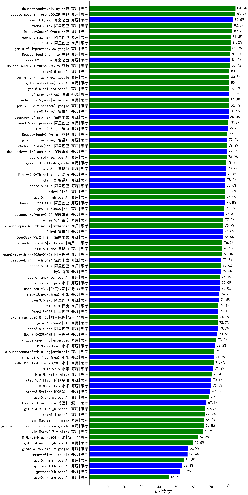

|类别|机构|大模型|【专业能力】准确率|平均耗时|平均消耗token|花费/千次（元）|排名（准确率）|
|---|---|-----|-------------------|-------|-----------|-----------|-----------|
|商用|豆包|doubao-seed-evolving(new)|84.0%|246s|9277|274.8|1|
|商用|豆包|doubao-seed-2-1-pro-260628(new)|83.9%|252s|9461|280.3|2|
|开源|月之暗面|kimi-k3(new)|82.5%|76s|1484|133.1|3|
|商用|阿里巴巴|qwen3.7-max|82.2%|36s|1824|63.1|4|
|商用|豆包|Doubao-Seed-2.0-pro|82.2%|260s|1221|17.6|5|
|商用|阿里巴巴|qwen3.8-max(new)|81.3%|55s|2337|80.7|6|
|商用|阿里巴巴|qwen3.7-plus(new)|81.2%|48s|2610|20.2|7|
|商用|google|gemini-3.1-pro-preview|81.2%|43s|1991|161.6|8|
|商用|豆包|Doubao-Seed-2.0-lite|81.0%|234s|1169|3.8|9|
|开源|月之暗面|kimi-k2.7-code(new)|81.0%|48s|1626|41.9|10|
|商用|豆包|doubao-seed-2-1-turbo-260628(new)|80.7%|216s|8305|122.8|11|
|商用|openAI|gpt-5.5|80.5%|14s|780|141.7|12|
|商用|google|gemini-3.7-flash(new)|80.5%|7s|878|20.7|13|
|商用|openAI|gpt-6-astra(new)|80.4%|13s|359|90.5|14|
|商用|openAI|gpt-5.6-sol-pro(new)|80.3%|28s|4179|354.2|15|
|商用|anthropic|claude-opus-5(new)|80.2%|14s|839|123.3|16|
|商用|google|gemini-3.8-flash(new)|80.1%|17s|1024|49.0|17|
|开源|智谱AI|glm-5.3(new)|80.1%|130s|3610|98.9|18|
|开源|深度求索|deepseek-v4-pro(new)|80.0%|126s|2483|63.9|19|
|商用|豆包|doubao-seed-1-8-251215|79.9%|29s|866|5.9|20|
|商用|阿里巴巴|qwen3.6-max-preview|79.9%|69s|2124|110.0|21|
|开源|月之暗面|kimi-k2.6|79.6%|139s|2812|73.5|22|
|商用|google|gemini-3-flash-preview|79.5%|74s|1981|40.2|23|
|商用|腾讯|hunyuan-2.0-thinking-20251109|79.4%|22s|1547|5.9|24|
|商用|豆包|Doubao-Seed-2.0-mini|79.3%|374s|3157|6.0|25|
|开源|智谱AI|glm-5.3-flash(new)|79.2%|106s|3356|9.2|26|
|商用|阿里巴巴|qwen3.8-flash(new)|79.2%|57s|2828|7.3|27|
|开源|智谱AI|GLM-5.1|78.7%|176s|2273|52.7|28|
|商用|google|gemini-3.5-flash|78.7%|11s|1851|110.7|29|
|开源|月之暗面|Kimi-K2.5-Thinking|78.5%|316s|3001|61.4|30|
|开源|智谱AI|glm-5.2(new)|78.2%|66s|2656|72.2|31|
|开源|阿里巴巴|qwen3.5-plus|78.0%|44s|3649|17.1|32|
|商用|XAI|grok-4.5(new)|78.0%|82s|2626|101.6|33|
|商用|openAI|gpt-5.4-high|78.0%|21s|1056|99.9|34|
|开源|阿里巴巴|Qwen3.5-122B-A10B|77.8%|283s|3934|24.6|35|
|商用|XAI|grok-4.6(new)|77.5%|117s|2265|86.5|36|
|开源|深度求索|deepseek-v4-pro-0424|77.3%|52s|1534|35.7|37|
|商用|百度|ernie-5.1|77.0%|43s|1629|27.8|38|
|商用|anthropic|claude-opus-4.8-thinking(new)|76.9%|16s|1096|168.2|39|
|开源|智谱AI|GLM-5|76.8%|115s|2831|49.5|40|
|开源|深度求索|DeepSeek-V3.2-Think|76.6%|130s|1776|5.2|41|
|商用|anthropic|claude-opus-4.6|76.5%|18s|727|103.7|42|
|商用|智谱AI|GLM-5-Turbo|76.1%|45s|2210|46.9|43|
|商用|阿里巴巴|qwen3-max-think-2026-01-23|76.0%|198s|3924|38.4|44|
|开源|深度求索|deepseek-v4-flash-0424|75.8%|38s|1481|2.9|45|
|商用|阿里巴巴|qwen3.6-plus|75.6%|53s|2319|26.8|46|
|开源|腾讯|hy3(new)|75.4%|65s|353|1.1|47|
|商用|腾讯|hunyuan-2.0-instruct-20251111|75.3%|11s|597|1.0|48|
|开源|智谱AI|GLM-4.7|75.0%|74s|2786|37.9|49|
|开源|小米|mimo-v2.5-pro|75.0%|44s|2461|46.7|50|
|开源|深度求索|DeepSeek-V3.2|75.0%|65s|576|1.6|51|
|开源|阿里巴巴|qwen3.6-27b|74.5%|40s|2615|45.5|52|
|商用|百度|ERNIE-5.0|74.1%|200s|2891|67.7|53|
|开源|阿里巴巴|Qwen3.5-27B|74.1%|321s|4081|19.1|54|
|商用|阿里巴巴|qwen3-max-2026-01-23|74.0%|88s|851|7.7|55|
|开源|阿里巴巴|qwen3.5-flash|73.7%|325s|4458|8.7|56|
|开源|阿里巴巴|Qwen3.6-35B-A3B|73.6%|83s|2512|26.2|57|
|商用|anthropic|claude-opus-4.8(new)|73.0%|9s|647|89.7|58|
|商用|阿里巴巴|qwen-plus-think-2025-12-01|72.7%|79s|3183|24.7|59|
|开源|美团|LongCat-Flash-Thinking-2601|72.2%|201s|3542|0.0|60|
|开源|小米|MiMo-V2-Omni|72.2%|246s|2041|24.6|61|
|商用|anthropic|claude-sonnet-5-thinking(new)|71.8%|19s|1272|79.6|62|
|商用|小米|MiMo-V2-Flash-think-0204|71.4%|584s|2658|5.4|63|
|开源|阿里巴巴|qwen3-next-80b-a3b-thinking|71.3%|148s|3923|15.4|64|
|开源|小米|mimo-v2.5|71.2%|51s|2092|25.4|65|
|商用|阿里巴巴|qwen3-max-preview-think|70.5%|183s|3031|70.7|66|
|商用|minimax|MiniMax-M3(new)|70.4%|69s|1799|26.9|67|
|商用|阿里巴巴|qwen-plus-2025-12-01|70.4%|29s|1220|2.3|68|
|开源|阶跃星辰|step-3.7-flash(new)|70.1%|307s|3790|30.0|69|
|开源|小米|MiMo-V2-Pro|70.0%|294s|1624|29.2|70|
|商用|openAI|gpt-5.2-high|69.7%|20s|881|76.6|71|
|开源|阶跃星辰|step-3.5-flash|69.5%|29s|3612|7.4|72|
|商用|openAI|gpt-5.3-chat|69.0%|25s|533|41.4|73|
|开源|小米|MiMo-V2-Flash-think|68.2%|86s|2900|0.0|74|
|开源|美团|LongCat-Flash-Lite|67.3%|226s|844|0.0|75|
|商用|openAI|gpt-5.2-medium|67.2%|13s|640|52.7|76|
|商用|openAI|gpt-5.4-mini-high|66.7%|66s|1629|48.0|77|
|商用|openAI|gpt-5.4|66.2%|7s|385|29.5|78|
|商用|minimax|MiniMax-M2.5|66.0%|42s|2303|18.5|79|
|商用|google|gemini-3.1-flash-lite-preview|65.8%|13s|480|4.1|80|
|商用|minimax|MiniMax-M2.1|65.4%|110s|2879|23.3|81|
|开源|Mistral|mistral-large-2512|65.3%|14s|680|6.2|82|
|商用|minimax|MiniMax-M2.7|65.2%|64s|2740|22.2|83|
|开源|小米|MiMo-V2-Flash|62.9%|48s|877|0.0|84|
|商用|openAI|gpt-5.2|62.6%|6s|315|20.4|85|
|商用|小米|MiMo-V2-Flash-0204|62.5%|249s|831|1.6|86|
|商用|openAI|gpt-5.4-nano-high|59.5%|57s|1099|8.7|87|
|开源|google|gemma-4-26b-a4b-it|56.5%|55s|741|1.8|88|
|开源|google|gemma-4-31b-it|56.4%|89s|617|1.5|89|
|开源|智谱AI|GLM-4.7-Flash|55.3%|1203s|6657|0.0|90|
|商用|openAI|gpt-5.4-mini|54.3%|39s|334|7.2|91|
|开源|openAI|gpt-oss-120b|53.2%|71s|894|2.5|92|
|开源|openAI|gpt-oss-20b|51.9%|88s|1679|1.8|93|
|开源|Mistral|Ministral-3-14B-Instruct-2512|46.6%|14s|1151|1.6|94|
|商用|openAI|gpt-5.4-nano|45.7%|41s|361|2.2|95|
|开源|Mistral|Ministral-3-8B-Instruct-2512|43.2%|13s|1303|1.4|96|
|开源|Mistral|Ministral-3-3B-Instruct-2512|38.8%|12s|1448|1.0|97|

