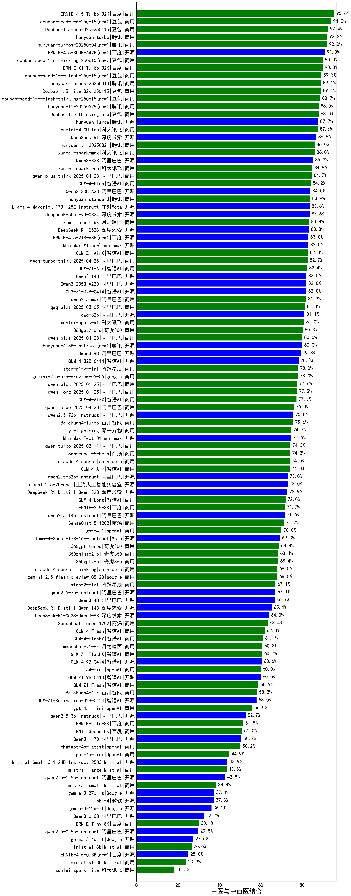

|类别|机构|大模型|【中医与中西医结合】准确率|平均耗时|平均消耗token|排名（准确率）|
|---|---|-----|-------------------|-------|-----------|------------|
|商用|百度|ERNIE-4.5-Turbo-32K|95.0%|22s|554|1|
|商用|豆包|doubao-seed-1-6-250615(new)|94.0%|113s|451|2|
|商用|腾讯|hunyuan-turbos-20250604(new)|93.0%|136s|387|3|
|商用|豆包|Doubao-1.5-pro-32k-250115|92.4%|9s|350|4|
|商用|腾讯|hunyuan-turbo|92.2%|17s|970|5|
|开源|百度|ERNIE-4.5-300B-A47B(new)|91.0%|21s|309|6|
|商用|百度|ERNIE-X1-Turbo-32K|91.0%|80s|1573|7|
|商用|豆包|doubao-seed-1-6-thinking-250615(new)|90.0%|290s|1078|8|
|商用|豆包|Doubao-1.5-lite-32k-250115|89.1%|4s|187|9|
|商用|豆包|doubao-seed-1-6-flash-thinking-250615(new)|89.0%|5s|597|10|
|商用|豆包|doubao-seed-1-6-flash-250615(new)|89.0%|3s|335|11|
|商用|腾讯|hunyuan-t1-20250529|88.0%|39s|947|12|
|商用|豆包|Doubao-1.5-thinking-pro|88.0%|466s|791|13|
|开源|腾讯|hunyuan-large|87.7%|6s|318|14|
|商用|科大讯飞|xunfei-4.0Ultra|87.6%|3s|129|15|
|商用|智谱AI|GLM-Z1-AirX|87.0%|29s|1543|16|
|开源|深度求索|deepseek-chat-v3-0324|87.0%|88s|325|17|
|开源|深度求索|DeepSeek-R1|86.8%|/|/|18|
|开源|阿里巴巴|Qwen3-235B-A22B|86.0%|74s|1671|19|
|开源|阿里巴巴|Qwen3-32B|86.0%|31s|1157|20|
|商用|科大讯飞|xunfei-spark-max|86.0%|3s|124|21|
|商用|阿里巴巴|qwen-plus-think-2025-04-28|86.0%|188s|1628|22|
|开源|阿里巴巴|Qwen3-30B-A3B|85.0%|26s|1368|23|
|开源|meta|Llama-4-Maverick-17B-128E-Instruct-FP8|85.0%|13s|528|24|
|商用|科大讯飞|xunfei-spark-pro|84.9%|/|/|25|
|商用|智谱AI|GLM-4-Plus|84.2%|11s|287|26|
|开源|智谱AI|GLM-Z1-32B-0414|84.0%|122s|1773|27|
|商用|腾讯|hunyuan-standard|83.9%|/|/|28|
|商用|月之暗面|kimi-latest-8k|83.4%|28s|491|29|
|开源|minimax|MiniMax-M1(new)|83.0%|112s|1744|30|
|商用|阿里巴巴|qwen-turbo-think-2025-04-28|83.0%|151s|2090|31|
|商用|阿里巴巴|qwen-plus-2025-04-28|83.0%|150s|502|32|
|开源|深度求索|DeepSeek-R1-0528|83.0%|229s|1715|33|
|商用|智谱AI|GLM-Z1-Air|83.0%|53s|1427|34|
|开源|百度|ERNIE-4.5-21B-A3B(new)|83.0%|36s|315|35|
|开源|阿里巴巴|Qwen3-14B|82.0%|32s|1341|36|
|开源|智谱AI|GLM-4-32B-0414|82.0%|11s|355|37|
|商用|科大讯飞|xunfei-spark-x1|82.0%|41s|1224|38|
|商用|阿里巴巴|qwen2.5-max|81.9%|19s|439|39|
|商用|阿里巴巴|qwq-plus-2025-03-05|81.4%|50s|2059|40|
|开源|阿里巴巴|qwq-32b|81.1%|40s|2131|41|
|商用|奇虎360|360gpt2-pro|80.3%|7s|217|42|
|开源|腾讯|Hunyuan-A13B-Instruct(new)|80.0%|47s|1099|43|
|商用|阶跃星辰|step-r1-v-mini|79.0%|154s|1539|44|
|商用|google|gemini-2.5-pro-preview-05-06|78.0%|47s|2778|45|
|商用|阿里巴巴|qwen-long-2025-01-25|77.5%|68s|379|46|
|商用|智谱AI|GLM-4-AirX|77.3%|18s|246|47|
|商用|google|gemini-2.5-flash(new)|77.0%|12s|1883|48|
|商用|google|gemini-2.5-flash-preview-05-20|76.0%|46s|1807|49|
|商用|anthropic|claude-4-sonnet-thinking|76.0%|51s|1112|50|
|开源|阿里巴巴|Qwen3-8B|76.0%|193s|4925|51|
|开源|阿里巴巴|qwen2.5-72b-instruct|75.8%|12s|249|52|
|商用|百川智能|Baichuan4-Turbo|75.6%|/|/|53|
|商用|阿里巴巴|qwen-turbo-2025-04-28|75.0%|9s|455|54|
|商用|零一万物|yi-lightning|74.7%|/|/|55|
|开源|minimax|MiniMax-Text-01|74.6%|11s|898|56|
|商用|商汤|SenseChat-5-beta|74.2%|18s|323|57|
|商用|anthropic|claude-4-sonnet|74.0%|42s|542|58|
|商用|智谱AI|GLM-Z1-Flash|74.0%|20s|2239|59|
|商用|智谱AI|GLM-4-Air|74.0%|12s|239|60|
|开源|上海人工智能实验室|internlm2_5-7b-chat|73.0%|/|/|61|
|开源|阿里巴巴|qwen2.5-32b-instruct|73.0%|8s|229|62|
|开源|深度求索|DeepSeek-R1-Distill-Qwen-32B|72.9%|28s|747|63|
|商用|智谱AI|GLM-4-Long|72.0%|17s|345|64|
|商用|百度|ERNIE-3.5-8K|71.7%|23s|377|65|
|开源|阿里巴巴|qwen2.5-14b-instruct|71.6%|4s|246|66|
|商用|商汤|SenseChat-5-1202|71.2%|/|/|67|
|开源|阿里巴巴|Qwen3-4B|70.0%|20s|1673|68|
|商用|openAI|gpt-4.1|70.0%|12s|284|69|
|开源|meta|Llama-4-Scout-17B-16E-Instruct|70.0%|99s|498|70|
|商用|奇虎360|360gpt-turbo|68.8%|/|/|71|
|商用|奇虎360|360zhinao2-o1|68.4%|/|/|72|
|商用|奇虎360|360gpt2-o1|68.4%|11s|302|73|
|开源|阿里巴巴|qwen2.5-7b-instruct|67.1%|10s|238|74|
|商用|阶跃星辰|step-2-mini|67.1%|87s|358|75|
|开源|深度求索|DeepSeek-R1-Distill-Qwen-14B|65.4%|/|/|76|
|开源|深度求索|DeepSeek-R1-0528-Qwen3-8B|64.0%|266s|1683|77|
|商用|商汤|SenseChat-Turbo-1202|63.4%|/|/|78|
|商用|智谱AI|GLM-Z1-FlashX|63.0%|35s|2431|79|
|商用|智谱AI|GLM-4-Flash|62.0%|8s|240|80|
|商用|智谱AI|GLM-4-FlashX|61.1%|34s|253|81|
|商用|月之暗面|moonshot-v1-8k|60.8%|/|/|82|
|商用|openAI|o4-mini|60.0%|27s|870|83|
|开源|智谱AI|GLM-4-9B-0414|59.0%|11s|476|84|
|商用|百川智能|Baichuan4-Air|58.2%|/|/|85|
|开源|智谱AI|GLM-Z1-Rumination-32B-0414|58.0%|24s|1195|86|
|商用|openAI|gpt-4.1-mini|56.0%|8s|334|87|
|开源|智谱AI|GLM-Z1-9B-0414|55.0%|112s|2533|88|
|开源|Mistral|Mistral-Small-3.1-24B-Instruct-2503|54.0%|/|/|89|
|商用|google|gemini-2.5-flash-lite-preview-06-17(new)|53.0%|3s|606|90|
|开源|阿里巴巴|qwen2.5-3b-instruct|52.7%|9s|264|91|
|商用|百度|ERNIE-Lite-8K|51.5%|/|/|92|
|商用|百度|ERNIE-Speed-8K|51.0%|/|/|93|
|商用|openAI|chatgpt-4o-latest|50.2%|/|/|94|
|开源|阿里巴巴|Qwen3-1.7B|48.0%|21s|2027|95|
|商用|OpenAI|gpt-4o-mini|44.9%|/|/|96|
|商用|Mistral|mistral-large|43.5%|/|/|97|
|开源|阿里巴巴|qwen2.5-1.5b-instruct|42.8%|6s|162|98|
|商用|Mistral|mistral-small|38.4%|/|/|99|
|开源|Google|gemma-3-27b-it|37.4%|/|/|100|
|开源|微软|phi-4|37.3%|/|/|101|
|开源|Google|gemma-3-12b-it|36.2%|/|/|102|
|开源|阿里巴巴|Qwen3-0.6B|36.0%|5s|1155|103|
|商用|百度|ERNIE-Tiny-8K|30.1%|/|/|104|
|开源|阿里巴巴|qwen2.5-0.5b-instruct|29.8%|13s|264|105|
|开源|Google|gemma-3-4b-it|27.5%|/|/|106|
|商用|Mistral|ministral-8b|26.6%|/|/|107|
|商用|Mistral|ministral-3b|23.9%|/|/|108|
|开源|百度|ERNIE-4.5-0.3B(new)|23.0%|36s|372|109|
|商用|科大讯飞|xunfei-spark-lite|18.3%|/|/|110|
|商用|google|gemini-2.5-pro(new)|/%|/|/|111|

