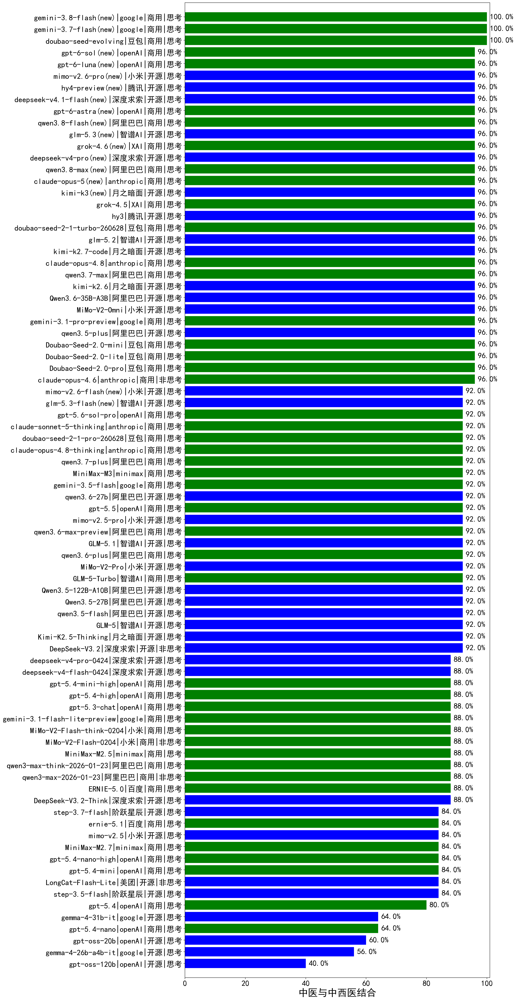

|类别|机构|大模型|【中医与中西医结合】准确率|平均耗时|平均消耗token|花费/千次（元）|排名（准确率）|
|---|---|-----|-------------------|-------|-----------|-----------|-----------|
|商用|豆包|doubao-seed-evolving(new)|100.0%|182s|5267|155.5|1|
|商用|google|gemini-3.7-flash(new)|100.0%|6s|777|18.9|2|
|商用|google|gemini-3.8-flash(new)|100.0%|33s|722|34.9|3|
|商用|anthropic|claude-opus-5(new)|96.0%|13s|612|93.1|4|
|商用|豆包|doubao-seed-2-1-turbo-260628(new)|96.0%|108s|4113|60.4|5|
|开源|小米|MiMo-V2-Omni|96.0%|164s|1110|12.0|6|
|商用|XAI|grok-4.5(new)|96.0%|95s|1206|43.1|7|
|开源|腾讯|hy3(new)|96.0%|34s|226|0.7|8|
|商用|anthropic|claude-opus-4.6|96.0%|12s|608|91.9|9|
|开源|月之暗面|kimi-k2.6|96.0%|69s|1204|31.1|10|
|开源|智谱AI|glm-5.2(new)|96.0%|36s|1705|46.2|11|
|商用|阿里巴巴|qwen3.8-max(new)|96.0%|17s|564|17.6|12|
|开源|月之暗面|kimi-k2.7-code(new)|96.0%|16s|499|12.1|13|
|商用|豆包|Doubao-Seed-2.0-pro|96.0%|180s|815|11.6|14|
|商用|豆包|Doubao-Seed-2.0-lite|96.0%|180s|837|2.7|15|
|商用|豆包|Doubao-Seed-2.0-mini|96.0%|223s|1475|2.8|16|
|开源|阿里巴巴|qwen3.5-plus|96.0%|25s|1925|8.9|17|
|商用|google|gemini-3.1-pro-preview|96.0%|40s|1325|107.8|18|
|商用|阿里巴巴|qwen3.7-max|96.0%|20s|892|30.3|19|
|开源|月之暗面|kimi-k3(new)|96.0%|34s|561|44.5|20|
|商用|anthropic|claude-opus-4.8(new)|96.0%|10s|507|74.6|21|
|开源|智谱AI|GLM-4.7|96.0%|36s|1585|21.4|22|
|开源|深度求索|deepseek-v4.1-flash(new)|96.0%|11s|596|4.2|23|
|开源|深度求索|deepseek-v4-pro(new)|96.0%|284s|575|12.9|24|
|开源|小米|MiMo-V2-Flash|96.0%|62s|411|0.0|25|
|商用|豆包|doubao-seed-1-8-251215|96.0%|22s|625|4.2|26|
|开源|阿里巴巴|Qwen3.6-35B-A3B|96.0%|90s|1674|17.4|27|
|商用|XAI|grok-4.6(new)|96.0%|25s|1191|42.4|28|
|开源|智谱AI|glm-5.3(new)|96.0%|33s|1007|26.7|29|
|商用|阿里巴巴|qwen3.8-flash(new)|96.0%|39s|612|1.4|30|
|开源|小米|mimo-v2.6-pro(new)|96.0%|42s|817|4.7|31|
|开源|阿里巴巴|qwen3-next-80b-a3b-thinking|96.0%|77s|2685|10.5|32|
|商用|腾讯|hunyuan-2.0-thinking-20251109|96.0%|25s|710|2.7|33|
|开源|腾讯|hy4-preview(new)|96.0%|22s|1285|22.1|34|
|商用|openAI|gpt-6-astra(new)|96.0%|15s|238|59.4|35|
|商用|智谱AI|GLM-5-Turbo|92.0%|35s|1129|23.7|36|
|商用|google|gemini-3.5-flash|92.0%|9s|1272|76.4|37|
|开源|阿里巴巴|qwen3.6-27b|92.0%|28s|1751|30.4|38|
|开源|智谱AI|GLM-5.1|92.0%|131s|1188|27.2|39|
|商用|minimax|MiniMax-M3(new)|92.0%|25s|635|7.7|40|
|开源|小米|mimo-v2.5-pro|92.0%|23s|1114|18.9|41|
|商用|openAI|gpt-5.5|92.0%|7s|332|54.8|42|
|开源|小米|MiMo-V2-Pro|92.0%|168s|1190|20.6|43|
|商用|阿里巴巴|qwen3.6-plus|92.0%|35s|1515|17.4|44|
|开源|小米|mimo-v2.6-flash(new)|92.0%|76s|884|1.7|45|
|开源|智谱AI|GLM-5|92.0%|57s|1664|29.0|46|
|商用|阿里巴巴|qwen3.7-plus(new)|92.0%|18s|911|6.8|47|
|商用|anthropic|claude-opus-4.8-thinking(new)|92.0%|11s|669|102.9|48|
|开源|阿里巴巴|Qwen3.5-122B-A10B|92.0%|265s|2880|18.0|49|
|开源|阿里巴巴|Qwen3.5-27B|92.0%|268s|2344|10.9|50|
|开源|阿里巴巴|qwen3.5-flash|92.0%|308s|2960|5.8|51|
|商用|豆包|doubao-seed-2-1-pro-260628(new)|92.0%|147s|4701|138.5|52|
|开源|月之暗面|Kimi-K2.5-Thinking|92.0%|282s|1359|27.4|53|
|商用|anthropic|claude-sonnet-5-thinking(new)|92.0%|13s|685|42.3|54|
|商用|openAI|gpt-5.6-sol-pro(new)|92.0%|36s|2964|215.1|55|
|商用|google|gemini-3-flash-preview|92.0%|39s|1009|20.2|56|
|开源|智谱AI|glm-5.3-flash(new)|92.0%|136s|1748|4.7|57|
|商用|腾讯|hunyuan-2.0-instruct-20251111|92.0%|12s|372|0.6|58|
|开源|深度求索|DeepSeek-V3.2|92.0%|64s|367|1.0|59|
|商用|阿里巴巴|qwen3.6-max-preview|92.0%|55s|1671|86.9|60|
|开源|深度求索|deepseek-v4-pro-0424|88.0%|29s|580|13.1|61|
|开源|深度求索|deepseek-v4-flash-0424|88.0%|27s|669|1.3|62|
|商用|openAI|gpt-5.4-mini-high|88.0%|36s|978|28.6|63|
|商用|阿里巴巴|qwen3-max-think-2026-01-23|88.0%|132s|2203|21.5|64|
|商用|小米|MiMo-V2-Flash-think-0204|88.0%|325s|1594|3.2|65|
|开源|深度求索|DeepSeek-V3.2-Think|88.0%|50s|812|2.4|66|
|开源|Mistral|mistral-large-2512|88.0%|12s|507|4.7|67|
|商用|阿里巴巴|qwen-plus-2025-12-01|88.0%|21s|802|1.5|68|
|商用|阿里巴巴|qwen-plus-think-2025-12-01|88.0%|43s|1877|14.5|69|
|商用|小米|MiMo-V2-Flash-0204|88.0%|182s|519|1.0|70|
|商用|阿里巴巴|qwen3-max-preview-think|88.0%|143s|1885|43.9|71|
|商用|minimax|MiniMax-M2.5|88.0%|22s|1042|8.1|72|
|商用|openAI|gpt-5.4-high|88.0%|13s|558|51.2|73|
|商用|百度|ERNIE-5.0|88.0%|117s|1526|35.5|74|
|商用|openAI|gpt-5.3-chat|88.0%|13s|414|33.3|75|
|商用|阿里巴巴|qwen3-max-2026-01-23|88.0%|65s|463|4.1|76|
|商用|google|gemini-3.1-flash-lite-preview|88.0%|16s|372|3.3|77|
|开源|美团|LongCat-Flash-Thinking-2601|84.0%|144s|1828|0.0|78|
|商用|openAI|gpt-5.2-medium|84.0%|9s|341|26.5|79|
|开源|阶跃星辰|step-3.5-flash|84.0%|18s|1259|2.5|80|
|开源|小米|mimo-v2.5|84.0%|20s|1235|13.8|81|
|开源|美团|LongCat-Flash-Lite|84.0%|269s|439|0.0|82|
|开源|阶跃星辰|step-3.7-flash(new)|84.0%|41s|1753|13.7|83|
|商用|minimax|MiniMax-M2.7|84.0%|34s|1378|10.9|84|
|商用|openAI|gpt-5.4-mini|84.0%|21s|246|5.5|85|
|商用|openAI|gpt-5.4-nano-high|84.0%|10s|606|4.7|86|
|商用|百度|ernie-5.1|84.0%|33s|775|13.1|87|
|开源|小米|MiMo-V2-Flash-think|80.0%|120s|1856|0.0|88|
|商用|openAI|gpt-5.2-high|80.0%|10s|427|35.0|89|
|开源|智谱AI|GLM-4.7-Flash|80.0%|1289s|2088|0.0|90|
|商用|openAI|gpt-5.4|80.0%|5s|306|24.7|91|
|商用|minimax|MiniMax-M2.1|72.0%|77s|1587|12.7|92|
|商用|openAI|gpt-5.2|72.0%|5s|207|13.2|93|
|商用|openAI|gpt-5.4-nano|64.0%|55s|231|1.4|94|
|开源|google|gemma-4-31b-it|64.0%|89s|512|1.3|95|
|开源|openAI|gpt-oss-20b|60.0%|49s|1633|1.8|96|
|开源|google|gemma-4-26b-a4b-it|56.0%|62s|588|1.5|97|
|开源|Mistral|Ministral-3-14B-Instruct-2512|56.0%|37s|3153|4.5|98|
|开源|openAI|gpt-oss-120b|40.0%|5s|744|2.1|99|
|开源|Mistral|Ministral-3-8B-Instruct-2512|36.0%|10s|612|0.7|100|
|开源|Mistral|Ministral-3-3B-Instruct-2512|24.0%|8s|670|0.5|101|

