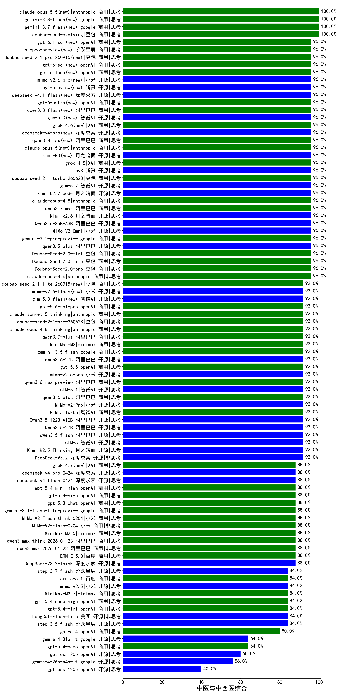

|类别|机构|大模型|【中医与中西医结合】准确率|平均耗时|平均消耗token|花费/千次（元）|排名（准确率）|
|---|---|-----|-------------------|-------|-----------|-----------|-----------|
|商用|google|gemini-3.7-flash|100.0%|6s|777|18.9|1|
|商用|google|gemini-4-argon(new)|100.0%|16s|514|60.8|2|
|商用|豆包|doubao-seed-evolving|100.0%|182s|5267|155.5|3|
|商用|anthropic|claude-opus-5.5(new)|100.0%|15s|641|78.3|4|
|商用|google|gemini-3.8-flash(new)|100.0%|33s|722|34.9|5|
|商用|XAI|grok-4.6|96.0%|25s|1191|42.4|6|
|开源|深度求索|deepseek-v4-pro|96.0%|284s|575|12.9|7|
|商用|阶跃星辰|step-5-preview(new)|96.0%|25s|1491|28.9|8|
|商用|阿里巴巴|qwen3.8-max|96.0%|17s|564|17.6|9|
|商用|阿里巴巴|qwen3.7-max|96.0%|20s|892|30.3|10|
|商用|阿里巴巴|qwen3.8-flash(new)|96.0%|39s|612|1.4|11|
|商用|anthropic|claude-opus-4.8|96.0%|10s|507|74.6|12|
|开源|智谱AI|glm-5.3(new)|96.0%|33s|1007|26.7|13|
|开源|月之暗面|kimi-k3|96.0%|34s|561|44.5|14|
|开源|月之暗面|kimi-k2.7-code|96.0%|16s|499|12.1|15|
|开源|智谱AI|glm-5.2|96.0%|36s|1705|46.2|16|
|商用|豆包|doubao-seed-2-1-pro-260915(new)|96.0%|31s|1043|28.7|17|
|商用|豆包|doubao-seed-2-1-turbo-260628|96.0%|108s|4113|60.4|18|
|商用|anthropic|claude-opus-5|96.0%|13s|612|93.1|19|
|商用|XAI|grok-4.5|96.0%|95s|1206|43.1|20|
|开源|腾讯|hy3|96.0%|34s|226|0.7|21|
|商用|openAI|gpt-6.1-sol(new)|96.0%|6s|208|9.8|22|
|商用|openAI|gpt-6-sol(new)|96.0%|180s|204|9.5|23|
|商用|openAI|gpt-6-luna(new)|96.0%|263s|295|0.8|24|
|商用|google|gemini-3.1-pro-preview|96.0%|40s|1325|107.8|25|
|开源|小米|mimo-v2.6-pro(new)|96.0%|42s|817|4.7|26|
|开源|腾讯|hy4-preview(new)|96.0%|22s|1285|22.1|27|
|开源|深度求索|deepseek-v4.1-flash(new)|96.0%|11s|596|4.2|28|
|商用|anthropic|claude-haiku-5.5(new)|96.0%|82s|753|2.3|29|
|商用|openAI|gpt-6-astra(new)|96.0%|15s|238|59.4|30|
|商用|anthropic|claude-sonnet-5.5(new)|96.0%|6s|468|27.0|31|
|开源|阿里巴巴|Qwen3.6-35B-A3B|96.0%|90s|1674|17.4|32|
|开源|月之暗面|kimi-k2.6|96.0%|69s|1204|31.1|33|
|商用|openAI|gpt-5.6-sol-pro|92.0%|36s|2964|215.1|34|
|开源|小米|mimo-v2.6-flash(new)|92.0%|76s|884|1.7|35|
|开源|智谱AI|glm-5.3-flash(new)|92.0%|136s|1748|4.7|36|
|商用|豆包|doubao-seed-2-1-pro-260628|92.0%|147s|4701|138.5|37|
|商用|豆包|doubao-seed-2-1-lite-260915(new)|92.0%|44s|1102|2.8|38|
|商用|anthropic|claude-sonnet-5-thinking|92.0%|13s|685|42.3|39|
|开源|小米|mimo-v2.5-pro|92.0%|23s|1114|18.9|40|
|开源|深度求索|DeepSeek-V3.2|92.0%|64s|367|1.0|41|
|开源|阿里巴巴|Qwen3.5-27B|92.0%|268s|2344|10.9|42|
|开源|阿里巴巴|Qwen3.5-122B-A10B|92.0%|265s|2880|18.0|43|
|商用|阿里巴巴|qwen3.6-plus|92.0%|35s|1515|17.4|44|
|开源|智谱AI|GLM-5.1|92.0%|131s|1188|27.2|45|
|商用|anthropic|claude-opus-4.8-thinking|92.0%|11s|669|102.9|46|
|商用|阿里巴巴|qwen3.6-max-preview|92.0%|55s|1671|86.9|47|
|商用|openAI|gpt-5.5|92.0%|7s|332|54.8|48|
|开源|阿里巴巴|qwen3.6-27b|92.0%|28s|1751|30.4|49|
|商用|google|gemini-3.5-flash|92.0%|9s|1272|76.4|50|
|商用|minimax|MiniMax-M3|92.0%|25s|635|7.7|51|
|商用|阿里巴巴|qwen3.7-plus|92.0%|18s|911|6.8|52|
|开源|深度求索|deepseek-v4-flash-0424|88.0%|27s|669|1.3|53|
|开源|深度求索|deepseek-v4-pro-0424|88.0%|29s|580|13.1|54|
|商用|google|gemini-3.1-flash-lite-preview|88.0%|16s|372|3.3|55|
|商用|百度|ERNIE-5.0|88.0%|117s|1526|35.5|56|
|开源|深度求索|DeepSeek-V3.2-Think|88.0%|50s|812|2.4|57|
|商用|XAI|grok-4.7(new)|88.0%|44s|3148|95.6|58|
|商用|minimax|MiniMax-M3.1-Flash(new)|84.0%|14s|778|2.3|59|
|开源|阶跃星辰|step-3.7-flash|84.0%|41s|1753|13.7|60|
|商用|百度|ernie-5.1|84.0%|33s|775|13.1|61|
|开源|小米|mimo-v2.5|84.0%|20s|1235|13.8|62|
|商用|minimax|MiniMax-M2.7|84.0%|34s|1378|10.9|63|
|开源|google|gemma-4-31b-it|64.0%|89s|512|1.3|64|
|开源|openAI|gpt-oss-20b|60.0%|49s|1633|1.8|65|
|开源|google|gemma-4-26b-a4b-it|56.0%|62s|588|1.5|66|
|开源|openAI|gpt-oss-120b|40.0%|5s|744|2.1|67|

