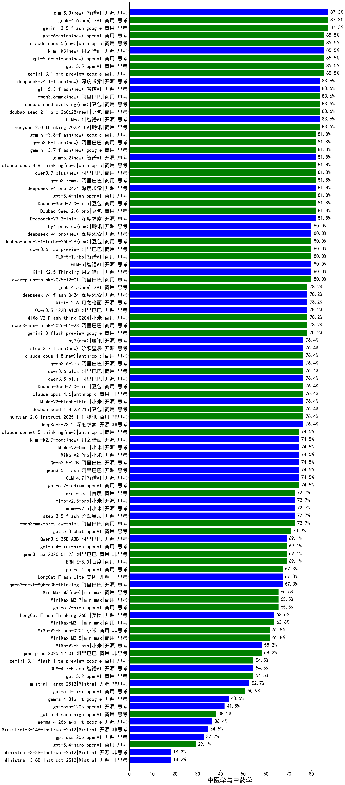

|类别|机构|大模型|【中医学与中药学】准确率|平均耗时|平均消耗token|花费/千次（元）|排名（准确率）|
|---|---|-----|-------------------|-------|-----------|-----------|-----------|
|商用|google|gemini-3.5-flash|87.3%|9s|1454|88.4|1|
|开源|智谱AI|glm-5.3(new)|87.3%|85s|3270|90.2|2|
|商用|XAI|grok-4.6(new)|87.3%|262s|1763|66.7|3|
|商用|openAI|gpt-5.6-sol-pro(new)|85.5%|48s|3543|294.4|4|
|商用|google|gemini-3.1-pro-preview|85.5%|42s|1710|141.4|5|
|商用|openAI|gpt-6-astra(new)|85.5%|14s|275|76.5|6|
|商用|anthropic|claude-opus-5(new)|85.5%|14s|651|102.2|7|
|开源|月之暗面|kimi-k3(new)|85.5%|73s|874|76.4|8|
|商用|openAI|gpt-5.5|85.5%|14s|520|96.8|9|
|商用|豆包|doubao-seed-2-1-pro-260628(new)|83.6%|213s|8103|240.7|10|
|开源|智谱AI|GLM-5.1|83.6%|156s|1534|35.7|11|
|商用|阿里巴巴|qwen3.8-max(new)|83.6%|22s|883|29.3|12|
|商用|豆包|doubao-seed-evolving(new)|83.6%|275s|8109|240.9|13|
|商用|腾讯|hunyuan-2.0-thinking-20251109|83.6%|14s|961|3.7|14|
|开源|深度求索|deepseek-v4.1-flash(new)|83.6%|16s|1142|8.6|15|
|开源|智谱AI|glm-5.3-flash(new)|83.6%|133s|2417|6.6|16|
|商用|豆包|Doubao-Seed-2.0-lite|81.8%|208s|971|3.2|17|
|商用|anthropic|claude-opus-4.8-thinking(new)|81.8%|16s|693|109.6|18|
|开源|智谱AI|glm-5.2(new)|81.8%|51s|1698|46.2|19|
|商用|openAI|gpt-5.4-high|81.8%|19s|886|86.9|20|
|商用|阿里巴巴|qwen3.7-max|81.8%|28s|1299|45.2|21|
|商用|豆包|Doubao-Seed-2.0-pro|81.8%|250s|1135|16.8|22|
|商用|阿里巴巴|qwen3.7-plus(new)|81.8%|23s|1150|8.8|23|
|商用|阿里巴巴|qwen3.8-flash(new)|81.8%|23s|1033|2.6|24|
|开源|深度求索|DeepSeek-V3.2-Think|81.8%|85s|1106|3.3|25|
|商用|google|gemini-3.8-flash(new)|81.8%|19s|791|39.0|26|
|开源|深度求索|deepseek-v4-pro-0424|81.8%|38s|1123|26.3|27|
|商用|google|gemini-3.7-flash(new)|81.8%|7s|852|21.1|28|
|开源|深度求索|deepseek-v4-pro(new)|80.0%|212s|1109|27.5|29|
|开源|小米|mimo-v2.6-pro(new)|80.0%|110s|2075|12.3|30|
|开源|腾讯|hy4-preview(new)|80.0%|79s|4703|83.8|31|
|商用|智谱AI|GLM-5-Turbo|80.0%|51s|1571|33.5|32|
|开源|智谱AI|GLM-5|80.0%|68s|2155|37.9|33|
|商用|豆包|doubao-seed-2-1-turbo-260628(new)|80.0%|301s|8338|123.9|34|
|商用|阿里巴巴|qwen-plus-think-2025-12-01|80.0%|66s|2869|22.5|35|
|开源|月之暗面|Kimi-K2.5-Thinking|80.0%|341s|1672|34.1|36|
|商用|阿里巴巴|qwen3.6-max-preview|80.0%|55s|1761|92.2|37|
|开源|深度求索|deepseek-v4-flash-0424|78.2%|32s|925|1.8|38|
|开源|月之暗面|kimi-k2.6|78.2%|146s|1875|49.4|39|
|开源|阿里巴巴|Qwen3.5-122B-A10B|78.2%|294s|3438|21.6|40|
|商用|小米|MiMo-V2-Flash-think-0204|78.2%|523s|1939|4.0|41|
|商用|google|gemini-3-flash-preview|78.2%|66s|1218|24.9|42|
|商用|阿里巴巴|qwen3-max-think-2026-01-23|78.2%|213s|2938|28.9|43|
|商用|XAI|grok-4.5(new)|78.2%|83s|1892|72.1|44|
|商用|阿里巴巴|qwen3.6-plus|76.4%|44s|1748|20.3|45|
|商用|腾讯|hunyuan-2.0-instruct-20251111|76.4%|4s|384|0.6|46|
|开源|小米|MiMo-V2-Flash-think|76.4%|36s|2111|0.0|47|
|商用|anthropic|claude-opus-4.8(new)|76.4%|10s|478|71.8|48|
|商用|豆包|doubao-seed-1-8-251215|76.4%|30s|689|4.8|49|
|商用|anthropic|claude-opus-4.6|76.4%|17s|573|88.2|50|
|开源|腾讯|hy3(new)|76.4%|78s|228|0.7|51|
|商用|豆包|Doubao-Seed-2.0-mini|76.4%|399s|2383|4.6|52|
|开源|深度求索|DeepSeek-V3.2|76.4%|86s|386|1.1|53|
|开源|阿里巴巴|qwen3.6-27b|76.4%|36s|2235|39.3|54|
|开源|阿里巴巴|qwen3.5-plus|76.4%|42s|3270|15.4|55|
|开源|阶跃星辰|step-3.7-flash(new)|76.4%|50s|3005|23.9|56|
|开源|智谱AI|GLM-4.7|74.5%|70s|2260|31.0|57|
|商用|openAI|gpt-5.2-medium|74.5%|11s|491|42.6|58|
|开源|阿里巴巴|qwen3.5-flash|74.5%|317s|3564|7.0|59|
|开源|阿里巴巴|Qwen3.5-27B|74.5%|350s|3734|17.6|60|
|开源|小米|MiMo-V2-Omni|74.5%|278s|1332|15.2|61|
|开源|小米|MiMo-V2-Pro|74.5%|226s|1057|17.9|62|
|开源|月之暗面|kimi-k2.7-code(new)|74.5%|32s|924|23.7|63|
|商用|anthropic|claude-sonnet-5-thinking(new)|74.5%|22s|770|49.2|64|
|商用|阿里巴巴|qwen3-max-preview-think|72.7%|161s|2546|59.9|65|
|开源|小米|mimo-v2.5|72.7%|23s|1255|14.2|66|
|开源|小米|mimo-v2.5-pro|72.7%|24s|1207|21.0|67|
|开源|阶跃星辰|step-3.5-flash|72.7%|20s|1920|3.9|68|
|商用|百度|ernie-5.1|72.7%|32s|951|16.3|69|
|开源|小米|mimo-v2.6-flash(new)|72.7%|66s|857|1.7|70|
|商用|openAI|gpt-5.3-chat|70.9%|22s|401|33.2|71|
|商用|openAI|gpt-5.4-mini-high|69.1%|24s|1516|45.9|72|
|开源|阿里巴巴|Qwen3.6-35B-A3B|69.1%|33s|2515|26.6|73|
|商用|百度|ERNIE-5.0|69.1%|150s|1925|45.3|74|
|商用|阿里巴巴|qwen3-max-2026-01-23|69.1%|35s|410|3.6|75|
|开源|美团|LongCat-Flash-Lite|67.3%|263s|455|0.0|76|
|开源|阿里巴巴|qwen3-next-80b-a3b-thinking|67.3%|124s|3833|15.1|77|
|商用|openAI|gpt-5.4|67.3%|4s|226|17.5|78|
|商用|minimax|MiniMax-M2.7|65.5%|38s|1548|12.4|79|
|商用|minimax|MiniMax-M3(new)|65.5%|27s|744|9.6|80|
|商用|openAI|gpt-5.2-high|65.5%|15s|646|58.0|81|
|开源|美团|LongCat-Flash-Thinking-2601|63.6%|195s|3147|0.0|82|
|商用|minimax|MiniMax-M2.1|63.6%|73s|1842|14.9|83|
|商用|minimax|MiniMax-M2.5|61.8%|31s|1443|11.5|84|
|商用|小米|MiMo-V2-Flash-0204|61.8%|204s|476|0.9|85|
|商用|阿里巴巴|qwen-plus-2025-12-01|58.2%|26s|932|1.8|86|
|开源|小米|MiMo-V2-Flash|58.2%|87s|424|0.0|87|
|商用|google|gemini-3.1-flash-lite-preview|54.5%|14s|344|3.1|88|
|商用|openAI|gpt-5.2|54.5%|4s|161|9.9|89|
|开源|智谱AI|GLM-4.7-Flash|54.5%|1524s|6036|0.0|90|
|开源|Mistral|mistral-large-2512|52.7%|14s|497|4.8|91|
|商用|openAI|gpt-5.4-mini|50.9%|35s|186|4.0|92|
|开源|google|gemma-4-31b-it|43.6%|76s|489|1.2|93|
|开源|openAI|gpt-oss-120b|41.8%|28s|681|1.9|94|
|商用|openAI|gpt-5.4-nano-high|38.2%|35s|845|6.9|95|
|开源|google|gemma-4-26b-a4b-it|36.4%|63s|562|1.4|96|
|开源|Mistral|Ministral-3-14B-Instruct-2512|34.5%|8s|488|0.7|97|
|开源|openAI|gpt-oss-20b|32.7%|58s|1809|2.0|98|
|商用|openAI|gpt-5.4-nano|29.1%|31s|202|1.2|99|
|开源|Mistral|Ministral-3-3B-Instruct-2512|18.2%|6s|529|0.4|100|
|开源|Mistral|Ministral-3-8B-Instruct-2512|18.2%|8s|474|0.5|101|

