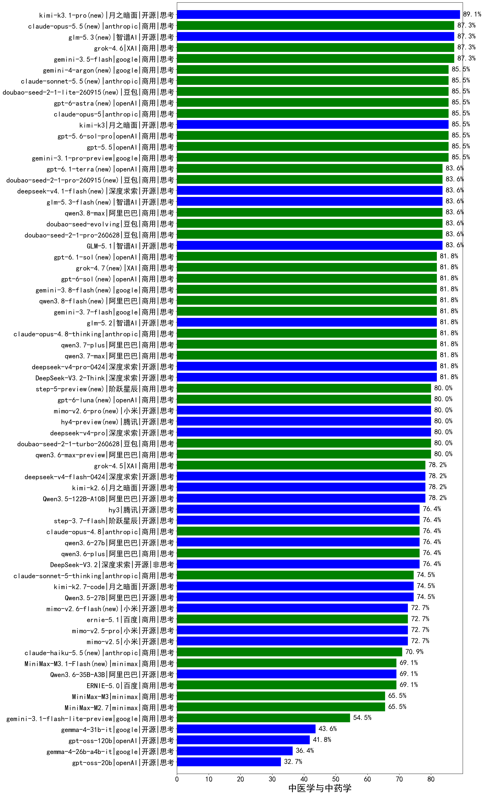

|类别|机构|大模型|【中医学与中药学】准确率|平均耗时|平均消耗token|花费/千次（元）|排名（准确率）|
|---|---|-----|-------------------|-------|-----------|-----------|-----------|
|开源|月之暗面|kimi-k3.1-pro(new)|89.1%|65s|2115|136.3|1|
|商用|anthropic|claude-opus-5.5(new)|87.3%|36s|643|80.4|2|
|商用|XAI|grok-4.6|87.3%|262s|1763|66.7|3|
|开源|智谱AI|glm-5.3(new)|87.3%|85s|3270|90.2|4|
|商用|google|gemini-3.5-flash|87.3%|9s|1454|88.4|5|
|商用|openAI|gpt-6-astra(new)|85.5%|14s|275|76.5|6|
|商用|anthropic|claude-opus-5|85.5%|14s|651|102.2|7|
|商用|openAI|gpt-5.5|85.5%|14s|520|96.8|8|
|商用|openAI|gpt-5.6-sol-pro|85.5%|48s|3543|294.4|9|
|开源|月之暗面|kimi-k3|85.5%|73s|874|76.4|10|
|商用|anthropic|claude-sonnet-5.5(new)|85.5%|10s|554|34.0|11|
|商用|google|gemini-4-argon(new)|85.5%|17s|416|48.3|12|
|商用|google|gemini-3.1-pro-preview|85.5%|42s|1710|141.4|13|
|商用|豆包|doubao-seed-2-1-lite-260915(new)|85.5%|62s|1548|4.0|14|
|开源|智谱AI|glm-5.3-flash(new)|83.6%|133s|2417|6.6|15|
|商用|阿里巴巴|qwen3.8-max|83.6%|22s|883|29.3|16|
|商用|豆包|doubao-seed-evolving|83.6%|275s|8109|240.9|17|
|商用|豆包|doubao-seed-2-1-pro-260628|83.6%|213s|8103|240.7|18|
|商用|豆包|doubao-seed-2-1-pro-260915(new)|83.6%|98s|1364|38.5|19|
|商用|openAI|gpt-6.1-terra(new)|83.6%|5s|371|11.0|20|
|开源|深度求索|deepseek-v4.1-flash(new)|83.6%|16s|1142|8.6|21|
|开源|智谱AI|GLM-5.1|83.6%|156s|1534|35.7|22|
|开源|深度求索|deepseek-v4-pro-0424|81.8%|38s|1123|26.3|23|
|开源|深度求索|DeepSeek-V3.2-Think|81.8%|85s|1106|3.3|24|
|商用|XAI|grok-4.7(new)|81.8%|50s|4030|132.9|25|
|商用|openAI|gpt-6-sol(new)|81.8%|167s|287|16.1|26|
|开源|智谱AI|glm-5.2|81.8%|51s|1698|46.2|27|
|商用|anthropic|claude-opus-4.8-thinking|81.8%|16s|693|109.6|28|
|商用|google|gemini-3.7-flash|81.8%|7s|852|21.1|29|
|商用|阿里巴巴|qwen3.7-plus|81.8%|23s|1150|8.8|30|
|商用|阿里巴巴|qwen3.8-flash(new)|81.8%|23s|1033|2.6|31|
|商用|阿里巴巴|qwen3.7-max|81.8%|28s|1299|45.2|32|
|商用|google|gemini-3.8-flash(new)|81.8%|19s|791|39.0|33|
|商用|openAI|gpt-6.1-sol(new)|81.8%|9s|234|12.4|34|
|开源|小米|mimo-v2.6-pro(new)|80.0%|110s|2075|12.3|35|
|商用|openAI|gpt-6-luna(new)|80.0%|279s|534|1.7|36|
|开源|深度求索|deepseek-v4-pro|80.0%|212s|1109|27.5|37|
|开源|腾讯|hy4-preview(new)|80.0%|79s|4703|83.8|38|
|商用|阶跃星辰|step-5-preview(new)|80.0%|25s|1661|32.4|39|
|商用|豆包|doubao-seed-2-1-turbo-260628|80.0%|301s|8338|123.9|40|
|商用|阿里巴巴|qwen3.6-max-preview|80.0%|55s|1761|92.2|41|
|商用|XAI|grok-4.5|78.2%|83s|1892|72.1|42|
|开源|阿里巴巴|Qwen3.5-122B-A10B|78.2%|294s|3438|21.6|43|
|开源|深度求索|deepseek-v4-flash-0424|78.2%|32s|925|1.8|44|
|开源|月之暗面|kimi-k2.6|78.2%|146s|1875|49.4|45|
|开源|腾讯|hy3|76.4%|78s|228|0.7|46|
|开源|深度求索|DeepSeek-V3.2|76.4%|86s|386|1.1|47|
|开源|阶跃星辰|step-3.7-flash|76.4%|50s|3005|23.9|48|
|商用|anthropic|claude-opus-4.8|76.4%|10s|478|71.8|49|
|开源|阿里巴巴|qwen3.6-27b|76.4%|36s|2235|39.3|50|
|商用|阿里巴巴|qwen3.6-plus|76.4%|44s|1748|20.3|51|
|商用|anthropic|claude-sonnet-5-thinking|74.5%|22s|770|49.2|52|
|开源|月之暗面|kimi-k2.7-code|74.5%|32s|924|23.7|53|
|开源|阿里巴巴|Qwen3.5-27B|74.5%|350s|3734|17.6|54|
|开源|小米|mimo-v2.6-flash(new)|72.7%|66s|857|1.7|55|
|开源|小米|mimo-v2.5|72.7%|23s|1255|14.2|56|
|开源|小米|mimo-v2.5-pro|72.7%|24s|1207|21.0|57|
|商用|百度|ernie-5.1|72.7%|32s|951|16.3|58|
|商用|anthropic|claude-haiku-5.5(new)|70.9%|9s|849|2.7|59|
|开源|阿里巴巴|Qwen3.6-35B-A3B|69.1%|33s|2515|26.6|60|
|商用|百度|ERNIE-5.0|69.1%|150s|1925|45.3|61|
|商用|minimax|MiniMax-M3.1-Flash(new)|69.1%|41s|2313|8.5|62|
|商用|minimax|MiniMax-M2.7|65.5%|38s|1548|12.4|63|
|商用|minimax|MiniMax-M3|65.5%|27s|744|9.6|64|
|商用|google|gemini-3.1-flash-lite-preview|54.5%|14s|344|3.1|65|
|开源|google|gemma-4-31b-it|43.6%|76s|489|1.2|66|
|开源|openAI|gpt-oss-120b|41.8%|28s|681|1.9|67|
|开源|google|gemma-4-26b-a4b-it|36.4%|63s|562|1.4|68|
|开源|openAI|gpt-oss-20b|32.7%|58s|1809|2.0|69|

