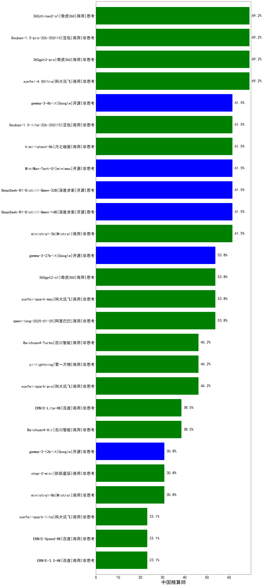

|类别|机构|大模型|【中国精算师】准确率|平均耗时|平均消耗token|排名（准确率）|
|---|---|-----|-------------------|-------|-----------|------------|
|开源|深度求索|DeepSeek-R1|84.6%|/|/|1|
|开源|阿里巴巴|qwq-32b|76.9%|/|/|2|
|商用|奇虎360|360gpt2-pro|69.2%|/|/|3|
|商用|豆包|Doubao-1.5-pro-32k-250115|69.2%|/|/|4|
|商用|科大讯飞|xunfei-4.0Ultra|69.2%|/|/|5|
|开源|阿里巴巴|qwen2.5-7b-instruct|69.2%|/|/|6|
|商用|奇虎360|360zhinao2-o1|69.2%|/|/|7|
|商用|阿里巴巴|qwq-plus-2025-03-05|69.2%|/|/|8|
|商用|Mistral|ministral-3b|61.5%|/|/|9|
|开源|Google|gemma-3-4b-it|61.5%|/|/|10|
|商用|豆包|Doubao-1.5-lite-32k-250115|61.5%|/|/|11|
|商用|月之暗面|kimi-latest-8k|61.5%|/|/|12|
|商用|商汤|SenseChat-5-beta|61.5%|/|/|13|
|商用|阿里巴巴|qwen2.5-max|61.5%|/|/|14|
|开源|阿里巴巴|qwen2.5-14b-instruct|61.5%|/|/|15|
|开源|深度求索|DeepSeek-R1-Distill-Qwen-14B|61.5%|/|/|16|
|开源|深度求索|DeepSeek-R1-Distill-Qwen-32B|61.5%|/|/|17|
|开源|minimax|MiniMax-Text-01|61.5%|/|/|18|
|商用|OpenAI|gpt-4o-mini|61.5%|/|/|19|
|开源|阿里巴巴|qwen2.5-32b-instruct|61.5%|/|/|20|
|商用|腾讯|hunyuan-standard|53.8%|/|/|21|
|商用|阿里巴巴|qwen-long-2025-01-25|53.8%|/|/|22|
|开源|微软|phi-4|53.8%|/|/|23|
|开源|Google|gemma-3-27b-it|53.8%|/|/|24|
|商用|Mistral|mistral-large|53.8%|/|/|25|
|商用|奇虎360|360gpt2-o1|53.8%|/|/|26|
|商用|科大讯飞|xunfei-spark-max|53.8%|/|/|27|
|商用|腾讯|hunyuan-turbo|53.8%|/|/|28|
|开源|阿里巴巴|qwen2.5-72b-instruct|53.8%|/|/|29|
|商用|奇虎360|360gpt-turbo|53.8%|/|/|30|
|开源|上海人工智能实验室|internlm2_5-7b-chat|46.2%|/|/|31|
|商用|科大讯飞|xunfei-spark-pro|46.2%|/|/|32|
|商用|零一万物|yi-lightning|46.2%|/|/|33|
|商用|月之暗面|moonshot-v1-8k|46.2%|/|/|34|
|商用|百度|ERNIE-Tiny-8K|46.2%|/|/|35|
|商用|百川智能|Baichuan4-Turbo|46.2%|/|/|36|
|开源|阿里巴巴|qwen2.5-3b-instruct|46.2%|/|/|37|
|开源|腾讯|hunyuan-large|46.2%|/|/|38|
|商用|商汤|SenseChat-Turbo-1202|46.2%|/|/|39|
|商用|商汤|SenseChat-5-1202|46.2%|/|/|40|
|商用|openAI|chatgpt-4o-latest|38.5%|/|/|41|
|商用|百度|ERNIE-Lite-8K|38.5%|/|/|42|
|开源|阿里巴巴|qwen2.5-1.5b-instruct|38.5%|/|/|43|
|商用|智谱AI|GLM-4-Flash|38.5%|/|/|44|
|商用|百川智能|Baichuan4-Air|38.5%|/|/|45|
|商用|Mistral|ministral-8b|30.8%|/|/|46|
|商用|智谱AI|GLM-4-FlashX|30.8%|/|/|47|
|商用|阶跃星辰|step-2-mini|30.8%|/|/|48|
|开源|Google|gemma-3-12b-it|30.8%|/|/|49|
|商用|Mistral|mistral-small|30.8%|/|/|50|
|商用|百度|ERNIE-Speed-8K|23.1%|/|/|51|
|商用|百度|ERNIE-3.5-8K|23.1%|/|/|52|
|商用|科大讯飞|xunfei-spark-lite|23.1%|/|/|53|
|开源|阿里巴巴|qwen2.5-0.5b-instruct|15.4%|/|/|54|
|商用|智谱AI|GLM-4-Air|nan%|/|/|55|
|商用|智谱AI|GLM-4-AirX|nan%|/|/|56|
|商用|智谱AI|GLM-4-Long|nan%|/|/|57|
|商用|智谱AI|GLM-4-Plus|nan%|/|/|58|
|开源|深度求索|deepseek-chat-v3-0324|nan%|/|/|59|
|开源|meta|Llama-4-Scout-17B-16E-Instruct|nan%|/|/|60|
|开源|meta|Llama-4-Maverick-17B-128E-Instruct-FP8|nan%|/|/|61|
|开源|Mistral|Mistral-Small-3.1-24B-Instruct-2503|nan%|/|/|62|
|商用|智谱AI|GLM-Z1-Flash|nan%|72s|9245|63|
|商用|智谱AI|GLM-Z1-FlashX|nan%|68s|10356|64|
|商用|智谱AI|GLM-Z1-Air|nan%|166s|6525|65|
|商用|智谱AI|GLM-Z1-AirX|nan%|38s|5913|66|
|开源|智谱AI|GLM-4-9B-0414|nan%|28s|1123|67|
|开源|智谱AI|GLM-Z1-9B-0414|nan%|160s|7044|68|
|开源|智谱AI|GLM-4-32B-0414|nan%|43s|1372|69|
|开源|智谱AI|GLM-Z1-32B-0414|nan%|300s|5450|70|
|开源|智谱AI|GLM-Z1-Rumination-32B-0414|nan%|141s|4767|71|
|开源|阿里巴巴|Qwen3-235B-A22B|nan%|213s|6497|72|
|开源|阿里巴巴|Qwen3-32B|nan%|43s|1573|73|
|开源|阿里巴巴|Qwen3-30B-A3B|nan%|102s|5986|74|
|开源|阿里巴巴|Qwen3-14B|nan%|119s|6560|75|
|开源|阿里巴巴|Qwen3-8B|nan%|425s|11564|76|
|开源|阿里巴巴|Qwen3-4B|nan%|24s|1538|77|
|开源|阿里巴巴|Qwen3-1.7B|nan%|86s|8056|78|
|开源|阿里巴巴|Qwen3-0.6B|nan%|25s|4472|79|
|商用|科大讯飞|xunfei-spark-x1|nan%|345s|4371|80|
|商用|豆包|Doubao-1.5-thinking-pro|nan%|671s|3097|81|
|商用|openAI|gpt-4.1|nan%|14s|793|82|
|商用|openAI|gpt-4.1-mini|nan%|16s|980|83|
|商用|openAI|o4-mini|nan%|34s|1565|84|
|开源|深度求索|DeepSeek-R1-0528|nan%|397s|7185|85|
|商用|百度|ERNIE-4.5-Turbo-32K|nan%|117s|1596|86|
|商用|百度|ERNIE-X1-Turbo-32K|nan%|579s|6348|87|
|商用|google|gemini-2.5-flash-preview-05-20|nan%|71s|3355|88|
|商用|google|gemini-2.5-pro-preview-05-06|nan%|78s|4979|89|
|开源|深度求索|DeepSeek-R1-0528-Qwen3-8B|nan%|493s|8567|90|
|商用|anthropic|claude-4-sonnet|nan%|41s|697|91|
|商用|anthropic|claude-4-sonnet-thinking|nan%|107s|1360|92|
|商用|阶跃星辰|step-r1-v-mini|nan%|560s|6110|93|
|商用|腾讯|hunyuan-turbos-20250604(new)|nan%|119s|3452|94|
|商用|腾讯|hunyuan-t1-20250529|nan%|65s|4218|95|
|商用|豆包|doubao-seed-1-6-flash-250615(new)|nan%|19s|1730|96|
|商用|豆包|doubao-seed-1-6-flash-thinking-250615(new)|nan%|56s|4859|97|
|商用|豆包|doubao-seed-1-6-250615(new)|nan%|962s|759|98|
|商用|豆包|doubao-seed-1-6-thinking-250615(new)|nan%|664s|5990|99|
|商用|阿里巴巴|qwen-plus-2025-04-28|nan%|/|/|100|
|商用|阿里巴巴|qwen-plus-think-2025-04-28|nan%|/|/|101|
|商用|阿里巴巴|qwen-turbo-2025-04-28|nan%|29s|1276|102|
|商用|阿里巴巴|qwen-turbo-think-2025-04-28|nan%|334s|14476|103|
|开源|minimax|MiniMax-M1(new)|nan%|/|/|104|
|开源|百度|ERNIE-4.5-0.3B(new)|nan%|6s|499|105|
|开源|百度|ERNIE-4.5-21B-A3B(new)|nan%|25s|468|106|
|开源|百度|ERNIE-4.5-300B-A47B(new)|nan%|52s|1545|107|
|开源|腾讯|Hunyuan-A13B-Instruct(new)|nan%|122s|4557|108|
|商用|google|gemini-2.5-pro(new)|nan%|/|/|109|
|商用|google|gemini-2.5-flash(new)|nan%|16s|3092|110|
|商用|google|gemini-2.5-flash-lite-preview-06-17(new)|nan%|13s|3684|111|

