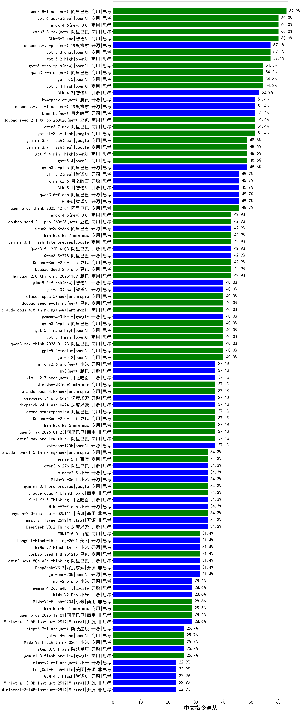

|类别|机构|大模型|【中文指令遵从】准确率|平均耗时|平均消耗token|花费/千次（元）|排名（准确率）|
|---|---|-----|-------------------|-------|-----------|-----------|-----------|
|商用|阿里巴巴|qwen3.8-flash(new)|62.9%|78s|2760|7.3|1|
|商用|智谱AI|GLM-5-Turbo|60.0%|35s|1706|36.9|2|
|商用|阿里巴巴|qwen3.8-max(new)|60.0%|48s|1938|67.9|3|
|商用|XAI|grok-4.6(new)|60.0%|45s|1899|73.0|4|
|商用|openAI|gpt-6-astra(new)|60.0%|22s|452|145.5|5|
|商用|openAI|gpt-5.3-chat|57.1%|7s|363|31.6|6|
|商用|openAI|gpt-5.2-high|57.1%|14s|568|52.5|7|
|开源|深度求索|deepseek-v4-pro(new)|57.1%|60s|1663|42.8|8|
|商用|阿里巴巴|qwen3.7-plus(new)|54.3%|38s|1943|15.3|9|
|商用|openAI|gpt-5.4-high|54.3%|17s|862|86.5|10|
|商用|openAI|gpt-5.6-sol-pro(new)|54.3%|25s|4137|383.5|11|
|商用|openAI|gpt-5.5|54.3%|9s|487|94.3|12|
|开源|智谱AI|GLM-4.7|52.9%|56s|1982|27.3|13|
|商用|阿里巴巴|qwen3.7-max|51.4%|41s|1874|66.5|14|
|商用|google|gemini-3.5-flash|51.4%|10s|1703|105.3|15|
|商用|豆包|doubao-seed-2-1-turbo-260628(new)|51.4%|210s|3475|51.2|16|
|开源|月之暗面|kimi-k3(new)|51.4%|130s|1565|147.4|17|
|开源|阿里巴巴|qwen3.5-plus|48.6%|52s|4381|20.9|18|
|商用|openAI|gpt-5.4-mini-high|48.6%|10s|978|29.6|19|
|商用|openAI|gpt-5.4|48.6%|8s|372|35.0|20|
|商用|google|gemini-3.7-flash(new)|48.6%|8s|1150|29.4|21|
|商用|google|gemini-3.8-flash(new)|48.6%|16s|1533|78.9|22|
|商用|阿里巴巴|qwen-plus-think-2025-12-01|45.7%|43s|1903|14.9|23|
|开源|智谱AI|glm-5.2(new)|45.7%|44s|1925|53.0|24|
|开源|阿里巴巴|qwen3.5-flash|45.7%|137s|4010|7.9|25|
|开源|智谱AI|GLM-5|45.7%|66s|1637|28.9|26|
|开源|月之暗面|kimi-k2.6|45.7%|115s|1333|35.2|27|
|开源|智谱AI|GLM-5.1|45.7%|226s|1633|38.5|28|
|开源|阿里巴巴|Qwen3.5-122B-A10B|42.9%|426s|3467|22.0|29|
|开源|阿里巴巴|Qwen3.5-27B|42.9%|453s|3698|17.6|30|
|商用|豆包|doubao-seed-2-1-pro-260628(new)|42.9%|132s|3433|101.0|31|
|开源|阿里巴巴|Qwen3.6-35B-A3B|42.9%|13s|2059|21.9|32|
|商用|google|gemini-3.1-flash-lite-preview|42.9%|5s|320|3.0|33|
|商用|XAI|grok-4.5(new)|42.9%|46s|1558|58.6|34|
|商用|腾讯|hunyuan-2.0-thinking-20251109|42.9%|8s|884|3.4|35|
|商用|豆包|Doubao-Seed-2.0-pro|42.9%|314s|1457|22.2|36|
|商用|豆包|Doubao-Seed-2.0-lite|42.9%|280s|1258|4.3|37|
|商用|minimax|MiniMax-M2.7|42.9%|51s|2018|16.5|38|
|商用|openAI|gpt-5.4-mini|40.0%|95s|279|7.6|39|
|商用|anthropic|claude-opus-4.8-thinking(new)|40.0%|12s|546|86.6|40|
|商用|阿里巴巴|qwen3.6-plus|40.0%|73s|1977|23.3|41|
|开源|google|gemma-4-31b-it|40.0%|46s|280|0.7|42|
|商用|openAI|gpt-5.4-nano-high|40.0%|104s|694|5.7|43|
|商用|阿里巴巴|qwen3-max-think-2026-01-23|40.0%|92s|2902|28.7|44|
|商用|anthropic|claude-opus-5(new)|40.0%|24s|1216|203.7|45|
|商用|openAI|gpt-5.2-medium|40.0%|13s|501|45.9|46|
|商用|openAI|gpt-5.2|40.0%|9s|370|32.8|47|
|开源|智谱AI|glm-5.3(new)|40.0%|84s|3271|90.7|48|
|开源|智谱AI|glm-5.3-flash(new)|40.0%|133s|2356|6.5|49|
|商用|豆包|doubao-seed-evolving(new)|40.0%|177s|3876|114.3|50|
|商用|阿里巴巴|qwen3.6-max-preview|37.1%|99s|1859|98.5|51|
|开源|openAI|gpt-oss-120b|37.1%|59s|866|2.6|52|
|商用|anthropic|claude-opus-4.8(new)|37.1%|11s|468|72.8|53|
|商用|minimax|MiniMax-M3(new)|37.1%|51s|1345|20.0|54|
|商用|豆包|Doubao-Seed-2.0-mini|37.1%|137s|1789|3.4|55|
|开源|深度求索|deepseek-v4-pro-0424|37.1%|58s|1222|28.9|56|
|开源|月之暗面|kimi-k2.7-code(new)|37.1%|32s|1056|27.8|57|
|商用|minimax|MiniMax-M2.5|37.1%|36s|1714|13.9|58|
|商用|阿里巴巴|qwen3-max-2026-01-23|37.1%|67s|276|2.4|59|
|开源|腾讯|hy3(new)|37.1%|91s|221|0.7|60|
|商用|阿里巴巴|qwen3-max-preview-think|37.1%|48s|1657|39.0|61|
|开源|深度求索|deepseek-v4-flash-0424|37.1%|31s|733|1.4|62|
|商用|百度|ernie-5.1|34.3%|34s|694|12.0|63|
|商用|anthropic|claude-sonnet-5-thinking(new)|34.3%|13s|588|37.5|64|
|开源|阿里巴巴|qwen3.6-27b|34.3%|32s|1898|33.5|65|
|开源|深度求索|DeepSeek-V3.2-Think|34.3%|35s|968|2.9|66|
|开源|Mistral|mistral-large-2512|34.3%|21s|579|5.8|67|
|开源|小米|mimo-v2.5|34.3%|24s|849|8.7|68|
|开源|小米|MiMo-V2-Omni|34.3%|7s|985|10.6|69|
|开源|月之暗面|Kimi-K2.5-Thinking|34.3%|227s|1087|22.2|70|
|商用|腾讯|hunyuan-2.0-instruct-20251111|34.3%|5s|440|0.8|71|
|商用|google|gemini-3.1-pro-preview|34.3%|43s|1642|137.2|72|
|商用|anthropic|claude-opus-4.6|34.3%|14s|556|88.0|73|
|开源|小米|MiMo-V2-Flash|34.3%|62s|446|0.0|74|
|商用|百度|ERNIE-5.0|31.4%|111s|812|18.9|75|
|开源|阿里巴巴|qwen3-next-80b-a3b-thinking|31.4%|165s|2845|11.2|76|
|开源|小米|MiMo-V2-Flash-think|31.4%|91s|1578|0.0|77|
|开源|美团|LongCat-Flash-Thinking-2601|31.4%|214s|2307|0.0|78|
|商用|豆包|doubao-seed-1-8-251215|31.4%|32s|797|5.8|79|
|开源|openAI|gpt-oss-20b|31.4%|65s|1423|1.6|80|
|开源|深度求索|DeepSeek-V3.2|31.4%|120s|268|0.8|81|
|商用|minimax|MiniMax-M2.1|28.6%|88s|767|6.0|82|
|开源|Mistral|Ministral-3-8B-Instruct-2512|28.6%|6s|628|0.7|83|
|商用|阿里巴巴|qwen-plus-2025-12-01|28.6%|13s|368|0.7|84|
|开源|小米|mimo-v2.5-pro|28.6%|21s|905|15.0|85|
|商用|小米|MiMo-V2-Flash-0204|28.6%|63s|456|0.9|86|
|开源|小米|MiMo-V2-Pro|28.6%|317s|868|14.2|87|
|开源|google|gemma-4-26b-a4b-it|28.6%|28s|359|0.9|88|
|开源|阶跃星辰|step-3.5-flash|25.7%|17s|879|1.8|89|
|商用|小米|MiMo-V2-Flash-think-0204|25.7%|547s|1608|3.3|90|
|商用|google|gemini-3-flash-preview|25.7%|14s|1329|27.6|91|
|开源|阶跃星辰|step-3.7-flash(new)|25.7%|65s|1734|13.8|92|
|商用|openAI|gpt-5.4-nano|25.7%|7s|331|2.6|93|
|开源|智谱AI|GLM-4.7-Flash|22.9%|1848s|1680|0.0|94|
|开源|美团|LongCat-Flash-Lite|22.9%|35s|271|0.0|95|
|开源|Mistral|Ministral-3-14B-Instruct-2512|22.9%|6s|683|1.0|96|
|开源|Mistral|Ministral-3-3B-Instruct-2512|22.9%|4s|702|0.5|97|

