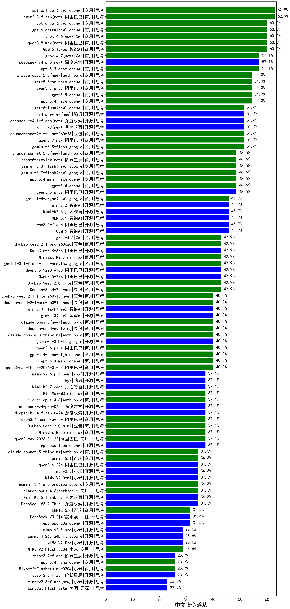

|类别|机构|大模型|【中文指令遵从】准确率|平均耗时|平均消耗token|花费/千次（元）|排名（准确率）|
|---|---|-----|-------------------|-------|-----------|-----------|-----------|
|商用|openAI|gpt-6.1-sol(new)|62.9%|10s|405|25.8|1|
|商用|阿里巴巴|qwen3.8-flash(new)|62.9%|78s|2760|7.3|2|
|商用|阿里巴巴|qwen3.8-max(new)|60.0%|48s|1938|67.9|3|
|商用|openAI|gpt-6-sol(new)|60.0%|279s|338|21.1|4|
|商用|XAI|grok-4.6(new)|60.0%|45s|1899|73.0|5|
|商用|智谱AI|GLM-5-Turbo|60.0%|35s|1706|36.9|6|
|商用|openAI|gpt-6-astra(new)|60.0%|22s|452|145.5|7|
|商用|openAI|gpt-5.3-chat|57.1%|7s|363|31.6|8|
|商用|XAI|grok-4.7(new)|57.1%|74s|2432|66.3|9|
|开源|深度求索|deepseek-v4-pro(new)|57.1%|60s|1663|42.8|10|
|商用|openAI|gpt-5.6-sol-pro|54.3%|25s|4137|383.5|11|
|商用|阿里巴巴|qwen3.7-plus|54.3%|38s|1943|15.3|12|
|商用|anthropic|claude-opus-5.5(new)|54.3%|27s|1000|132.5|13|
|商用|openAI|gpt-5.5|54.3%|9s|487|94.3|14|
|商用|openAI|gpt-5.4-high|54.3%|17s|862|86.5|15|
|开源|月之暗面|kimi-k3(new)|51.4%|130s|1565|147.4|16|
|商用|google|gemini-3.5-flash|51.4%|10s|1703|105.3|17|
|开源|深度求索|deepseek-v4.1-flash(new)|51.4%|38s|2172|17.0|18|
|开源|腾讯|hy4-preview(new)|51.4%|118s|7035|126.0|19|
|商用|openAI|gpt-6-luna(new)|51.4%|164s|437|1.4|20|
|商用|阿里巴巴|qwen3.7-max|51.4%|41s|1874|66.5|21|
|商用|豆包|doubao-seed-2-1-turbo-260628|51.4%|210s|3475|51.2|22|
|商用|openAI|gpt-5.4-mini-high|48.6%|10s|978|29.6|23|
|商用|openAI|gpt-5.4|48.6%|8s|372|35.0|24|
|商用|anthropic|claude-sonnet-5.5(new)|48.6%|12s|972|64.3|25|
|开源|阿里巴巴|qwen3.5-plus|48.6%|52s|4381|20.9|26|
|商用|google|gemini-3.8-flash(new)|48.6%|16s|1533|78.9|27|
|商用|google|gemini-3.7-flash(new)|48.6%|8s|1150|29.4|28|
|商用|阶跃星辰|step-5-preview(new)|48.6%|22s|1712|33.7|29|
|开源|阿里巴巴|qwen3.5-flash|45.7%|137s|4010|7.9|30|
|开源|智谱AI|glm-5.2|45.7%|44s|1925|53.0|31|
|开源|月之暗面|kimi-k2.6|45.7%|115s|1333|35.2|32|
|开源|智谱AI|GLM-5|45.7%|66s|1637|28.9|33|
|开源|智谱AI|GLM-5.1|45.7%|226s|1633|38.5|34|
|商用|XAI|grok-4.5|42.9%|46s|1558|58.6|35|
|开源|阿里巴巴|Qwen3.6-35B-A3B|42.9%|13s|2059|21.9|36|
|商用|豆包|doubao-seed-2-1-pro-260628|42.9%|132s|3433|101.0|37|
|商用|豆包|Doubao-Seed-2.0-lite|42.9%|280s|1258|4.3|38|
|商用|豆包|Doubao-Seed-2.0-pro|42.9%|314s|1457|22.2|39|
|商用|minimax|MiniMax-M2.7|42.9%|51s|2018|16.5|40|
|商用|google|gemini-3.1-flash-lite-preview|42.9%|5s|320|3.0|41|
|开源|阿里巴巴|Qwen3.5-122B-A10B|42.9%|426s|3467|22.0|42|
|开源|阿里巴巴|Qwen3.5-27B|42.9%|453s|3698|17.6|43|
|商用|anthropic|claude-opus-4.8-thinking|40.0%|12s|546|86.6|44|
|商用|豆包|doubao-seed-2-1-lite-260915(new)|40.0%|65s|3000|8.0|45|
|商用|豆包|doubao-seed-2-1-pro-260915(new)|40.0%|72s|2391|69.8|46|
|商用|豆包|doubao-seed-evolving|40.0%|177s|3876|114.3|47|
|商用|阿里巴巴|qwen3-max-think-2026-01-23|40.0%|92s|2902|28.7|48|
|开源|google|gemma-4-31b-it|40.0%|46s|280|0.7|49|
|商用|阿里巴巴|qwen3.6-plus|40.0%|73s|1977|23.3|50|
|商用|anthropic|claude-opus-5(new)|40.0%|24s|1216|203.7|51|
|开源|智谱AI|glm-5.3-flash(new)|40.0%|133s|2356|6.5|52|
|商用|openAI|gpt-5.4-nano-high|40.0%|104s|694|5.7|53|
|开源|智谱AI|glm-5.3(new)|40.0%|84s|3271|90.7|54|
|商用|openAI|gpt-5.4-mini|40.0%|95s|279|7.6|55|
|开源|小米|mimo-v2.6-pro(new)|37.1%|25s|816|4.8|56|
|开源|腾讯|hy3|37.1%|91s|221|0.7|57|
|开源|openAI|gpt-oss-120b|37.1%|59s|866|2.6|58|
|开源|月之暗面|kimi-k2.7-code|37.1%|32s|1056|27.8|59|
|开源|深度求索|deepseek-v4-pro-0424|37.1%|58s|1222|28.9|60|
|商用|阿里巴巴|qwen3-max-2026-01-23|37.1%|67s|276|2.4|61|
|商用|minimax|MiniMax-M2.5|37.1%|36s|1714|13.9|62|
|商用|豆包|Doubao-Seed-2.0-mini|37.1%|137s|1789|3.4|63|
|商用|阿里巴巴|qwen3.6-max-preview|37.1%|99s|1859|98.5|64|
|开源|深度求索|deepseek-v4-flash-0424|37.1%|31s|733|1.4|65|
|商用|minimax|MiniMax-M3|37.1%|51s|1345|20.0|66|
|商用|anthropic|claude-opus-4.8|37.1%|11s|468|72.8|67|
|开源|阿里巴巴|qwen3.6-27b|34.3%|32s|1898|33.5|68|
|商用|anthropic|claude-sonnet-5-thinking|34.3%|13s|588|37.5|69|
|开源|小米|mimo-v2.5|34.3%|24s|849|8.7|70|
|商用|百度|ernie-5.1|34.3%|34s|694|12.0|71|
|开源|深度求索|DeepSeek-V3.2-Think|34.3%|35s|968|2.9|72|
|开源|小米|MiMo-V2-Omni|34.3%|7s|985|10.6|73|
|商用|google|gemini-3.1-pro-preview|34.3%|43s|1642|137.2|74|
|开源|月之暗面|Kimi-K2.5-Thinking|34.3%|227s|1087|22.2|75|
|商用|anthropic|claude-opus-4.6|34.3%|14s|556|88.0|76|
|开源|深度求索|DeepSeek-V3.2|31.4%|120s|268|0.8|77|
|商用|百度|ERNIE-5.0|31.4%|111s|812|18.9|78|
|开源|openAI|gpt-oss-20b|31.4%|65s|1423|1.6|79|
|商用|小米|MiMo-V2-Flash-0204|28.6%|63s|456|0.9|80|
|开源|小米|MiMo-V2-Pro|28.6%|317s|868|14.2|81|
|开源|google|gemma-4-26b-a4b-it|28.6%|28s|359|0.9|82|
|开源|小米|mimo-v2.5-pro|28.6%|21s|905|15.0|83|
|开源|阶跃星辰|step-3.5-flash|25.7%|17s|879|1.8|84|
|商用|小米|MiMo-V2-Flash-think-0204|25.7%|547s|1608|3.3|85|
|开源|阶跃星辰|step-3.7-flash|25.7%|65s|1734|13.8|86|
|商用|openAI|gpt-5.4-nano|25.7%|7s|331|2.6|87|
|开源|小米|mimo-v2.6-flash(new)|22.9%|185s|573|1.1|88|
|开源|美团|LongCat-Flash-Lite|22.9%|35s|271|0.0|89|

