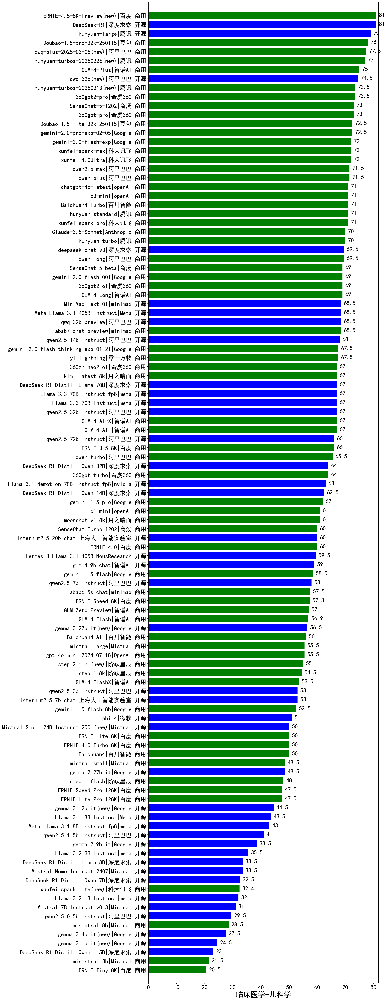

| 类别 | 大模型                         | 临床医学-儿科学 | 排名 |
|-----|------------------------------|---------|----|
|商用|ERNIE-4.5-8K-Preview(new)|81.0|1|
|开源|DeepSeek-R1|81.0|2|
|开源|hunyuan-large|79.0|3|
|商用|Doubao-1.5-pro-32k-250115|78.0|4|
|商用|qwq-plus-2025-03-05(new)|77.5|5|
|商用|hunyuan-turbos-20250226(new)|77.0|6|
|商用|GLM-4-Plus|75.0|7|
|开源|qwq-32b(new)|74.5|8|
|商用|360gpt2-pro|73.5|9|
|商用|hunyuan-turbos-20250313(new)|73.5|10|
|商用|SenseChat-5-1202|73.0|11|
|商用|360gpt-pro|73.0|12|
|商用|Doubao-1.5-lite-32k-250115|72.5|13|
|商用|gemini-2.0-pro-exp-02-05|72.5|14|
|商用|xunfei-4.0Ultra|72.0|15|
|商用|gemini-2.0-flash-exp|72.0|16|
|商用|xunfei-spark-max|72.0|17|
|商用|qwen-plus|71.5|18|
|商用|qwen2.5-max|71.5|19|
|商用|Baichuan4-Turbo|71.0|20|
|商用|chatgpt-4o-latest|71.0|21|
|商用|xunfei-spark-pro|71.0|22|
|商用|hunyuan-standard|71.0|23|
|商用|o3-mini|71.0|24|
|商用|Claude-3.5-Sonnet|70.0|25|
|商用|hunyuan-turbo|70.0|26|
|商用|qwen-long|69.5|27|
|开源|deepseek-chat-v3|69.5|28|
|商用|gemini-2.0-flash-001|69.0|29|
|商用|SenseChat-5-beta|69.0|30|
|商用|360gpt2-o1|69.0|31|
|商用|GLM-4-Long|69.0|32|
|开源|Meta-Llama-3.1-405B-Instruct|68.5|33|
|商用|abab7-chat-preview|68.5|34|
|开源|qwq-32b-preview|68.5|35|
|开源|MiniMax-Text-01|68.5|36|
|开源|qwen2.5-14b-instruct|68.0|37|
|商用|yi-lightning|67.5|38|
|商用|gemini-2.0-flash-thinking-exp-01-21|67.5|39|
|开源|Llama-3.3-70B-Instruct|67.0|40|
|开源|Llama-3.3-70B-Instruct-fp8|67.0|41|
|商用|GLM-4-AirX|67.0|42|
|开源|qwen2.5-32b-instruct|67.0|43|
|商用|GLM-4-Air|67.0|44|
|开源|DeepSeek-R1-Distill-Llama-70B|67.0|45|
|商用|360zhinao2-o1|67.0|46|
|商用|kimi-latest-8k|67.0|47|
|商用|ERNIE-3.5-8K|66.0|48|
|开源|qwen2.5-72b-instruct|66.0|49|
|商用|qwen-turbo|65.5|50|
|商用|360gpt-turbo|64.0|51|
|开源|DeepSeek-R1-Distill-Qwen-32B|64.0|52|
|开源|Llama-3.1-Nemotron-70B-Instruct-fp8|63.0|53|
|开源|DeepSeek-R1-Distill-Qwen-14B|62.5|54|
|商用|gemini-1.5-pro|62.0|55|
|商用|moonshot-v1-8k|61.0|56|
|商用|o1-mini|61.0|57|
|商用|SenseChat-Turbo-1202|60.0|58|
|开源|internlm2_5-20b-chat|60.0|59|
|商用|ERNIE-4.0|60.0|60|
|开源|Hermes-3-Llama-3.1-405B|59.5|61|
|开源|glm-4-9b-chat|59.0|62|
|商用|gemini-1.5-flash|58.5|63|
|开源|qwen2.5-7b-instruct|58.0|64|
|商用|abab6.5s-chat|57.5|65|
|商用|ERNIE-Speed-8K|57.3|66|
|商用|GLM-Zero-Preview|57.0|67|
|商用|GLM-4-Flash|56.9|68|
|开源|gemma-3-27b-it(new)|56.5|69|
|商用|Baichuan4-Air|56.0|70|
|商用|gpt-4o-mini-2024-07-18|55.5|71|
|商用|mistral-large|55.5|72|
|商用|step-2-mini(new)|55.0|73|
|商用|step-1-8k|54.5|74|
|商用|GLM-4-FlashX|53.5|75|
|开源|internlm2_5-7b-chat|53.0|76|
|开源|qwen2.5-3b-instruct|53.0|77|
|商用|gemini-1.5-flash-8b|52.5|78|
|开源|phi-4|51.0|79|
|商用|ERNIE-Lite-8K|50.0|80|
|开源|Mistral-Small-24B-Instruct-2501(new)|50.0|81|
|商用|ERNIE-4.0-Turbo-8K|50.0|82|
|商用|Baichuan4|50.0|83|
|开源|gemma-2-27b-it|48.5|84|
|商用|mistral-small|48.5|85|
|商用|step-1-flash|48.0|86|
|商用|ERNIE-Speed-Pro-128K|47.5|87|
|商用|ERNIE-Lite-Pro-128K|47.5|88|
|开源|gemma-3-12b-it(new)|44.5|89|
|开源|Llama-3.1-8B-Instruct|43.5|90|
|开源|Meta-Llama-3.1-8B-Instruct-fp8|43.0|91|
|开源|qwen2.5-1.5b-instruct|41.0|92|
|开源|gemma-2-9b-it|38.5|93|
|开源|Llama-3.2-3B-Instruct|35.5|94|
|开源|DeepSeek-R1-Distill-Llama-8B|33.5|95|
|开源|Mistral-Nemo-Instruct-2407|33.5|96|
|开源|DeepSeek-R1-Distill-Qwen-7B|32.5|97|
|商用|xunfei-spark-lite(new)|32.4|98|
|开源|Llama-3.2-1B-Instruct|32.0|99|
|开源|Mistral-7B-Instruct-v0.3|31.0|100|
|开源|qwen2.5-0.5b-instruct|29.5|101|
|商用|ministral-8b|28.5|102|
|开源|gemma-3-4b-it(new)|27.5|103|
|开源|gemma-3-1b-it(new)|24.5|104|
|开源|DeepSeek-R1-Distill-Qwen-1.5B|23.0|105|
|商用|ministral-3b|21.5|106|
|商用|ERNIE-Tiny-8K|20.5|107|
|开源|qwen2.5-math-72b-instruct|/|108|

