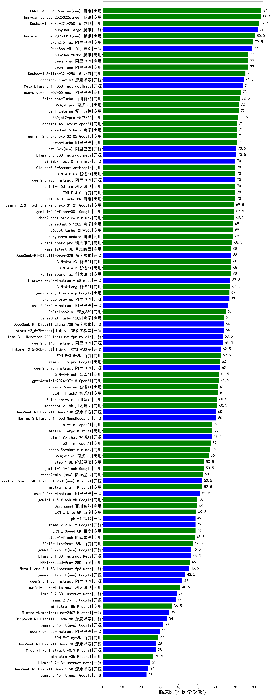

| 类别 | 大模型                         | 临床医学-医学影像学 | 排名 |
|-----|------------------------------|---------|----|
|商用|ERNIE-4.5-8K-Preview(new)|84.0|1|
|商用|hunyuan-turbos-20250226(new)|83.5|2|
|商用|Doubao-1.5-pro-32k-250115|82.5|3|
|开源|hunyuan-large|82.0|4|
|商用|hunyuan-turbos-20250313(new)|80.5|5|
|商用|qwen2.5-max|79.5|6|
|开源|DeepSeek-R1|79.0|7|
|商用|qwen-plus|77.0|8|
|商用|hunyuan-turbo|77.0|9|
|商用|qwen-long|77.0|10|
|商用|Doubao-1.5-lite-32k-250115|75.5|11|
|开源|deepseek-chat-v3|74.5|12|
|开源|Meta-Llama-3.1-405B-Instruct|74.0|13|
|商用|qwq-plus-2025-03-05(new)|73.0|14|
|商用|Baichuan4-Turbo|72.5|15|
|商用|yi-lightning|72.0|16|
|商用|360gpt-pro|72.0|17|
|商用|360gpt2-pro|71.5|18|
|商用|gemini-2.0-pro-exp-02-05|71.0|19|
|商用|chatgpt-4o-latest|71.0|20|
|商用|SenseChat-5-beta|71.0|21|
|商用|qwen-turbo|71.0|22|
|开源|qwq-32b(new)|70.5|23|
|开源|Llama-3.3-70B-Instruct|70.5|24|
|商用|xunfei-4.0Ultra|70.0|25|
|商用|ERNIE-4.0|70.0|26|
|开源|qwen2.5-72b-instruct|70.0|27|
|开源|MiniMax-Text-01|70.0|28|
|商用|Claude-3.5-Sonnet|70.0|29|
|商用|GLM-4-Plus|70.0|30|
|商用|ERNIE-4.0-Turbo-8K|70.0|31|
|商用|abab7-chat-preview|69.5|32|
|商用|gemini-2.0-flash-001|69.5|33|
|商用|gemini-2.0-flash-thinking-exp-01-21|69.5|34|
|商用|SenseChat-5-1202|69.0|35|
|商用|hunyuan-standard|69.0|36|
|商用|360gpt-turbo|69.0|37|
|商用|xunfei-spark-pro|68.5|38|
|商用|kimi-latest-8k|68.0|39|
|开源|DeepSeek-R1-Distill-Qwen-32B|68.0|40|
|商用|GLM-4-AirX|68.0|41|
|商用|xunfei-spark-max|68.0|42|
|商用|GLM-4-Air|68.0|43|
|商用|GLM-4-Long|67.5|44|
|开源|Llama-3.3-70B-Instruct-fp8|67.5|45|
|商用|gemini-2.0-flash-exp|67.0|46|
|开源|qwq-32b-preview|67.0|47|
|开源|qwen2.5-32b-instruct|66.0|48|
|商用|360zhinao2-o1|65.0|49|
|开源|internlm2_5-7b-chat|64.0|50|
|商用|SenseChat-Turbo-1202|64.0|51|
|开源|DeepSeek-R1-Distill-Llama-70B|64.0|52|
|开源|Llama-3.1-Nemotron-70B-Instruct-fp8|63.5|53|
|开源|qwen2.5-14b-instruct|63.5|54|
|商用|ERNIE-3.5-8K|62.5|55|
|开源|internlm2_5-20b-chat|62.5|56|
|商用|gemini-1.5-pro|62.0|57|
|开源|qwen2.5-7b-instruct|62.0|58|
|商用|gpt-4o-mini-2024-07-18|61.5|59|
|商用|GLM-4-Flash|61.5|60|
|商用|GLM-Zero-Preview|61.0|61|
|商用|GLM-4-FlashX|61.0|62|
|商用|moonshot-v1-8k|60.5|63|
|商用|Baichuan4-Air|60.5|64|
|开源|DeepSeek-R1-Distill-Qwen-14B|60.0|65|
|开源|Hermes-3-Llama-3.1-405B|60.0|66|
|商用|mistral-large|58.0|67|
|商用|o1-mini|58.0|68|
|开源|glm-4-9b-chat|57.5|69|
|商用|o3-mini|57.0|70|
|商用|abab6.5s-chat|56.5|71|
|商用|360gpt2-o1|56.0|72|
|商用|step-1-8k|53.5|73|
|商用|gemini-1.5-flash|53.5|74|
|商用|step-2-mini(new)|53.0|75|
|开源|Mistral-Small-24B-Instruct-2501(new)|52.5|76|
|商用|mistral-small|52.5|77|
|开源|qwen2.5-3b-instruct|51.5|78|
|商用|gemini-1.5-flash-8b|50.0|79|
|商用|Baichuan4|50.0|80|
|商用|ERNIE-Lite-8K|49.5|81|
|开源|phi-4|49.0|82|
|商用|ERNIE-Speed-8K|49.0|83|
|开源|gemma-2-27b-it|49.0|84|
|商用|step-1-flash|48.5|85|
|商用|ERNIE-Lite-Pro-128K|47.5|86|
|开源|Llama-3.1-8B-Instruct|46.5|87|
|开源|gemma-3-27b-it(new)|46.5|88|
|商用|ERNIE-Speed-Pro-128K|46.0|89|
|开源|Meta-Llama-3.1-8B-Instruct-fp8|45.5|90|
|开源|gemma-3-12b-it(new)|43.5|91|
|开源|qwen2.5-1.5b-instruct|42.0|92|
|商用|xunfei-spark-lite(new)|40.9|93|
|开源|Llama-3.2-3B-Instruct|39.0|94|
|开源|gemma-2-9b-it|38.5|95|
|商用|ministral-8b|36.5|96|
|开源|Mistral-Nemo-Instruct-2407|35.0|97|
|开源|DeepSeek-R1-Distill-Llama-8B|34.0|98|
|开源|gemma-3-4b-it(new)|32.0|99|
|开源|qwen2.5-0.5b-instruct|30.0|100|
|商用|ERNIE-Tiny-8K|29.0|101|
|开源|Mistral-7B-Instruct-v0.3|28.0|102|
|开源|DeepSeek-R1-Distill-Qwen-7B|28.0|103|
|商用|ministral-3b|26.5|104|
|开源|Llama-3.2-1B-Instruct|25.0|105|
|开源|DeepSeek-R1-Distill-Qwen-1.5B|24.0|106|
|开源|gemma-3-1b-it(new)|23.0|107|
|开源|qwen2.5-math-72b-instruct|/|108|

