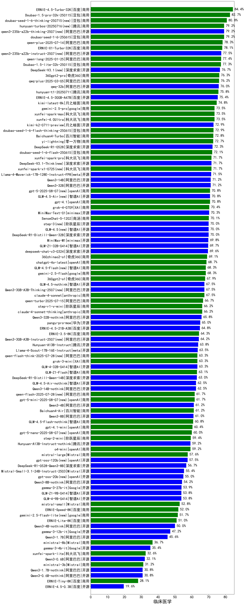

|类别|机构|大模型|【临床医学】准确率|平均耗时|平均消耗token|花费/千次（元）|排名（准确率）|
|---|---|-----|-------------------|-------|-----------|-----------|-----------|
|商用|百度|ERNIE-4.5-Turbo-32K|84.4%|20s|513|1.5|1|
|商用|google|gemini-3-pro-preview(new)|83.3%|55s|1901|157.4|2|
|商用|豆包|doubao-seed-1-8-251215(new)|82.5%|29s|699|4.8|3|
|商用|google|gemini-3-flash-preview(new)|82.5%|60s|1290|26.3|4|
|商用|豆包|doubao-seed-1-6-251015(new)|82.5%|25s|704|5.0|5|
|商用|腾讯|hunyuan-2.0-thinking-20251109(new)|80.8%|12s|872|3.3|6|
|商用|阿里巴巴|qwen-plus-think-2025-07-28|80.8%|/|2540|19.8|7|
|商用|豆包|doubao-seed-1-6-thinking-250715|80.8%|22s|1367|10.5|8|
|开源|阿里巴巴|qwen3-235b-a22b-thinking-2507|79.2%|110s|2445|47.7|9|
|开源|深度求索|DeepSeek-V3.2-Think(new)|79.2%|119s|1167|3.4|10|
|商用|豆包|doubao-seed-1-6-250615|79.2%|91s|462|3.0|11|
|商用|百度|ERNIE-X1.1-Preview(new)|78.3%|124s|926|3.5|12|
|商用|腾讯|hunyuan-2.0-instruct-20251111(new)|78.3%|7s|404|0.7|13|
|商用|百度|ERNIE-X1-Turbo-32K|78.1%|118s|2005|7.9|14|
|商用|腾讯|hunyuan-turbos-20250926(new)|77.5%|14s|595|1.1|15|
|开源|阿里巴巴|qwen3-235b-a22b-instruct-2507|77.5%|11s|477|3.4|16|
|商用|阿里巴巴|qwen-plus-think-2025-12-01(new)|76.7%|58s|2420|18.9|17|
|开源|深度求索|DeepSeek-V3.1|76.7%|17s|322|3.4|18|
|开源|深度求索|DeepSeek-V3.2-Exp-Think(new)|76.7%|193s|1028|3.0|19|
|商用|阿里巴巴|qwen3-max-preview|75.8%|9s|450|9.6|20|
|商用|腾讯|hunyuan-t1-20250711|75.8%|33s|1950|7.5|21|
|开源|百度|ERNIE-4.5-300B-A47B|75.4%|20s|339|2.3|22|
|商用|阿里巴巴|qwen-plus-2025-07-28|75.0%|13s|478|0.9|23|
|开源|月之暗面|Kimi-K2-Thinking(new)|74.2%|135s|2059|32.2|24|
|商用|anthropic|claude-opus-4.5(new)|74.2%|14s|651|102.2|25|
|商用|openAI|gpt-5.2(new)|74.2%|5s|198|12.9|26|
|商用|google|gemini-2.5-pro|73.5%|34s|2266|160.0|27|
|商用|豆包|doubao-seed-1-6-lite-251015(new)|73.3%|62s|817|1.8|28|
|开源|月之暗面|kimi-k2-0905(new)|73.3%|84s|359|4.7|29|
|商用|openAI|gpt-5.1-high(new)|73.3%|96s|1011|66.9|30|
|商用|anthropic|claude-sonnet-4.5-thinking(new)|73.3%|23s|1584|161.4|31|
|开源|深度求索|DeepSeek-V3.2(new)|73.3%|45s|322|0.9|32|
|商用|阿里巴巴|qwen3-max-2025-09-23(new)|73.3%|178s|478|10.2|33|
|商用|阿里巴巴|qwen-long-2025-01-25|72.9%|47s|334|0.6|34|
|开源|月之暗面|kimi-k2-0711-preview|72.9%|37s|538|7.8|35|
|商用|豆包|doubao-seed-1-6-flash-thinking-250615|72.9%|7s|670|0.8|36|
|商用|Mistral|mistral-medium-2508|72.5%|245s|453|5.6|37|
|商用|openAI|gpt-5.2-high(new)|72.5%|10s|448|37.7|38|
|开源|阿里巴巴|qwen3-next-80b-a3b-thinking(new)|72.5%|98s|3435|13.5|39|
|开源|Mistral|mistral-large-2512(new)|72.5%|12s|521|4.9|40|
|开源|豆包|Seed-OSS-36B-Instruct|72.5%|111s|2013|7.9|41|
|商用|anthropic|claude-sonnet-4.5(new)|72.5%|11s|579|54.6|42|
|开源|深度求索|DeepSeek-R1-0528|72.3%|224s|1803|28.1|43|
|商用|豆包|doubao-seed-1-6-flash-250615|72.1%|4s|304|0.4|44|
|开源|深度求索|DeepSeek-V3.1-Think|71.7%|50s|966|11.1|45|
|商用|阿里巴巴|qwen-plus-2025-12-01(new)|71.7%|21s|801|1.5|46|
|开源|阿里巴巴|qwen3-next-80b-a3b-instruct|71.7%|8s|524|1.9|47|
|商用|科大讯飞|xunfei-spark-x1-0725|71.7%|/|1036|12.4|48|
|开源|阿里巴巴|Qwen3-32B|71.2%|42s|1517|5.9|49|
|开源|阿里巴巴|Qwen3-14B|71.2%|40s|1507|2.9|50|
|开源|meta|Llama-4-Maverick-17B-128E-Instruct-FP8|71.0%|8s|502|2.0|51|
|开源|深度求索|DeepSeek-V3.2-Exp(new)|70.8%|165s|328|0.9|52|
|开源|智谱AI|GLM-4.5-Air|70.8%|32s|1570|9.1|53|
|商用|openAI|gpt-5.2-medium(new)|70.8%|7s|333|26.3|54|
|商用|openAI|gpt-5-2025-08-07|70.8%|26s|289|16.4|55|
|商用|XAI|grok-4-0709|70.4%|269s|1550|162.1|56|
|商用|豆包|Doubao-1.5-lite-32k-250115|70.2%|2s|189|0.1|57|
|商用|openAI|gpt-5.1-medium(new)|70.0%|142s|453|27.3|58|
|开源|智谱AI|GLM-4.5|70.0%|66s|1656|22.5|59|
|开源|阶跃星辰|step-3|70.0%|95s|1864|7.3|60|
|商用|XAI|grok-4-1-fast-reasoning(new)|69.2%|62s|1244|3.9|61|
|开源|小米|MiMo-V2-Flash-think(new)|69.2%|102s|2046|0.0|62|
|商用|google|gemini-2.5-flash|68.3%|10s|1739|30.4|63|
|商用|智谱AI|GLM-4.5-Flash|68.3%|34s|1520|0.0|64|
|开源|minimax|MiniMax-M2(new)|68.3%|34s|1616|13.0|65|
|开源|智谱AI|GLM-4.6(new)|68.3%|58s|2193|30.0|66|
|商用|百度|ERNIE-5.0-Thinking-Preview(new)|67.5%|259s|1879|44.1|67|
|商用|anthropic|claude-4-sonnet|67.5%|43s|549|50.1|68|
|商用|openAI|gpt-5.1(new)|67.5%|176s|199|9.3|69|
|开源|智谱AI|GLM-4.5-nothink|67.5%|19s|661|8.5|70|
|开源|阿里巴巴|Qwen3-30B-A3B-Thinking-2507|67.5%|69s|2816|7.7|71|
|商用|百川智能|Baichuan4-Turbo|67.3%|/|/|/|72|
|开源|minimax|MiniMax-M1|66.7%|180s|2892|19.9|73|
|商用|阿里巴巴|qwen-turbo-2025-07-15|66.7%|7s|344|0.2|74|
|商用|阿里巴巴|qwen-turbo-think-2025-07-15|66.7%|/|2376|6.9|75|
|商用|anthropic|claude-4-sonnet-thinking|66.2%|49s|1127|112.9|76|
|开源|阿里巴巴|Qwen3-32B-nothink|65.8%|65s|497|1.8|77|
|商用|360|360zhinao2-o1|65.4%|/|/|/|78|
|开源|百度|ERNIE-4.5-21B-A3B|64.8%|46s|316|0.0|79|
|开源|minimax|MiniMax-Text-01|64.6%|11s|895|7.2|80|
|开源|阿里巴巴|Qwen3-30B-A3B-Instruct-2507|64.2%|5s|533|1.4|81|
|开源|小米|MiMo-V2-Flash(new)|64.2%|67s|422|0.0|82|
|商用|anthropic|claude-haiku-4.5-thinking(new)|64.2%|45s|2432|84.1|83|
|开源|腾讯|Hunyuan-A13B-Instruct|63.8%|61s|1059|4.1|84|
|商用|阿里巴巴|qwen-flash-think-2025-07-28|63.3%|27s|2793|4.1|85|
|商用|XAI|grok-3-mini|63.3%|207s|1050|3.7|86|
|开源|meta|Llama-4-Scout-17B-16E-Instruct|63.1%|10s|526|1.0|87|
|开源|阿里巴巴|Qwen3-8B-nothink|62.5%|73s|494|0.0|88|
|开源|智谱AI|GLM-4.5-Air-nothink|62.5%|15s|909|5.1|89|
|开源|阿里巴巴|Qwen3-14B-nothink|62.5%|13s|523|0.9|90|
|商用|openAI|gpt-5-mini-2025-08-07|61.7%|60s|813|10.8|91|
|商用|阿里巴巴|qwen-flash-2025-07-28|61.7%|7s|500|0.7|92|
|开源|阿里巴巴|Qwen3-4B|61.2%|29s|1852|5.4|93|
|开源|阿里巴巴|Qwen3-8B|61.0%|323s|8866|0.0|94|
|商用|openAI|gpt-5-mini-high(new)|60.8%|615s|2001|28.0|95|
|商用|智谱AI|GLM-4.5-Flash-nothink|60.8%|19s|915|0.0|96|
|开源|Mistral|Mistral-Small-3.2-24B-Instruct-2506|60.0%|124s|511|1.0|97|
|商用|openAI|gpt-5-nano-2025-08-07|60.0%|61s|1717|4.8|98|
|商用|openAI|gpt-5-nano-high(new)|59.2%|552s|4197|12.0|99|
|开源|腾讯|Hunyuan-A13B-Instruct-nothink|59.2%|309s|359|1.2|100|
|商用|openAI|o4-mini|59.2%|32s|819|24.2|101|
|商用|anthropic|claude-haiku-4.5(new)|59.2%|17s|602|18.6|102|
|开源|openAI|gpt-oss-120b|57.5%|34s|646|1.8|103|
|开源|深度求索|DeepSeek-R1-0528-Qwen3-8B|56.7%|234s|1589|0.0|104|
|开源|Mistral|Ministral-3-14B-Instruct-2512(new)|56.7%|8s|560|0.8|105|
|商用|百川智能|Baichuan4-Air|56.5%|/|/|/|106|
|开源|Mistral|Magistral-Small-2507|55.8%|160s|5719|61.6|107|
|开源|openAI|gpt-oss-20b|55.0%|36s|933|1.0|108|
|开源|智谱AI|GLM-4-9B-0414|53.8%|10s|426|0.0|109|
|商用|google|gemini-2.5-flash-lite|51.7%|7s|574|1.5|110|
|商用|XAI|grok-4-1-fast-non-reasoning(new)|50.8%|56s|619|1.7|111|
|开源|Mistral|Ministral-3-8B-Instruct-2512(new)|50.8%|9s|615|0.7|112|
|开源|google|gemma-3-27b-it|50.4%|/|/|/|113|
|开源|阿里巴巴|Qwen3-4B-nothink|50.0%|15s|419|1.1|114|
|开源|阿里巴巴|Qwen3-1.7B|45.6%|27s|2014|5.8|115|
|商用|百度|ERNIE-Lite-8K|45.4%|/|/|/|116|
|开源|Mistral|Ministral-3-3B-Instruct-2512(new)|45.0%|6s|590|0.4|117|
|开源|google|gemma-3-12b-it|39.8%|/|/|/|118|
|开源|google|gemma-3-4b-it|33.3%|/|/|/|119|
|开源|阿里巴巴|Qwen3-0.6B|32.1%|14s|1220|3.5|120|
|开源|阿里巴巴|Qwen3-1.7B-nothink|30.8%|10s|444|1.1|121|
|开源|阿里巴巴|Qwen3-0.6B-nothink|30.8%|11s|221|0.5|122|
|开源|百度|ERNIE-4.5-0.3B|20.8%|46s|377|0.0|123|

