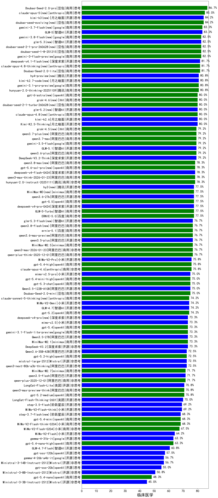

|类别|机构|大模型|【临床医学】准确率|平均耗时|平均消耗token|花费/千次（元）|排名（准确率）|
|---|---|-----|-------------------|-------|-----------|-----------|-----------|
|商用|豆包|Doubao-Seed-2.0-pro|86.7%|243s|1027|15.1|1|
|商用|anthropic|claude-opus-5(new)|85.0%|16s|732|114.7|2|
|商用|豆包|doubao-seed-evolving(new)|84.2%|249s|7464|221.5|3|
|开源|月之暗面|kimi-k3(new)|84.2%|45s|936|82.5|4|
|商用|google|gemini-3.7-flash(new)|83.3%|9s|798|19.6|5|
|开源|智谱AI|GLM-5|83.3%|118s|2043|35.9|6|
|商用|google|gemini-3-flash-preview|82.5%|60s|1290|26.3|7|
|商用|豆包|doubao-seed-2-1-pro-260628(new)|82.5%|217s|7585|225.1|8|
|商用|豆包|doubao-seed-1-8-251215|82.5%|29s|699|4.8|9|
|商用|google|gemini-3.8-flash(new)|82.5%|19s|781|38.3|10|
|开源|智谱AI|glm-5.3(new)|82.5%|1s|1666|45.3|11|
|开源|深度求索|deepseek-v4.1-flash(new)|81.7%|10s|1052|7.9|12|
|商用|anthropic|claude-opus-4.8-thinking(new)|81.7%|15s|777|122.6|13|
|商用|豆包|Doubao-Seed-2.0-lite|81.7%|199s|906|2.9|14|
|商用|腾讯|hunyuan-2.0-thinking-20251109|80.8%|12s|872|3.3|15|
|开源|腾讯|hy4-preview(new)|80.8%|65s|3306|58.6|16|
|开源|月之暗面|kimi-k2.7-code(new)|80.8%|49s|1352|35.3|17|
|商用|google|gemini-3.1-pro-preview|80.8%|35s|1476|121.2|18|
|开源|月之暗面|Kimi-K2.5-Thinking|80.0%|364s|1941|39.7|19|
|商用|XAI|grok-4.6(new)|80.0%|203s|1559|58.1|20|
|商用|anthropic|claude-opus-4.8(new)|80.0%|10s|532|79.9|21|
|开源|智谱AI|glm-5.2(new)|80.0%|48s|1862|50.8|22|
|商用|豆包|doubao-seed-2-1-turbo-260628(new)|80.0%|194s|7534|111.8|23|
|开源|月之暗面|kimi-k2.6|80.0%|109s|2184|57.7|24|
|商用|openAI|gpt-6-astra(new)|80.0%|11s|262|69.8|25|
|商用|阿里巴巴|qwen3.7-max|79.2%|23s|1136|39.3|26|
|商用|google|gemini-3.5-flash|79.2%|8s|1400|84.8|27|
|商用|XAI|grok-4.5(new)|79.2%|80s|1738|65.6|28|
|商用|阿里巴巴|qwen3.7-plus(new)|79.2%|28s|1451|11.2|29|
|开源|智谱AI|GLM-5.1|79.2%|156s|1507|35.0|30|
|开源|深度求索|DeepSeek-V3.2-Think|79.2%|119s|1167|3.4|31|
|商用|阿里巴巴|qwen3.6-plus|79.2%|32s|1551|17.9|32|
|商用|openAI|gpt-5.6-sol-pro(new)|78.3%|23s|3381|273.4|33|
|开源|深度求索|deepseek-v4-flash-0424|78.3%|33s|821|1.6|34|
|商用|腾讯|hunyuan-2.0-instruct-20251111|78.3%|7s|404|0.7|35|
|商用|阿里巴巴|qwen3-max-think-2026-01-23|78.3%|173s|2970|29.2|36|
|商用|阿里巴巴|qwen3.8-max(new)|78.3%|38s|1516|52.1|37|
|开源|阿里巴巴|qwen3.6-27b|77.5%|28s|1623|28.2|38|
|商用|minimax|MiniMax-M3(new)|77.5%|24s|696|8.8|39|
|开源|深度求索|deepseek-v4-pro-0424|77.5%|37s|887|20.6|40|
|开源|腾讯|hy3(new)|77.5%|68s|229|0.7|41|
|商用|openAI|gpt-5.5|77.5%|8s|434|77.6|42|
|商用|百度|ERNIE-5.0|77.5%|143s|1995|46.9|43|
|商用|智谱AI|GLM-5-Turbo|77.5%|41s|1488|31.7|44|
|商用|百度|ernie-5.1|76.7%|30s|935|16.0|45|
|商用|阿里巴巴|qwen3.6-max-preview|76.7%|50s|1561|81.3|46|
|开源|阿里巴巴|qwen3.5-plus|76.7%|35s|2786|13.1|47|
|商用|minimax|MiniMax-M2.5|76.7%|26s|1362|10.9|48|
|商用|阿里巴巴|qwen3-max-2026-01-23|76.7%|44s|522|4.7|49|
|商用|阿里巴巴|qwen-plus-think-2025-12-01|76.7%|58s|2420|18.9|50|
|商用|阿里巴巴|qwen3.8-flash(new)|76.7%|58s|1880|4.9|51|
|开源|智谱AI|glm-5.3-flash(new)|76.7%|133s|2414|6.6|52|
|商用|openAI|gpt-5.4-high|75.8%|14s|624|58.8|53|
|商用|anthropic|claude-opus-4.6|75.8%|15s|611|93.5|54|
|开源|小米|MiMo-V2-Pro|75.8%|212s|1058|17.9|55|
|商用|openAI|gpt-5.3-chat|75.0%|16s|372|29.8|56|
|开源|阿里巴巴|Qwen3.5-122B-A10B|75.0%|253s|2943|18.5|57|
|商用|豆包|Doubao-Seed-2.0-mini|75.0%|391s|2407|4.6|58|
|开源|小米|mimo-v2.5-pro|75.0%|23s|1224|21.3|59|
|商用|openAI|gpt-5.4-mini-high|75.0%|35s|941|27.6|60|
|商用|anthropic|claude-sonnet-5-thinking(new)|74.2%|15s|765|48.3|61|
|开源|小米|mimo-v2.6-pro(new)|74.2%|35s|1075|6.2|62|
|开源|小米|mimo-v2.6-flash(new)|74.2%|92s|1161|2.3|63|
|开源|智谱AI|GLM-4.7|74.2%|63s|2228|30.5|64|
|开源|小米|MiMo-V2-Omni|74.2%|139s|1188|13.1|65|
|商用|openAI|gpt-5.2|74.2%|5s|198|12.9|66|
|开源|小米|mimo-v2.5|73.3%|22s|1273|14.4|67|
|商用|google|gemini-3.1-flash-lite-preview|73.3%|18s|356|3.2|68|
|商用|minimax|MiniMax-M2.1|73.3%|76s|1214|9.6|69|
|开源|深度求索|deepseek-v4-pro(new)|73.3%|108s|1162|28.9|70|
|开源|阿里巴巴|Qwen3.5-27B|73.3%|279s|2978|14.0|71|
|商用|openAI|gpt-5.4|73.3%|7s|262|20.7|72|
|开源|深度求索|DeepSeek-V3.2|73.3%|45s|322|0.9|73|
|商用|openAI|gpt-5.2-high|72.5%|10s|448|37.7|74|
|开源|Mistral|mistral-large-2512|72.5%|12s|521|4.9|75|
|开源|阿里巴巴|qwen3-next-80b-a3b-thinking|72.5%|98s|3435|13.5|76|
|开源|阿里巴巴|Qwen3.6-35B-A3B|72.5%|84s|1780|18.6|77|
|商用|阿里巴巴|qwen-plus-2025-12-01|71.7%|21s|801|1.5|78|
|开源|阿里巴巴|qwen3.5-flash|71.7%|271s|3134|6.1|79|
|商用|minimax|MiniMax-M2.7|71.7%|46s|1836|14.8|80|
|商用|阿里巴巴|qwen3-max-preview-think|70.8%|169s|2358|55.3|81|
|商用|openAI|gpt-5.2-medium|70.8%|7s|333|26.3|82|
|开源|美团|LongCat-Flash-Lite|70.8%|278s|516|0.0|83|
|开源|美团|LongCat-Flash-Thinking-2601|70.0%|161s|2143|0.0|84|
|开源|小米|MiMo-V2-Flash-think|69.2%|102s|2046|0.0|85|
|开源|阶跃星辰|step-3.5-flash|69.2%|21s|1800|3.7|86|
|商用|小米|MiMo-V2-Flash-think-0204|68.3%|704s|2008|4.1|87|
|开源|阶跃星辰|step-3.7-flash(new)|68.3%|36s|2806|22.3|88|
|商用|openAI|gpt-5.4-mini|68.3%|32s|212|4.6|89|
|商用|小米|MiMo-V2-Flash-0204|67.5%|201s|510|0.9|90|
|开源|小米|MiMo-V2-Flash|64.2%|67s|422|0.0|91|
|商用|openAI|gpt-5.4-nano-high|63.3%|26s|505|3.8|92|
|开源|google|gemma-4-31b-it|63.3%|69s|513|1.3|93|
|开源|智谱AI|GLM-4.7-Flash|60.8%|927s|3724|0.0|94|
|开源|openAI|gpt-oss-120b|57.5%|34s|646|1.8|95|
|开源|Mistral|Ministral-3-14B-Instruct-2512|56.7%|8s|560|0.8|96|
|开源|google|gemma-4-26b-a4b-it|56.7%|54s|556|1.4|97|
|开源|openAI|gpt-oss-20b|55.0%|36s|933|1.0|98|
|开源|Mistral|Ministral-3-8B-Instruct-2512|50.8%|9s|615|0.7|99|
|商用|openAI|gpt-5.4-nano|48.3%|42s|225|1.4|100|
|开源|Mistral|Ministral-3-3B-Instruct-2512|45.0%|6s|590|0.4|101|

