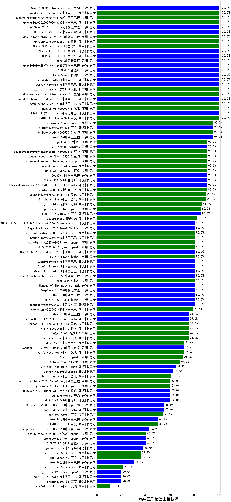

|类别|机构|大模型|【临床医学检验主管技师】准确率|平均耗时|平均消耗token|花费/千次（元）|排名（准确率）|
|---|---|-----|-------------------|-------|-----------|-----------|-----------|
|开源|阿里巴巴|Qwen3-32B-nothink|100.0%|33s|625|2.2|1|
|开源|智谱AI|GLM-4.5|100.0%|39s|2202|30.0|2|
|开源|智谱AI|GLM-4.5-Air|100.0%|31s|1642|9.5|3|
|开源|阿里巴巴|Qwen3-30B-A3B-Thinking-2507|100.0%|66s|2668|7.3|4|
|开源|智谱AI|GLM-4.5-Air-nothink|100.0%|14s|1101|6.2|5|
|开源|智谱AI|GLM-4.5-nothink|100.0%|32s|1029|13.6|6|
|开源|阶跃星辰|step-3|100.0%|95s|1919|7.5|7|
|开源|阿里巴巴|Qwen3-14B-nothink|100.0%|23s|614|1.1|8|
|开源|豆包|Seed-OSS-36B-Instruct(new)|100.0%|115s|1346|5.2|9|
|商用|阿里巴巴|qwen3-max-preview(new)|100.0%|14s|660|14.3|10|
|商用|阿里巴巴|qwen-turbo-think-2025-07-15(new)|100.0%|/|2211|6.4|11|
|开源|深度求索|DeepSeek-V3.1(new)|100.0%|20s|407|4.3|12|
|开源|深度求索|DeepSeek-V3.1-Think(new)|100.0%|40s|767|8.6|13|
|商用|阿里巴巴|qwen-flash-think-2025-07-28|100.0%|23s|2270|3.3|14|
|商用|腾讯|hunyuan-turbos-20250716|100.0%|12s|615|1.1|15|
|商用|阿里巴巴|qwen-plus-2025-07-28(new)|100.0%|19s|615|1.1|16|
|商用|阿里巴巴|qwen-turbo-2025-07-15|100.0%|8s|472|0.3|17|
|商用|腾讯|hunyuan-t1-20250711|100.0%|24s|1429|5.4|18|
|开源|阿里巴巴|qwen3-235b-a22b-instruct-2507|100.0%|15s|628|4.5|19|
|商用|豆包|doubao-seed-1-6-thinking-250715|100.0%|40s|1397|10.6|20|
|商用|科大讯飞|xunfei-spark-x1-0725|100.0%|/|978|11.7|21|
|开源|月之暗面|kimi-k2-0711-preview|100.0%|45s|757|11.2|22|
|商用|百度|ERNIE-4.5-Turbo-32K|100.0%|23s|574|1.7|23|
|商用|智谱AI|GLM-4.5-Flash-nothink|100.0%|22s|1015|0.0|24|
|开源|阿里巴巴|Qwen3-32B|95.0%|24s|742|2.7|25|
|商用|google|gemini-2.5-pro|95.0%|30s|2435|171.8|26|
|开源|百度|ERNIE-4.5-300B-A47B|95.0%|39s|322|2.1|27|
|商用|豆包|doubao-seed-1-6-250615|95.0%|128s|519|3.4|28|
|开源|阿里巴巴|Qwen3-14B|90.0%|32s|1123|2.1|29|
|开源|meta|Llama-4-Maverick-17B-128E-Instruct-FP8|90.0%|13s|574|2.2|30|
|开源|智谱AI|GLM-4-32B-0414|90.0%|16s|405|0.8|31|
|商用|百度|ERNIE-X1-Turbo-32K|90.0%|90s|1671|6.5|32|
|商用|XAI|grok-4-0709|90.0%|88s|1967|206.1|33|
|商用|anthropic|claude-4-sonnet|90.0%|47s|680|61.5|34|
|开源|minimax|MiniMax-M1|90.0%|404s|4936|36.2|35|
|商用|豆包|doubao-seed-1-6-flash-250615|90.0%|4s|361|0.4|36|
|商用|豆包|doubao-seed-1-6-flash-thinking-250615|90.0%|7s|660|0.8|37|
|商用|anthropic|claude-4-sonnet-thinking|90.0%|47s|1230|121.3|38|
|商用|百川智能|Baichuan4-Turbo|89.3%|/|/|/|39|
|商用|豆包|Doubao-1.5-pro-32k-250115|89.3%|10s|432|0.8|40|
|商用|google|gemini-2.5-flash|85.0%|11s|1940|34.0|41|
|开源|百度|ERNIE-4.5-21B-A3B|85.0%|49s|344|0.0|42|
|开源|阿里巴巴|qwen3-235b-a22b-thinking-2507|80.0%|54s|2211|42.7|43|
|商用|智谱AI|GLM-4.5-Flash|80.0%|28s|1722|0.0|44|
|开源|Mistral|Magistral-Small-2507|80.0%|181s|5661|60.8|45|
|商用|openAI|gpt-5-2025-08-07(new)|80.0%|15s|317|17.4|46|
|开源|Mistral|Mistral-Small-3.2-24B-Instruct-2506|80.0%|21s|677|1.3|47|
|开源|阿里巴巴|qwen3-next-80b-a3b-instruct(new)|80.0%|8s|679|2.5|48|
|商用|Mistral|mistral-medium-2508(new)|80.0%|176s|714|9.1|49|
|商用|阿里巴巴|qwen-flash-2025-07-28|80.0%|11s|741|1.0|50|
|商用|openAI|gpt-5-mini-2025-08-07(new)|80.0%|40s|866|11.4|51|
|商用|XAI|grok-3-mini|80.0%|499s|1268|4.5|52|
|开源|阿里巴巴|Qwen3-8B-nothink|80.0%|166s|657|0.0|53|
|开源|阿里巴巴|Qwen3-4B|80.0%|16s|1280|3.6|54|
|开源|深度求索|deepseek-chat-v3-0324|80.0%|124s|377|2.6|55|
|开源|智谱AI|GLM-Z1-32B-0414|80.0%|315s|3009|11.8|56|
|开源|阿里巴巴|Qwen3-4B-nothink|80.0%|23s|623|1.6|57|
|开源|腾讯|Hunyuan-A13B-Instruct|80.0%|45s|1157|4.4|58|
|开源|深度求索|DeepSeek-R1-0528|80.0%|259s|2289|35.7|59|
|开源|阿里巴巴|Qwen3-30B-A3B-Instruct-2507|80.0%|8s|850|2.4|60|
|开源|阿里巴巴|Qwen3-1.7B-nothink|80.0%|17s|596|1.6|61|
|商用|阿里巴巴|qwen-long-2025-01-25|78.6%|109s|455|0.8|62|
|开源|meta|Llama-4-Scout-17B-16E-Instruct|75.0%|15s|625|1.2|63|
|商用|豆包|Doubao-1.5-lite-32k-250115|75.0%|6s|210|0.1|64|
|开源|阿里巴巴|Qwen3-8B|75.0%|600s|17663|0.0|65|
|商用|月之暗面|kimi-latest-8k|75.0%|21s|543|6.5|66|
|开源|深度求索|DeepSeek-R1-Distill-Qwen-32B|71.4%|26s|747|0.9|67|
|商用|阶跃星辰|step-2-mini|71.4%|5s|354|0.6|68|
|商用|openAI|o4-mini|70.0%|27s|799|23.0|69|
|商用|奇虎360|360zhinao2-o1|67.9%|/|/|/|70|
|开源|minimax|MiniMax-Text-01|64.3%|10s|906|7.3|71|
|开源|Google|gemma-3-27b-it|62.5%|/|/|/|72|
|商用|百川智能|Baichuan4-Air|60.7%|/|/|/|73|
|开源|智谱AI|GLM-4-9B-0414|60.0%|13s|464|0.0|74|
|开源|腾讯|Hunyuan-A13B-Instruct-nothink|60.0%|15s|462|1.6|75|
|商用|阿里巴巴|qwen-plus-think-2025-07-28(new)|60.0%|/|3061|23.9|76|
|商用|google|gemini-2.5-flash-lite|60.0%|3s|638|1.7|77|
|开源|华为|pangu-pro-moe|60.0%|462s|11554|46.0|78|
|开源|Google|gemma-3-12b-it|55.0%|/|/|/|79|
|开源|深度求索|DeepSeek-R1-0528-Qwen3-8B|55.0%|258s|2047|0.0|80|
|商用|百度|ERNIE-Lite-8K|54.0%|/|/|/|81|
|开源|阿里巴巴|Qwen3-1.7B|50.0%|35s|3537|10.4|82|
|开源|深度求索|DeepSeek-R1-Distill-Qwen-14B|42.9%|/|/|/|83|
|商用|openAI|gpt-5-nano-2025-08-07(new)|40.0%|131s|1855|5.1|84|
|开源|智谱AI|GLM-Z1-9B-0414|40.0%|165s|3036|0.0|85|
|开源|openAI|gpt-oss-20b(new)|40.0%|8s|1084|1.1|86|
|开源|Google|gemma-3-4b-it|38.0%|/|/|/|87|
|商用|Mistral|ministral-8b|35.7%|/|/|/|88|
|商用|百度|ERNIE-Speed-8K|35.7%|/|/|/|89|
|开源|阿里巴巴|Qwen3-0.6B|30.0%|11s|1163|3.2|90|
|商用|Mistral|ministral-3b|21.4%|/|/|/|91|
|开源|阿里巴巴|Qwen3-0.6B-nothink|20.0%|4s|328|0.7|92|
|开源|百度|ERNIE-4.5-0.3B|20.0%|60s|417|0.0|93|
|开源|openAI|gpt-oss-120b(new)|20.0%|202s|809|2.3|94|
|商用|科大讯飞|xunfei-spark-lite|10.7%|/|/|/|95|

