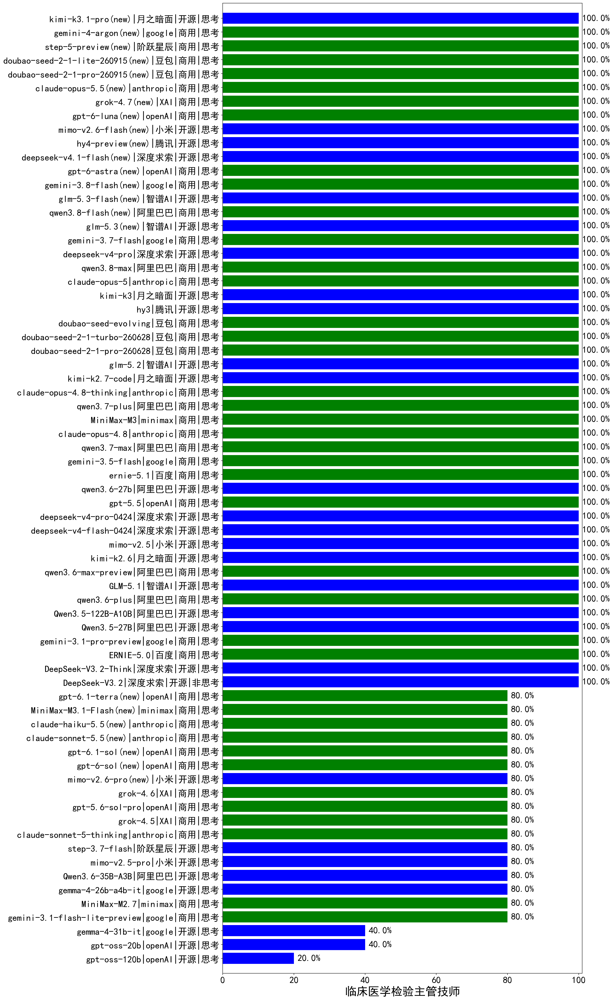

|类别|机构|大模型|【临床医学检验主管技师】准确率|平均耗时|平均消耗token|花费/千次（元）|排名（准确率）|
|---|---|-----|-------------------|-------|-----------|-----------|-----------|
|商用|豆包|doubao-seed-2-1-turbo-260628|100.0%|168s|5884|86.9|1|
|开源|小米|mimo-v2.6-flash(new)|100.0%|39s|1151|2.2|2|
|商用|阶跃星辰|step-5-preview(new)|100.0%|18s|1240|23.8|3|
|商用|anthropic|claude-opus-4.8-thinking|100.0%|12s|850|132.2|4|
|开源|月之暗面|kimi-k2.7-code|100.0%|64s|937|23.9|5|
|开源|智谱AI|glm-5.2|100.0%|52s|3011|82.7|6|
|商用|豆包|doubao-seed-2-1-pro-260628|100.0%|354s|6158|182.0|7|
|商用|豆包|doubao-seed-2-1-lite-260915(new)|100.0%|16s|757|1.9|8|
|商用|豆包|doubao-seed-evolving|100.0%|178s|6511|192.6|9|
|商用|豆包|doubao-seed-2-1-pro-260915(new)|100.0%|83s|631|16.2|10|
|开源|腾讯|hy3|100.0%|77s|279|0.9|11|
|商用|anthropic|claude-opus-5.5(new)|100.0%|112s|779|95.6|12|
|商用|XAI|grok-4.7(new)|100.0%|52s|4287|143.3|13|
|开源|月之暗面|kimi-k3|100.0%|28s|655|53.6|14|
|商用|anthropic|claude-opus-5|100.0%|14s|718|109.0|15|
|商用|阿里巴巴|qwen3.8-max|100.0%|26s|950|31.4|16|
|开源|深度求索|deepseek-v4-pro|100.0%|26s|758|17.8|17|
|商用|google|gemini-3.7-flash|100.0%|5s|862|20.9|18|
|开源|智谱AI|glm-5.3(new)|100.0%|32s|1217|32.5|19|
|商用|阿里巴巴|qwen3.8-flash(new)|100.0%|21s|1059|2.6|20|
|开源|智谱AI|glm-5.3-flash(new)|100.0%|22s|960|2.5|21|
|商用|google|gemini-3.8-flash(new)|100.0%|9s|721|34.4|22|
|商用|openAI|gpt-6-astra(new)|100.0%|10s|260|64.6|23|
|开源|深度求索|deepseek-v4.1-flash(new)|100.0%|40s|857|6.3|24|
|开源|腾讯|hy4-preview(new)|100.0%|41s|2216|38.9|25|
|商用|阿里巴巴|qwen3.7-plus|100.0%|34s|1806|14.0|26|
|商用|minimax|MiniMax-M3|100.0%|18s|554|6.3|27|
|商用|anthropic|claude-opus-4.8|100.0%|15s|719|109.3|28|
|商用|阿里巴巴|qwen3.7-max|100.0%|21s|1038|35.5|29|
|开源|深度求索|DeepSeek-V3.2|100.0%|53s|446|1.3|30|
|开源|深度求索|DeepSeek-V3.2-Think|100.0%|47s|1414|4.2|31|
|商用|百度|ERNIE-5.0|100.0%|141s|2160|50.7|32|
|商用|google|gemini-3.1-pro-preview|100.0%|27s|1459|118.5|33|
|开源|阿里巴巴|Qwen3.5-27B|100.0%|267s|4095|19.3|34|
|开源|阿里巴巴|Qwen3.5-122B-A10B|100.0%|403s|3875|24.4|35|
|开源|月之暗面|kimi-k3.1-pro(new)|100.0%|32s|1109|67.2|36|
|商用|阿里巴巴|qwen3.6-plus|100.0%|94s|1649|19.0|37|
|商用|google|gemini-4-argon(new)|100.0%|12s|608|73.3|38|
|开源|智谱AI|GLM-5.1|100.0%|185s|1523|35.2|39|
|商用|阿里巴巴|qwen3.6-max-preview|100.0%|51s|1772|92.2|40|
|开源|月之暗面|kimi-k2.6|100.0%|95s|2493|65.9|41|
|开源|小米|mimo-v2.5|100.0%|23s|1617|19.0|42|
|开源|深度求索|deepseek-v4-flash-0424|100.0%|15s|549|1.0|43|
|开源|深度求索|deepseek-v4-pro-0424|100.0%|22s|655|14.9|44|
|商用|openAI|gpt-5.5|100.0%|22s|625|114.8|45|
|开源|阿里巴巴|qwen3.6-27b|100.0%|30s|1769|30.7|46|
|商用|百度|ernie-5.1|100.0%|27s|1089|18.6|47|
|商用|google|gemini-3.5-flash|100.0%|8s|1378|82.6|48|
|商用|openAI|gpt-6-luna(new)|100.0%|530s|337|0.9|49|
|商用|anthropic|claude-sonnet-5.5(new)|80.0%|13s|655|39.1|50|
|商用|anthropic|claude-haiku-5.5(new)|80.0%|6s|946|3.0|51|
|商用|openAI|gpt-6-sol(new)|80.0%|324s|264|13.2|52|
|商用|minimax|MiniMax-M3.1-Flash(new)|80.0%|33s|2020|7.3|53|
|商用|openAI|gpt-6.1-sol(new)|80.0%|39s|259|12.9|54|
|商用|openAI|gpt-6.1-terra(new)|80.0%|5s|291|7.5|55|
|开源|小米|mimo-v2.6-pro(new)|80.0%|62s|2276|13.4|56|
|商用|XAI|grok-4.6|80.0%|33s|1637|61.0|57|
|商用|openAI|gpt-5.6-sol-pro|80.0%|85s|3214|240.8|58|
|商用|XAI|grok-4.5|80.0%|169s|1389|50.6|59|
|商用|anthropic|claude-sonnet-5-thinking|80.0%|15s|903|56.6|60|
|开源|阶跃星辰|step-3.7-flash|80.0%|43s|3870|30.8|61|
|开源|小米|mimo-v2.5-pro|80.0%|49s|1524|27.4|62|
|开源|阿里巴巴|Qwen3.6-35B-A3B|80.0%|16s|1811|18.9|63|
|开源|google|gemma-4-26b-a4b-it|80.0%|69s|759|1.9|64|
|商用|minimax|MiniMax-M2.7|80.0%|26s|1090|8.5|65|
|商用|google|gemini-3.1-flash-lite-preview|80.0%|5s|452|4.0|66|
|开源|openAI|gpt-oss-20b|40.0%|8s|1084|1.1|67|
|开源|google|gemma-4-31b-it|40.0%|146s|673|1.7|68|
|开源|openAI|gpt-oss-120b|20.0%|202s|809|2.3|69|

