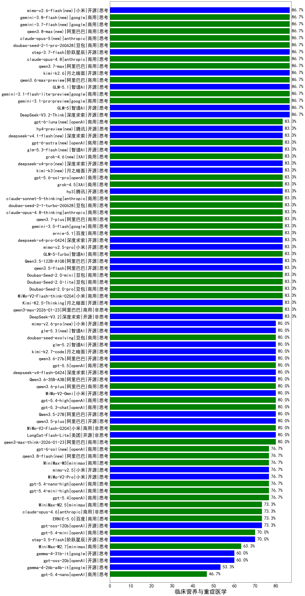

|类别|机构|大模型|【临床营养与重症医学】准确率|平均耗时|平均消耗token|花费/千次（元）|排名（准确率）|
|---|---|-----|-------------------|-------|-----------|-----------|-----------|
|开源|月之暗面|kimi-k2.6|86.7%|74s|1450|37.6|1|
|商用|anthropic|claude-opus-4.8|86.7%|9s|603|89.1|2|
|商用|google|gemini-3.7-flash(new)|86.7%|5s|719|17.2|3|
|开源|智谱AI|GLM-5.1|86.7%|142s|1376|31.7|4|
|商用|google|gemini-3.1-flash-lite-preview|86.7%|20s|415|3.7|5|
|商用|阿里巴巴|qwen3.6-max-preview|86.7%|51s|1704|88.4|6|
|商用|阿里巴巴|qwen3.8-max(new)|86.7%|20s|944|31.2|7|
|商用|anthropic|claude-opus-5(new)|86.7%|13s|690|104.4|8|
|商用|google|gemini-3.1-pro-preview|86.7%|34s|1367|110.8|9|
|商用|阿里巴巴|qwen3.7-max|86.7%|22s|991|33.8|10|
|商用|google|gemini-3.8-flash(new)|86.7%|18s|673|32.0|11|
|开源|智谱AI|GLM-5|86.7%|78s|1877|32.7|12|
|开源|阶跃星辰|step-3.7-flash|86.7%|28s|3082|24.4|13|
|开源|小米|mimo-v2.6-flash(new)|86.7%|74s|988|1.9|14|
|开源|深度求索|DeepSeek-V3.2-Think|86.7%|134s|1209|3.6|15|
|商用|豆包|doubao-seed-2-1-pro-260628|86.7%|212s|7502|222.3|16|
|商用|阿里巴巴|qwen3.7-plus|83.3%|21s|1115|8.4|17|
|商用|anthropic|claude-sonnet-5-thinking|83.3%|15s|762|46.8|18|
|商用|openAI|gpt-5.6-sol-pro|83.3%|30s|3220|242.2|19|
|开源|腾讯|hy3|83.3%|46s|248|0.8|20|
|商用|XAI|grok-4.6(new)|83.3%|195s|1392|50.7|21|
|开源|深度求索|deepseek-v4-pro(new)|83.3%|27s|643|14.6|22|
|商用|anthropic|claude-opus-4.8-thinking|83.3%|13s|734|112.0|23|
|商用|豆包|doubao-seed-2-1-turbo-260628|83.3%|146s|5689|84.0|24|
|开源|月之暗面|kimi-k3(new)|83.3%|37s|699|57.7|25|
|开源|小米|mimo-v2.5-pro|83.3%|21s|1215|20.9|26|
|开源|深度求索|deepseek-v4-pro-0424|83.3%|34s|841|19.3|27|
|商用|百度|ernie-5.1|83.3%|27s|912|15.4|28|
|开源|智谱AI|glm-5.3-flash(new)|83.3%|72s|2392|6.5|29|
|商用|google|gemini-3.5-flash|83.3%|7s|1315|78.7|30|
|商用|XAI|grok-4.5|83.3%|78s|1331|48.1|31|
|开源|腾讯|hy4-preview(new)|83.3%|43s|2503|44.0|32|
|商用|智谱AI|GLM-5-Turbo|83.3%|49s|1225|25.7|33|
|开源|深度求索|DeepSeek-V3.2|83.3%|38s|422|1.2|34|
|商用|openAI|gpt-6-luna(new)|83.3%|219s|450|1.3|35|
|商用|小米|MiMo-V2-Flash-think-0204|83.3%|783s|1910|3.9|36|
|开源|深度求索|deepseek-v4.1-flash(new)|83.3%|4s|658|4.7|37|
|商用|阿里巴巴|qwen3-max-2026-01-23|83.3%|65s|531|4.7|38|
|商用|豆包|Doubao-Seed-2.0-pro|83.3%|214s|1001|14.5|39|
|开源|阿里巴巴|Qwen3.5-122B-A10B|83.3%|250s|2781|17.3|40|
|商用|豆包|Doubao-Seed-2.0-lite|83.3%|210s|1002|3.3|41|
|开源|阿里巴巴|qwen3.5-flash|83.3%|294s|3074|6.0|42|
|商用|openAI|gpt-6-astra(new)|83.3%|11s|291|72.8|43|
|开源|月之暗面|Kimi-K2.5-Thinking|83.3%|357s|1766|35.8|44|
|商用|豆包|Doubao-Seed-2.0-mini|83.3%|431s|2649|5.1|45|
|开源|小米|mimo-v2.6-pro(new)|80.0%|50s|1029|5.9|46|
|开源|阿里巴巴|qwen3.6-27b|80.0%|29s|1728|29.9|47|
|开源|月之暗面|kimi-k2.7-code|80.0%|19s|727|18.1|48|
|开源|美团|LongCat-Flash-Lite|80.0%|306s|541|0.0|49|
|商用|阿里巴巴|qwen3-max-think-2026-01-23|80.0%|138s|2716|26.5|50|
|商用|豆包|doubao-seed-evolving|80.0%|187s|6609|195.5|51|
|开源|智谱AI|glm-5.2|80.0%|36s|1442|38.7|52|
|开源|智谱AI|glm-5.3(new)|80.0%|80s|1413|37.9|53|
|商用|小米|MiMo-V2-Flash-0204|80.0%|218s|675|1.3|54|
|商用|openAI|gpt-5.5|80.0%|10s|476|83.0|55|
|开源|深度求索|deepseek-v4-flash-0424|80.0%|27s|889|1.7|56|
|开源|阿里巴巴|qwen3.5-plus|80.0%|34s|2659|12.4|57|
|开源|阿里巴巴|Qwen3.5-27B|80.0%|289s|2846|13.3|58|
|开源|阿里巴巴|Qwen3.6-35B-A3B|80.0%|61s|1665|17.3|59|
|商用|openAI|gpt-5.3-chat|80.0%|18s|420|32.9|60|
|商用|openAI|gpt-5.4-high|80.0%|15s|625|57.2|61|
|商用|阿里巴巴|qwen3.6-plus|80.0%|41s|1551|17.8|62|
|开源|小米|MiMo-V2-Omni|80.0%|120s|1473|17.0|63|
|商用|阿里巴巴|qwen3.8-flash(new)|76.7%|59s|2775|7.2|64|
|商用|openAI|gpt-6-sol(new)|76.7%|167s|239|10.9|65|
|商用|minimax|MiniMax-M3|76.7%|25s|676|8.3|66|
|商用|openAI|gpt-5.4-mini-high|76.7%|57s|760|21.4|67|
|开源|小米|MiMo-V2-Pro|76.7%|491s|1184|20.3|68|
|商用|openAI|gpt-5.4|76.7%|9s|326|25.8|69|
|商用|openAI|gpt-5.4-nano-high|76.7%|49s|569|4.3|70|
|开源|小米|mimo-v2.5|76.7%|31s|1572|18.4|71|
|商用|百度|ERNIE-5.0|73.3%|211s|3827|90.6|72|
|商用|anthropic|claude-opus-4.6|73.3%|16s|660|98.9|73|
|商用|minimax|MiniMax-M2.5|73.3%|24s|1264|10.0|74|
|开源|openAI|gpt-oss-120b|73.3%|5s|677|1.8|75|
|商用|openAI|gpt-5.4-mini|70.0%|45s|283|6.4|76|
|开源|阶跃星辰|step-3.5-flash|70.0%|19s|1932|3.9|77|
|商用|minimax|MiniMax-M2.7|63.3%|32s|1367|10.8|78|
|开源|google|gemma-4-31b-it|60.0%|123s|570|1.4|79|
|开源|openAI|gpt-oss-20b|60.0%|18s|1119|1.2|80|
|开源|google|gemma-4-26b-a4b-it|53.3%|51s|611|1.5|81|
|商用|openAI|gpt-5.4-nano|46.7%|31s|268|1.6|82|

