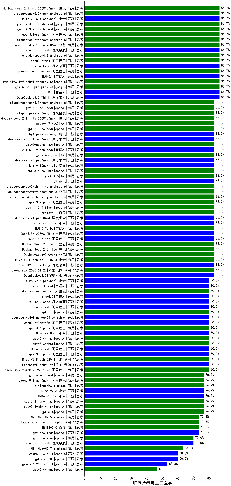

|类别|机构|大模型|【临床营养与重症医学】准确率|平均耗时|平均消耗token|花费/千次（元）|排名（准确率）|
|---|---|-----|-------------------|-------|-----------|-----------|-----------|
|商用|anthropic|claude-opus-5.5(new)|86.7%|36s|650|77.6|1|
|商用|豆包|doubao-seed-2-1-pro-260915(new)|86.7%|51s|1100|30.3|2|
|开源|月之暗面|kimi-k2.6|86.7%|74s|1450|37.6|3|
|商用|阿里巴巴|qwen3.6-max-preview|86.7%|51s|1704|88.4|4|
|商用|阿里巴巴|qwen3.8-max|86.7%|20s|944|31.2|5|
|开源|智谱AI|GLM-5.1|86.7%|142s|1376|31.7|6|
|开源|阶跃星辰|step-3.7-flash|86.7%|28s|3082|24.4|7|
|商用|google|gemini-3.7-flash|86.7%|5s|719|17.2|8|
|商用|anthropic|claude-opus-5|86.7%|13s|690|104.4|9|
|商用|google|gemini-3.1-flash-lite-preview|86.7%|20s|415|3.7|10|
|商用|anthropic|claude-opus-4.8|86.7%|9s|603|89.1|11|
|商用|阿里巴巴|qwen3.7-max|86.7%|22s|991|33.8|12|
|商用|google|gemini-3.1-pro-preview|86.7%|34s|1367|110.8|13|
|商用|豆包|doubao-seed-2-1-pro-260628|86.7%|212s|7502|222.3|14|
|开源|深度求索|DeepSeek-V3.2-Think|86.7%|134s|1209|3.6|15|
|商用|google|gemini-3.8-flash(new)|86.7%|18s|673|32.0|16|
|开源|小米|mimo-v2.6-flash(new)|86.7%|74s|988|1.9|17|
|开源|深度求索|deepseek-v4-pro|83.3%|27s|643|14.6|18|
|商用|豆包|doubao-seed-2-1-turbo-260628|83.3%|146s|5689|84.0|19|
|开源|月之暗面|kimi-k3|83.3%|37s|699|57.7|20|
|商用|openAI|gpt-5.6-sol-pro|83.3%|30s|3220|242.2|21|
|商用|XAI|grok-4.5|83.3%|78s|1331|48.1|22|
|商用|XAI|grok-4.6|83.3%|195s|1392|50.7|23|
|开源|腾讯|hy4-preview(new)|83.3%|43s|2503|44.0|24|
|开源|智谱AI|glm-5.3-flash(new)|83.3%|72s|2392|6.5|25|
|商用|openAI|gpt-6-astra(new)|83.3%|11s|291|72.8|26|
|开源|深度求索|deepseek-v4.1-flash(new)|83.3%|4s|658|4.7|27|
|商用|anthropic|claude-sonnet-5-thinking|83.3%|15s|762|46.8|28|
|商用|openAI|gpt-6-luna(new)|83.3%|219s|450|1.3|29|
|商用|XAI|grok-4.7(new)|83.3%|45s|3286|101.4|30|
|商用|豆包|doubao-seed-2-1-lite-260915(new)|83.3%|24s|881|2.2|31|
|商用|阶跃星辰|step-5-preview(new)|83.3%|75s|1244|23.8|32|
|商用|openAI|gpt-6.1-sol(new)|83.3%|11s|259|12.4|33|
|商用|anthropic|claude-sonnet-5.5(new)|83.3%|8s|537|30.9|34|
|商用|google|gemini-4-argon(new)|83.3%|29s|572|68.2|35|
|开源|腾讯|hy3|83.3%|46s|248|0.8|36|
|开源|月之暗面|kimi-k3.1-pro(new)|83.3%|43s|1488|92.9|37|
|开源|小米|mimo-v2.5-pro|83.3%|21s|1215|20.9|38|
|开源|深度求索|deepseek-v4-pro-0424|83.3%|34s|841|19.3|39|
|开源|深度求索|DeepSeek-V3.2|83.3%|38s|422|1.2|40|
|商用|anthropic|claude-opus-4.8-thinking|83.3%|13s|734|112.0|41|
|商用|阿里巴巴|qwen3.7-plus|83.3%|21s|1115|8.4|42|
|开源|阿里巴巴|Qwen3.5-122B-A10B|83.3%|250s|2781|17.3|43|
|商用|google|gemini-3.5-flash|83.3%|7s|1315|78.7|44|
|商用|百度|ernie-5.1|83.3%|27s|912|15.4|45|
|开源|阿里巴巴|Qwen3.5-27B|80.0%|289s|2846|13.3|46|
|商用|阿里巴巴|qwen3.6-plus|80.0%|41s|1551|17.8|47|
|开源|阿里巴巴|Qwen3.6-35B-A3B|80.0%|61s|1665|17.3|48|
|开源|小米|mimo-v2.6-pro(new)|80.0%|50s|1029|5.9|49|
|开源|深度求索|deepseek-v4-flash-0424|80.0%|27s|889|1.7|50|
|商用|豆包|doubao-seed-evolving|80.0%|187s|6609|195.5|51|
|商用|openAI|gpt-5.5|80.0%|10s|476|83.0|52|
|开源|月之暗面|kimi-k2.7-code|80.0%|19s|727|18.1|53|
|开源|智谱AI|glm-5.2|80.0%|36s|1442|38.7|54|
|开源|智谱AI|glm-5.3(new)|80.0%|80s|1413|37.9|55|
|开源|阿里巴巴|qwen3.6-27b|80.0%|29s|1728|29.9|56|
|商用|阿里巴巴|qwen3.8-flash(new)|76.7%|59s|2775|7.2|57|
|商用|openAI|gpt-6-sol(new)|76.7%|167s|239|10.9|58|
|商用|minimax|MiniMax-M3|76.7%|25s|676|8.3|59|
|开源|小米|mimo-v2.5|76.7%|31s|1572|18.4|60|
|商用|anthropic|claude-haiku-5.5(new)|76.7%|11s|872|2.7|61|
|商用|minimax|MiniMax-M3.1-Flash(new)|76.7%|15s|962|3.0|62|
|商用|百度|ERNIE-5.0|73.3%|211s|3827|90.6|63|
|开源|openAI|gpt-oss-120b|73.3%|5s|677|1.8|64|
|商用|minimax|MiniMax-M2.7|63.3%|32s|1367|10.8|65|
|开源|google|gemma-4-31b-it|60.0%|123s|570|1.4|66|
|开源|openAI|gpt-oss-20b|60.0%|18s|1119|1.2|67|
|开源|google|gemma-4-26b-a4b-it|53.3%|51s|611|1.5|68|

