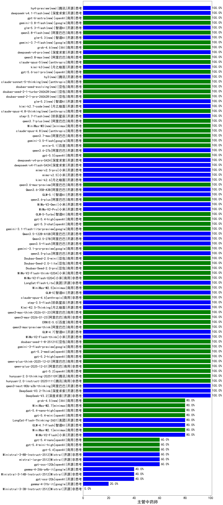

|类别|机构|大模型|【主管中药师】准确率|平均耗时|平均消耗token|花费/千次（元）|排名（准确率）|
|---|---|-----|-------------------|-------|-----------|-----------|-----------|
|商用|智谱AI|GLM-5-Turbo|100.0%|27s|1057|22.4|1|
|开源|小米|mimo-v2.5-pro|100.0%|40s|1005|17.0|2|
|商用|anthropic|claude-opus-4.8(new)|100.0%|9s|426|65.5|3|
|商用|阿里巴巴|qwen3.7-max|100.0%|23s|631|21.4|4|
|商用|google|gemini-3.5-flash|100.0%|6s|1053|63.9|5|
|商用|百度|ernie-5.1|100.0%|20s|616|10.5|6|
|开源|阿里巴巴|qwen3.6-27b|100.0%|23s|1481|25.9|7|
|商用|openAI|gpt-5.5|100.0%|6s|241|41.2|8|
|开源|深度求索|deepseek-v4-pro-0424|100.0%|18s|473|10.8|9|
|开源|深度求索|deepseek-v4-flash-0424|100.0%|14s|382|0.7|10|
|开源|小米|mimo-v2.5|100.0%|11s|788|7.8|11|
|商用|阿里巴巴|qwen3.7-plus(new)|100.0%|13s|636|4.8|12|
|开源|月之暗面|kimi-k2.6|100.0%|47s|902|23.4|13|
|商用|阿里巴巴|qwen3.6-max-preview|100.0%|40s|1349|70.5|14|
|开源|阿里巴巴|Qwen3.6-35B-A3B|100.0%|107s|1520|15.9|15|
|开源|智谱AI|GLM-5.1|100.0%|42s|1077|25.0|16|
|商用|阿里巴巴|qwen3.6-plus|100.0%|30s|1497|17.4|17|
|开源|小米|MiMo-V2-Omni|100.0%|125s|892|9.2|18|
|开源|小米|MiMo-V2-Pro|100.0%|190s|846|13.7|19|
|商用|openAI|gpt-5.4-high|100.0%|14s|591|57.4|20|
|商用|minimax|MiniMax-M3(new)|100.0%|24s|745|9.8|21|
|开源|阶跃星辰|step-3.7-flash(new)|100.0%|16s|1737|13.7|22|
|商用|google|gemini-3.1-flash-lite-preview|100.0%|39s|277|2.5|23|
|商用|anthropic|claude-opus-5(new)|100.0%|11s|455|70.7|24|
|商用|google|gemini-3.8-flash(new)|100.0%|19s|569|27.9|25|
|开源|智谱AI|glm-5.3-flash(new)|100.0%|27s|841|2.2|26|
|商用|阿里巴巴|qwen3.8-flash(new)|100.0%|135s|467|1.1|27|
|开源|智谱AI|glm-5.3(new)|100.0%|38s|843|22.5|28|
|商用|google|gemini-3.7-flash(new)|100.0%|18s|677|16.8|29|
|商用|XAI|grok-4.6(new)|100.0%|36s|1488|55.5|30|
|开源|深度求索|deepseek-v4-pro(new)|100.0%|850s|378|8.0|31|
|商用|阿里巴巴|qwen3.8-max(new)|100.0%|7s|342|10.1|32|
|开源|月之暗面|kimi-k3(new)|100.0%|18s|358|25.7|33|
|商用|anthropic|claude-opus-4.8-thinking(new)|100.0%|19s|555|88.1|34|
|商用|openAI|gpt-5.6-sol-pro(new)|100.0%|8s|2462|163.7|35|
|开源|腾讯|hy3(new)|100.0%|30s|185|0.6|36|
|商用|anthropic|claude-sonnet-5-thinking(new)|100.0%|15s|604|38.7|37|
|商用|豆包|doubao-seed-evolving(new)|100.0%|57s|2511|73.2|38|
|商用|豆包|doubao-seed-2-1-turbo-260628(new)|100.0%|146s|2052|29.7|39|
|商用|豆包|doubao-seed-2-1-pro-260628(new)|100.0%|135s|2960|86.7|40|
|开源|智谱AI|glm-5.2(new)|100.0%|73s|999|26.9|41|
|开源|月之暗面|kimi-k2.7-code(new)|100.0%|14s|496|12.4|42|
|商用|openAI|gpt-5.3-chat|100.0%|44s|345|29.2|43|
|商用|openAI|gpt-6-astra(new)|100.0%|10s|190|51.5|44|
|开源|阿里巴巴|Qwen3.5-122B-A10B|100.0%|288s|2097|13.1|45|
|商用|anthropic|claude-opus-4.6|100.0%|10s|457|70.7|46|
|开源|月之暗面|Kimi-K2.5-Thinking|100.0%|170s|898|18.0|47|
|商用|阿里巴巴|qwen3-max-think-2026-01-23|100.0%|68s|1481|14.4|48|
|开源|阿里巴巴|Qwen3.5-27B|100.0%|94s|1409|6.5|49|
|商用|百度|ERNIE-5.0|100.0%|413s|1141|26.7|50|
|商用|阿里巴巴|qwen3-max-preview-think|100.0%|55s|1285|29.9|51|
|开源|智谱AI|GLM-4.7|100.0%|40s|1141|15.4|52|
|开源|小米|MiMo-V2-Flash-think|100.0%|260s|1128|0.0|53|
|商用|豆包|doubao-seed-1-8-251215|100.0%|23s|507|3.4|54|
|商用|google|gemini-3-flash-preview|100.0%|116s|1031|21.1|55|
|商用|openAI|gpt-5.2-medium|100.0%|6s|248|20.0|56|
|商用|openAI|gpt-5.2-high|100.0%|9s|284|23.6|57|
|商用|阿里巴巴|qwen-plus-think-2025-12-01|100.0%|34s|1423|11.0|58|
|商用|阿里巴巴|qwen-plus-2025-12-01|100.0%|15s|513|1.0|59|
|商用|openAI|gpt-5.2|100.0%|3s|144|9.6|60|
|商用|腾讯|hunyuan-2.0-thinking-20251109|100.0%|6s|625|2.4|61|
|商用|腾讯|hunyuan-2.0-instruct-20251111|100.0%|13s|358|0.6|62|
|开源|阿里巴巴|qwen3-next-80b-a3b-thinking|100.0%|123s|1799|7.0|63|
|开源|深度求索|DeepSeek-V3.2-Think|100.0%|134s|594|1.7|64|
|开源|深度求索|DeepSeek-V3.2|100.0%|10s|273|0.8|65|
|开源|阶跃星辰|step-3.5-flash|100.0%|10s|1010|2.0|66|
|商用|阿里巴巴|qwen3-max-2026-01-23|100.0%|120s|376|3.4|67|
|开源|智谱AI|GLM-5|100.0%|318s|1174|20.5|68|
|商用|豆包|Doubao-Seed-2.0-pro|100.0%|169s|728|10.5|69|
|开源|阿里巴巴|qwen3.5-flash|100.0%|264s|1723|3.4|70|
|商用|minimax|MiniMax-M2.5|100.0%|13s|676|5.2|71|
|开源|阿里巴巴|qwen3.5-plus|100.0%|22s|1760|8.2|72|
|商用|豆包|Doubao-Seed-2.0-mini|100.0%|297s|1254|2.3|73|
|商用|豆包|Doubao-Seed-2.0-lite|100.0%|122s|650|2.1|74|
|商用|google|gemini-3.1-pro-preview|100.0%|20s|1086|89.2|75|
|开源|美团|LongCat-Flash-Lite|100.0%|311s|372|0.0|76|
|商用|小米|MiMo-V2-Flash-think-0204|100.0%|93s|1136|2.3|77|
|商用|小米|MiMo-V2-Flash-0204|100.0%|167s|341|0.6|78|
|商用|minimax|MiniMax-M2.1|80.0%|86s|2146|17.5|79|
|开源|小米|MiMo-V2-Flash|80.0%|133s|373|0.0|80|
|开源|美团|LongCat-Flash-Thinking-2601|80.0%|93s|2190|0.0|81|
|商用|minimax|MiniMax-M2.7|80.0%|37s|1526|12.3|82|
|商用|XAI|grok-4.5(new)|80.0%|28s|1090|38.8|83|
|商用|openAI|gpt-5.4-nano-high|80.0%|21s|409|3.2|84|
|开源|智谱AI|GLM-4.7-Flash|80.0%|219s|1302|0.0|85|
|商用|openAI|gpt-5.4-mini|80.0%|89s|205|5.1|86|
|开源|Mistral|Ministral-3-8B-Instruct-2512|60.0%|13s|432|0.5|87|
|商用|openAI|gpt-5.4|60.0%|4s|233|19.8|88|
|开源|Mistral|mistral-large-2512|60.0%|10s|334|3.2|89|
|商用|openAI|gpt-5.4-nano|60.0%|65s|146|0.9|90|
|商用|openAI|gpt-5.4-mini-high|60.0%|12s|847|25.3|91|
|开源|openAI|gpt-oss-120b|60.0%|8s|952|2.8|92|
|开源|Mistral|Ministral-3-14B-Instruct-2512|40.0%|15s|365|0.5|93|
|开源|openAI|gpt-oss-20b|40.0%|24s|4989|5.7|94|
|开源|google|gemma-4-26b-a4b-it|40.0%|17s|444|1.1|95|
|开源|google|gemma-4-31b-it|20.0%|13s|379|1.0|96|
|开源|Mistral|Ministral-3-3B-Instruct-2512|0.0%|13s|505|0.4|97|

