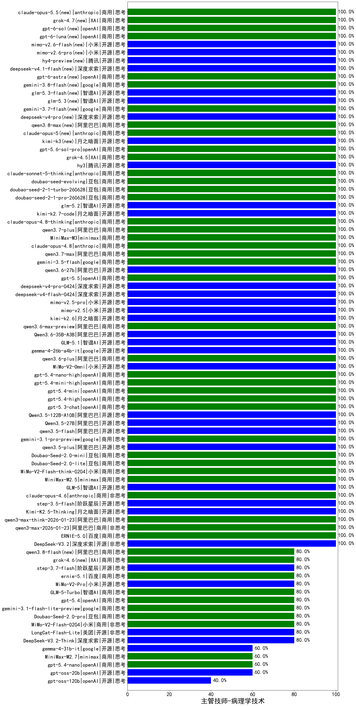

|类别|机构|大模型|【主管技师-病理学技术】准确率|平均耗时|平均消耗token|花费/千次（元）|排名（准确率）|
|---|---|-----|-------------------|-------|-----------|-----------|-----------|
|开源|小米|mimo-v2.5-pro|100.0%|18s|1244|21.8|1|
|开源|月之暗面|kimi-k2.6|100.0%|42s|1031|26.7|2|
|开源|腾讯|hy3|100.0%|8s|210|0.6|3|
|商用|anthropic|claude-sonnet-5-thinking|100.0%|21s|830|53.3|4|
|商用|豆包|doubao-seed-evolving|100.0%|226s|3220|94.3|5|
|商用|豆包|doubao-seed-2-1-turbo-260628|100.0%|154s|4352|64.1|6|
|商用|豆包|doubao-seed-2-1-pro-260628|100.0%|131s|3290|96.4|7|
|开源|智谱AI|glm-5.2|100.0%|24s|1097|29.4|8|
|开源|月之暗面|kimi-k2.7-code|100.0%|14s|585|14.6|9|
|商用|anthropic|claude-opus-4.8-thinking|100.0%|11s|634|98.9|10|
|商用|阿里巴巴|qwen3.7-plus|100.0%|16s|760|5.7|11|
|商用|minimax|MiniMax-M3|100.0%|17s|541|6.3|12|
|商用|anthropic|claude-opus-4.8|100.0%|8s|494|74.4|13|
|商用|阿里巴巴|qwen3.7-max|100.0%|18s|736|25.0|14|
|商用|google|gemini-3.5-flash|100.0%|7s|1023|61.3|15|
|开源|阿里巴巴|qwen3.6-27b|100.0%|32s|1631|28.4|16|
|商用|openAI|gpt-5.5|100.0%|7s|393|69.4|17|
|开源|深度求索|deepseek-v4-pro-0424|100.0%|35s|457|10.3|18|
|开源|深度求索|deepseek-v4-flash-0424|100.0%|49s|856|1.7|19|
|商用|XAI|grok-4.5|100.0%|111s|1100|38.9|20|
|商用|openAI|gpt-5.6-sol-pro|100.0%|8s|2974|221.7|21|
|开源|月之暗面|kimi-k3(new)|100.0%|33s|620|51.2|22|
|开源|腾讯|hy4-preview(new)|100.0%|25s|1600|27.9|23|
|商用|豆包|doubao-seed-2-1-pro-260915(new)|100.0%|17s|496|12.6|24|
|商用|anthropic|claude-opus-5.5(new)|100.0%|13s|630|78.3|25|
|商用|XAI|grok-4.7(new)|100.0%|26s|2864|84.0|26|
|商用|openAI|gpt-6-sol(new)|100.0%|217s|161|7.1|27|
|商用|openAI|gpt-6-luna(new)|100.0%|413s|258|0.7|28|
|开源|小米|mimo-v2.6-flash(new)|100.0%|26s|743|1.4|29|
|开源|小米|mimo-v2.6-pro(new)|100.0%|25s|1090|6.4|30|
|开源|深度求索|deepseek-v4.1-flash(new)|100.0%|8s|555|4.0|31|
|商用|anthropic|claude-opus-5(new)|100.0%|12s|502|75.8|32|
|商用|openAI|gpt-6-astra(new)|100.0%|12s|212|53.4|33|
|商用|google|gemini-3.8-flash(new)|100.0%|9s|586|28.3|34|
|开源|智谱AI|glm-5.3-flash(new)|100.0%|26s|774|2.0|35|
|开源|智谱AI|glm-5.3(new)|100.0%|20s|768|20.2|36|
|商用|google|gemini-3.7-flash(new)|100.0%|4s|651|15.9|37|
|开源|深度求索|deepseek-v4-pro(new)|100.0%|556s|407|8.6|38|
|商用|阿里巴巴|qwen3.8-max(new)|100.0%|21s|657|21.2|39|
|开源|小米|mimo-v2.5|100.0%|14s|1153|12.8|40|
|商用|豆包|doubao-seed-2-1-lite-260915(new)|100.0%|12s|532|1.3|41|
|商用|阿里巴巴|qwen3.6-max-preview|100.0%|40s|1424|74.1|42|
|商用|minimax|MiniMax-M2.5|100.0%|22s|1061|8.3|43|
|开源|阿里巴巴|Qwen3.6-35B-A3B|100.0%|12s|1550|16.2|44|
|开源|阿里巴巴|qwen3.5-flash|100.0%|294s|1979|3.8|45|
|商用|google|gemini-3.1-pro-preview|100.0%|19s|993|80.4|46|
|开源|阿里巴巴|qwen3.5-plus|100.0%|20s|1598|7.4|47|
|商用|豆包|Doubao-Seed-2.0-mini|100.0%|267s|1177|2.2|48|
|商用|豆包|Doubao-Seed-2.0-lite|100.0%|191s|841|2.7|49|
|商用|小米|MiMo-V2-Flash-think-0204|100.0%|622s|1577|3.2|50|
|开源|智谱AI|GLM-5|100.0%|84s|1297|22.5|51|
|商用|openAI|gpt-5.3-chat|100.0%|16s|445|37.2|52|
|商用|anthropic|claude-opus-4.6|100.0%|21s|557|85.1|53|
|开源|阶跃星辰|step-3.5-flash|100.0%|14s|2005|4.1|54|
|开源|月之暗面|Kimi-K2.5-Thinking|100.0%|381s|1874|38.4|55|
|商用|阿里巴巴|qwen3-max-think-2026-01-23|100.0%|290s|2130|20.8|56|
|商用|阿里巴巴|qwen3-max-2026-01-23|100.0%|10s|394|3.5|57|
|商用|百度|ERNIE-5.0|100.0%|61s|1031|23.9|58|
|开源|深度求索|DeepSeek-V3.2|100.0%|50s|339|1.0|59|
|开源|阿里巴巴|Qwen3.5-122B-A10B|100.0%|324s|2637|16.5|60|
|开源|阿里巴巴|Qwen3.5-27B|100.0%|198s|2344|11.0|61|
|商用|openAI|gpt-5.4-high|100.0%|9s|515|47.6|62|
|商用|openAI|gpt-5.4-mini|100.0%|3s|233|5.4|63|
|商用|openAI|gpt-5.4-mini-high|100.0%|91s|1306|39.2|64|
|开源|智谱AI|GLM-5.1|100.0%|44s|941|21.5|65|
|开源|google|gemma-4-26b-a4b-it|100.0%|33s|453|1.1|66|
|商用|阿里巴巴|qwen3.6-plus|100.0%|21s|1355|15.6|67|
|商用|openAI|gpt-5.4-nano-high|100.0%|8s|545|4.2|68|
|开源|小米|MiMo-V2-Omni|100.0%|150s|1121|12.3|69|
|商用|google|gemini-3.1-flash-lite-preview|80.0%|21s|331|3.0|70|
|开源|美团|LongCat-Flash-Lite|80.0%|40s|338|0.0|71|
|开源|深度求索|DeepSeek-V3.2-Think|80.0%|111s|747|2.2|72|
|商用|百度|ernie-5.1|80.0%|19s|728|12.4|73|
|开源|小米|MiMo-V2-Pro|80.0%|399s|1160|20.1|74|
|商用|小米|MiMo-V2-Flash-0204|80.0%|99s|515|1.0|75|
|商用|openAI|gpt-5.4|80.0%|7s|265|21.2|76|
|商用|阿里巴巴|qwen3.8-flash(new)|80.0%|135s|570|1.3|77|
|商用|豆包|Doubao-Seed-2.0-pro|80.0%|253s|1155|17.2|78|
|商用|XAI|grok-4.6(new)|80.0%|600s|1603|60.1|79|
|开源|阶跃星辰|step-3.7-flash|80.0%|36s|3652|29.2|80|
|商用|智谱AI|GLM-5-Turbo|80.0%|25s|1039|21.9|81|
|商用|minimax|MiniMax-M2.7|60.0%|52s|2045|16.6|82|
|开源|google|gemma-4-31b-it|60.0%|57s|403|1.0|83|
|商用|openAI|gpt-5.4-nano|60.0%|82s|231|1.5|84|
|开源|openAI|gpt-oss-20b|60.0%|278s|1246|1.3|85|
|开源|openAI|gpt-oss-120b|40.0%|6s|798|2.3|86|

