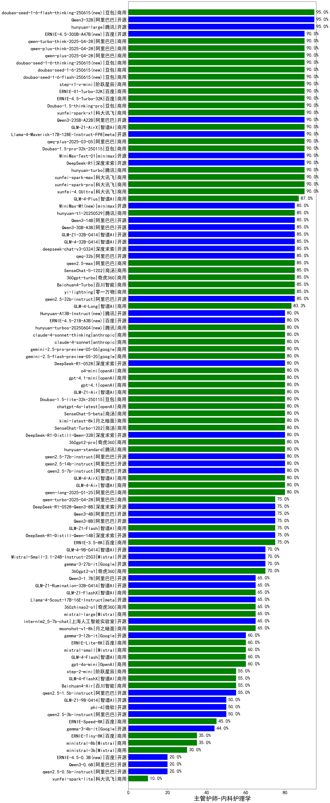

| 类别 | 大模型                         | 主管护师-内科护理学 | 排名 |
|-----|------------------------------|---------|----|
|商用|hunyuan-t1-20250321|100.0|1|
|商用|ERNIE-4.5-8K-Preview|97.0|2|
|开源|Qwen3-32B|96.7|3|
|商用|ERNIE-4.5-Turbo-32K(new)|96.0|4|
|商用|GLM-Z1-Air|95.7|5|
|商用|hunyuan-turbos-20250226|95.0|6|
|开源|hunyuan-large|95.0|7|
|商用|hunyuan-turbos-20250313|94.0|8|
|商用|GLM-Z1-AirX|92.0|9|
|商用|xunfei-4.0Ultra|90.0|10|
|商用|xunfei-spark-max|90.0|11|
|商用|GLM-4-Plus|90.0|12|
|商用|xunfei-spark-pro|90.0|13|
|商用|hunyuan-turbo|90.0|14|
|开源|Qwen3-30B-A3B|90.0|15|
|开源|Qwen3-235B-A22B|90.0|16|
|商用|gemini-2.5-pro-preview-03-25|90.0|17|
|商用|qwq-plus-2025-03-05|90.0|18|
|商用|Doubao-1.5-pro-32k-250115|90.0|19|
|开源|MiniMax-Text-01|90.0|20|
|开源|DeepSeek-R1|90.0|21|
|开源|Qwen3-14B|90.0|22|
|商用|Doubao-1.5-thinking-pro(new)|90.0|23|
|商用|gemini-2.5-flash-preview-04-17|90.0|24|
|商用|ERNIE-X1-Turbo-32K(new)|90.0|25|
|开源|Llama-4-Maverick-17B-128E-Instruct-FP8|89.0|26|
|开源|Llama-4-Scout-17B-16E-Instruct|89.0|27|
|开源|deepseek-chat-v3-0324|89.0|28|
|开源|GLM-4-32B-0414|89.0|29|
|开源|DeepSeek-R1-0528(new)|86.7|30|
|开源|GLM-Z1-32B-0414|86.7|31|
|开源|Qwen3-8B|86.7|32|
|商用|xunfei-spark-x1(new)|86.0|33|
|商用|GLM-4-Long|85.0|34|
|商用|yi-lightning|85.0|35|
|开源|qwq-32b|85.0|36|
|商用|qwen2.5-max|85.0|37|
|商用|SenseChat-5-1202|85.0|38|
|开源|qwen2.5-32b-instruct|85.0|39|
|商用|360gpt-turbo|85.0|40|
|商用|Baichuan4-Turbo|85.0|41|
|开源|DeepSeek-R1-0528-Qwen3-8B(new)|83.3|42|
|开源|GLM-4-9B-0414|81.0|43|
|商用|qwen-long|80.0|44|
|商用|qwen-turbo|80.0|45|
|商用|qwen-plus|80.0|46|
|开源|qwen2.5-14b-instruct|80.0|47|
|开源|qwen2.5-7b-instruct|80.0|48|
|商用|hunyuan-standard|80.0|49|
|商用|SenseChat-Turbo-1202|80.0|50|
|商用|SenseChat-5-beta|80.0|51|
|商用|o4-mini(new)|80.0|52|
|商用|gpt-4.1-mini(new)|80.0|53|
|商用|gemini-2.5-flash-preview-05-20(new)|80.0|54|
|商用|gemini-2.5-pro-preview-05-06(new)|80.0|55|
|商用|gpt-4.1(new)|80.0|56|
|开源|Qwen3-4B|80.0|57|
|商用|claude-4-sonnet(new)|80.0|58|
|商用|claude-4-sonnet-thinking(new)|80.0|59|
|商用|chatgpt-4o-latest|80.0|60|
|商用|kimi-latest-8k|80.0|61|
|商用|Doubao-1.5-lite-32k-250115|80.0|62|
|商用|360gpt2-pro|80.0|63|
|开源|DeepSeek-R1-Distill-Qwen-32B|80.0|64|
|开源|Llama-3.3-70B-Instruct|80.0|65|
|开源|qwen2.5-72b-instruct|80.0|66|
|商用|GLM-4-AirX|75.0|67|
|商用|ERNIE-3.5-8K|75.0|68|
|开源|DeepSeek-R1-Distill-Qwen-14B|75.0|69|
|开源|Llama-3.3-70B-Instruct-fp8|75.0|70|
|商用|GLM-4-Air|75.0|71|
|商用|GLM-Z1-FlashX|74.5|72|
|开源|Mistral-Small-3.1-24B-Instruct-2503|73.5|73|
|开源|Qwen3-1.7B|73.3|74|
|开源|GLM-Z1-Rumination-32B-0414|73.3|75|
|商用|GLM-Z1-Flash|71.5|76|
|开源|GLM-Z1-9B-0414|70.5|77|
|商用|360gpt2-o1|70.0|78|
|开源|Meta-Llama-3.1-405B-Instruct|70.0|79|
|开源|gemma-3-27b-it|70.0|80|
|商用|mistral-large|65.0|81|
|商用|360zhinao2-o1|65.0|82|
|商用|moonshot-v1-8k|65.0|83|
|开源|internlm2_5-7b-chat|65.0|84|
|商用|GLM-4-Flash|60.0|85|
|商用|gpt-4o-mini|60.0|86|
|开源|DeepSeek-R1-Distill-Llama-70B|60.0|87|
|商用|ERNIE-Lite-8K|60.0|88|
|开源|gemma-3-12b-it|60.0|89|
|商用|Claude-3.5-Sonnet|60.0|90|
|商用|mistral-small|60.0|91|
|商用|step-2-mini|55.0|92|
|商用|GLM-4-FlashX|55.0|93|
|开源|qwen2.5-1.5b-instruct|55.0|94|
|商用|Baichuan4-Air|55.0|95|
|开源|phi-4|50.0|96|
|开源|qwen2.5-3b-instruct|50.0|97|
|商用|ERNIE-Lite-Pro-128K|50.0|98|
|商用|ERNIE-Speed-8K|45.0|99|
|开源|gemma-3-4b-it|44.0|100|
|开源|Llama-3.1-8B-Instruct|40.0|101|
|商用|ERNIE-Speed-Pro-128K|40.0|102|
|开源|Meta-Llama-3.1-8B-Instruct-fp8|40.0|103|
|商用|ministral-8b|35.0|104|
|商用|ERNIE-Tiny-8K|35.0|105|
|开源|Qwen3-0.6B|33.3|106|
|商用|ministral-3b|30.0|107|
|开源|Llama-3.2-3B-Instruct|30.0|108|
|开源|Llama-3.2-1B-Instruct|25.0|109|
|开源|qwen2.5-0.5b-instruct|20.0|110|
|开源|DeepSeek-R1-Distill-Qwen-7B|20.0|111|
|开源|DeepSeek-R1-Distill-Llama-8B|15.0|112|
|商用|xunfei-spark-lite|10.0|113|

