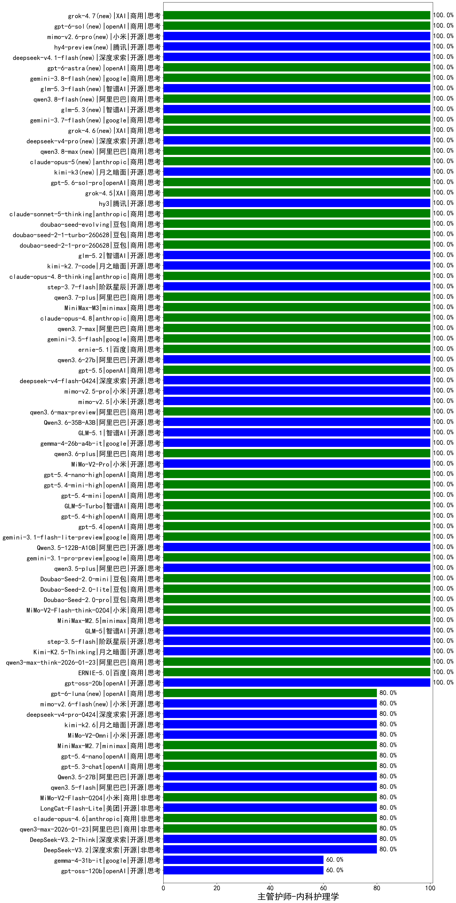

|类别|机构|大模型|【主管护师-内科护理学】准确率|平均耗时|平均消耗token|花费/千次（元）|排名（准确率）|
|---|---|-----|-------------------|-------|-----------|-----------|-----------|
|商用|openAI|gpt-5.4-mini|100.0%|169s|395|8.5|1|
|开源|小米|mimo-v2.5-pro|100.0%|28s|1516|26.5|2|
|商用|阿里巴巴|qwen3.7-plus(new)|100.0%|25s|1335|9.9|3|
|商用|minimax|MiniMax-M3(new)|100.0%|27s|798|9.8|4|
|商用|anthropic|claude-opus-4.8(new)|100.0%|10s|734|101.0|5|
|商用|阿里巴巴|qwen3.7-max|100.0%|20s|1203|40.2|6|
|商用|google|gemini-3.5-flash|100.0%|8s|1659|97.3|7|
|商用|百度|ernie-5.1|100.0%|32s|1406|23.6|8|
|开源|阿里巴巴|qwen3.6-27b|100.0%|37s|2281|39.1|9|
|商用|openAI|gpt-5.5|100.0%|7s|497|78.2|10|
|开源|深度求索|deepseek-v4-flash-0424|100.0%|41s|879|1.6|11|
|开源|小米|mimo-v2.5|100.0%|21s|1391|15.2|12|
|商用|openAI|gpt-5.4-high|100.0%|14s|814|72.4|13|
|商用|阿里巴巴|qwen3.6-max-preview|100.0%|54s|1879|95.6|14|
|开源|阿里巴巴|Qwen3.6-35B-A3B|100.0%|112s|2329|24.0|15|
|开源|智谱AI|GLM-5.1|100.0%|164s|1283|28.6|16|
|开源|google|gemma-4-26b-a4b-it|100.0%|18s|745|1.8|17|
|商用|阿里巴巴|qwen3.6-plus|100.0%|49s|1997|22.7|18|
|开源|小米|MiMo-V2-Pro|100.0%|22s|1461|25.4|19|
|商用|openAI|gpt-5.4-nano-high|100.0%|39s|769|5.6|20|
|商用|openAI|gpt-5.4-mini-high|100.0%|7s|983|27.0|21|
|开源|openAI|gpt-oss-20b|100.0%|9s|1592|1.7|22|
|开源|阶跃星辰|step-3.7-flash(new)|100.0%|28s|1937|14.8|23|
|商用|anthropic|claude-opus-4.8-thinking(new)|100.0%|13s|936|136.4|24|
|开源|月之暗面|kimi-k2.7-code(new)|100.0%|19s|1018|25.1|25|
|开源|智谱AI|glm-5.2(new)|100.0%|30s|1414|37.0|26|
|开源|深度求索|deepseek-v4.1-flash(new)|100.0%|33s|725|4.9|27|
|商用|openAI|gpt-6-astra(new)|100.0%|17s|414|102.9|28|
|商用|google|gemini-3.8-flash(new)|100.0%|15s|848|38.7|29|
|开源|智谱AI|glm-5.3-flash(new)|100.0%|60s|2113|5.7|30|
|商用|阿里巴巴|qwen3.8-flash(new)|100.0%|16s|1076|2.6|31|
|开源|智谱AI|glm-5.3(new)|100.0%|59s|1778|47.2|32|
|商用|google|gemini-3.7-flash(new)|100.0%|5s|750|16.8|33|
|商用|XAI|grok-4.6(new)|100.0%|35s|1518|54.6|34|
|开源|深度求索|deepseek-v4-pro(new)|100.0%|23s|1032|24.3|35|
|商用|阿里巴巴|qwen3.8-max(new)|100.0%|42s|2054|69.9|36|
|商用|anthropic|claude-opus-5(new)|100.0%|13s|832|118.1|37|
|开源|月之暗面|kimi-k3(new)|100.0%|41s|907|75.0|38|
|商用|openAI|gpt-5.6-sol-pro(new)|100.0%|19s|3953|315.8|39|
|商用|XAI|grok-4.5(new)|100.0%|45s|1610|58.4|40|
|开源|腾讯|hy3(new)|100.0%|96s|336|1.0|41|
|商用|anthropic|claude-sonnet-5-thinking(new)|100.0%|15s|985|58.0|42|
|商用|豆包|doubao-seed-evolving(new)|100.0%|345s|5599|164.0|43|
|商用|豆包|doubao-seed-2-1-turbo-260628(new)|100.0%|235s|3370|48.6|44|
|商用|豆包|doubao-seed-2-1-pro-260628(new)|100.0%|147s|3825|110.8|45|
|商用|智谱AI|GLM-5-Turbo|100.0%|62s|1556|32.2|46|
|开源|腾讯|hy4-preview(new)|100.0%|55s|3468|60.8|47|
|商用|openAI|gpt-5.4|100.0%|7s|455|34.7|48|
|商用|小米|MiMo-V2-Flash-think-0204|100.0%|1157s|2524|5.1|49|
|开源|小米|MiMo-V2-Flash-think|100.0%|36s|2545|0.0|50|
|开源|智谱AI|GLM-4.7|100.0%|51s|1888|25.1|51|
|商用|minimax|MiniMax-M2.1|100.0%|92s|2263|18.1|52|
|商用|google|gemini-3-flash-preview|100.0%|115s|1343|26.1|53|
|商用|百度|ERNIE-5.0|100.0%|157s|1690|38.4|54|
|商用|阿里巴巴|qwen3-max-think-2026-01-23|100.0%|136s|3658|35.5|55|
|开源|月之暗面|Kimi-K2.5-Thinking|100.0%|267s|2271|45.7|56|
|开源|阶跃星辰|step-3.5-flash|100.0%|42s|1281|2.5|57|
|商用|阿里巴巴|qwen-plus-2025-12-01|100.0%|26s|1132|2.1|58|
|开源|智谱AI|GLM-5|100.0%|69s|1817|31.0|59|
|商用|minimax|MiniMax-M2.5|100.0%|52s|2804|22.6|60|
|商用|腾讯|hunyuan-2.0-thinking-20251109|100.0%|14s|673|2.4|61|
|商用|豆包|doubao-seed-1-8-251215|100.0%|33s|889|5.9|62|
|商用|腾讯|hunyuan-2.0-instruct-20251111|100.0%|8s|572|1.0|63|
|开源|Mistral|mistral-large-2512|100.0%|16s|737|6.6|64|
|商用|google|gemini-3.1-pro-preview|100.0%|43s|1665|132.1|65|
|商用|google|gemini-3.1-flash-lite-preview|100.0%|4s|540|4.5|66|
|开源|阿里巴巴|Qwen3.5-122B-A10B|100.0%|229s|3145|19.4|67|
|商用|豆包|Doubao-Seed-2.0-pro|100.0%|179s|879|11.9|68|
|开源|Mistral|Ministral-3-14B-Instruct-2512|100.0%|12s|767|1.1|69|
|开源|小米|MiMo-V2-Flash|100.0%|17s|614|0.0|70|
|开源|Mistral|Ministral-3-8B-Instruct-2512|100.0%|16s|814|0.9|71|
|开源|阿里巴巴|qwen3.5-plus|100.0%|45s|3326|15.4|72|
|商用|豆包|Doubao-Seed-2.0-mini|100.0%|99s|2126|3.9|73|
|商用|豆包|Doubao-Seed-2.0-lite|100.0%|215s|1001|3.1|74|
|商用|阿里巴巴|qwen-plus-think-2025-12-01|80.0%|63s|2997|23.0|75|
|开源|阿里巴巴|qwen3-next-80b-a3b-thinking|80.0%|181s|3664|14.2|76|
|商用|openAI|gpt-5.2-high|80.0%|11s|604|47.0|77|
|商用|openAI|gpt-5.2-medium|80.0%|13s|558|42.4|78|
|开源|深度求索|DeepSeek-V3.2-Think|80.0%|192s|1522|4.4|79|
|开源|深度求索|DeepSeek-V3.2|80.0%|51s|519|1.4|80|
|商用|openAI|gpt-5.2|80.0%|11s|317|18.5|81|
|开源|Mistral|Ministral-3-3B-Instruct-2512|80.0%|14s|814|0.6|82|
|商用|阿里巴巴|qwen3-max-2026-01-23|80.0%|107s|764|6.6|83|
|开源|智谱AI|GLM-4.7-Flash|80.0%|336s|2426|0.0|84|
|开源|美团|LongCat-Flash-Thinking-2601|80.0%|318s|3961|0.0|85|
|商用|openAI|gpt-5.3-chat|80.0%|8s|520|38.1|86|
|商用|anthropic|claude-opus-4.6|80.0%|12s|846|120.7|87|
|开源|深度求索|deepseek-v4-pro-0424|80.0%|46s|942|21.2|88|
|开源|美团|LongCat-Flash-Lite|80.0%|375s|647|0.0|89|
|商用|小米|MiMo-V2-Flash-0204|80.0%|80s|778|1.4|90|
|开源|月之暗面|kimi-k2.6|80.0%|161s|2432|63.3|91|
|开源|小米|MiMo-V2-Omni|80.0%|678s|2024|24.1|92|
|开源|阿里巴巴|qwen3.5-flash|80.0%|191s|2874|5.5|93|
|商用|minimax|MiniMax-M2.7|80.0%|54s|2010|15.9|94|
|开源|阿里巴巴|Qwen3.5-27B|80.0%|353s|2998|13.8|95|
|商用|openAI|gpt-5.4-nano|80.0%|16s|384|2.3|96|
|商用|阿里巴巴|qwen3-max-preview-think|60.0%|106s|3053|70.8|97|
|开源|google|gemma-4-31b-it|60.0%|109s|647|1.5|98|
|开源|openAI|gpt-oss-120b|60.0%|4s|872|2.3|99|

