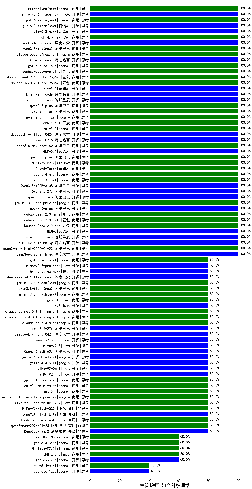

|类别|机构|大模型|【主管护师-妇产科护理学】准确率|平均耗时|平均消耗token|花费/千次（元）|排名（准确率）|
|---|---|-----|-------------------|-------|-----------|-----------|-----------|
|开源|月之暗面|kimi-k2.6|100.0%|82s|2028|53.0|1|
|开源|智谱AI|glm-5.3(new)|100.0%|-644s|2683|73.3|2|
|开源|阶跃星辰|step-3.7-flash|100.0%|14s|1539|11.8|3|
|商用|XAI|grok-4.6(new)|100.0%|1297s|2281|87.6|4|
|开源|深度求索|deepseek-v4-pro(new)|100.0%|44s|1357|33.7|5|
|商用|阿里巴巴|qwen3.8-max(new)|100.0%|27s|1216|40.7|6|
|商用|minimax|MiniMax-M2.7|100.0%|52s|2057|16.5|7|
|商用|anthropic|claude-opus-5(new)|100.0%|30s|961|148.0|8|
|开源|月之暗面|kimi-k3(new)|100.0%|39s|913|78.4|9|
|商用|阿里巴巴|qwen3.6-plus|100.0%|35s|1627|18.6|10|
|商用|openAI|gpt-5.6-sol-pro|100.0%|21s|3300|246.8|11|
|开源|智谱AI|GLM-5.1|100.0%|237s|2004|46.5|12|
|商用|阿里巴巴|qwen3.6-max-preview|100.0%|59s|1905|98.8|13|
|商用|豆包|doubao-seed-evolving|100.0%|121s|5664|166.8|14|
|商用|豆包|doubao-seed-2-1-turbo-260628|100.0%|119s|5357|78.8|15|
|开源|深度求索|deepseek-v4-flash-0424|100.0%|30s|1195|2.3|16|
|商用|豆包|doubao-seed-2-1-pro-260628|100.0%|226s|7687|227.5|17|
|商用|openAI|gpt-5.5|100.0%|10s|548|95.2|18|
|开源|智谱AI|glm-5.2|100.0%|97s|1930|52.2|19|
|商用|百度|ernie-5.1|100.0%|25s|984|16.5|20|
|商用|google|gemini-3.5-flash|100.0%|8s|1481|88.3|21|
|商用|阿里巴巴|qwen3.7-max|100.0%|27s|1142|39.0|22|
|开源|月之暗面|kimi-k2.7-code|100.0%|39s|1135|28.9|23|
|商用|openAI|gpt-5.4-high|100.0%|15s|845|78.7|24|
|商用|智谱AI|GLM-5-Turbo|100.0%|33s|1416|29.7|25|
|商用|openAI|gpt-5.3-chat|100.0%|8s|460|35.3|26|
|开源|智谱AI|glm-5.3-flash(new)|100.0%|47s|1631|4.4|27|
|商用|openAI|gpt-6-luna(new)|100.0%|266s|562|1.6|28|
|开源|深度求索|DeepSeek-V3.2-Think|100.0%|42s|1248|3.7|29|
|开源|小米|mimo-v2.6-flash(new)|100.0%|38s|870|1.6|30|
|商用|阿里巴巴|qwen3-max-think-2026-01-23|100.0%|151s|3659|35.9|31|
|开源|月之暗面|Kimi-K2.5-Thinking|100.0%|306s|1374|27.4|32|
|开源|阶跃星辰|step-3.5-flash|100.0%|28s|2444|5.0|33|
|开源|智谱AI|GLM-5|100.0%|63s|1991|34.6|34|
|商用|openAI|gpt-6-astra(new)|100.0%|15s|309|76.3|35|
|商用|阿里巴巴|qwen3.7-plus|100.0%|19s|943|7.0|36|
|商用|豆包|Doubao-Seed-2.0-pro|100.0%|171s|850|11.9|37|
|商用|豆包|Doubao-Seed-2.0-mini|100.0%|121s|2852|5.5|38|
|开源|阿里巴巴|Qwen3.5-122B-A10B|100.0%|199s|3544|22.2|39|
|开源|阿里巴巴|Qwen3.5-27B|100.0%|338s|2926|13.7|40|
|开源|阿里巴巴|qwen3.5-flash|100.0%|390s|3651|7.1|41|
|商用|google|gemini-3.1-pro-preview|100.0%|43s|1642|133.2|42|
|开源|阿里巴巴|qwen3.5-plus|100.0%|34s|2608|12.2|43|
|商用|豆包|Doubao-Seed-2.0-lite|100.0%|277s|926|2.9|44|
|开源|深度求索|deepseek-v4.1-flash(new)|80.0%|16s|1684|12.8|45|
|开源|腾讯|hy4-preview(new)|80.0%|69s|3378|59.6|46|
|商用|XAI|grok-4.5|80.0%|95s|1794|67.1|47|
|商用|anthropic|claude-sonnet-5-thinking|80.0%|15s|1018|63.2|48|
|开源|小米|mimo-v2.6-pro(new)|80.0%|103s|1092|6.3|49|
|商用|阿里巴巴|qwen3.8-flash(new)|80.0%|36s|1827|4.7|50|
|商用|google|gemini-3.7-flash(new)|80.0%|6s|757|17.9|51|
|商用|google|gemini-3.8-flash(new)|80.0%|13s|1042|50.7|52|
|商用|anthropic|claude-opus-4.8-thinking|80.0%|22s|854|129.3|53|
|开源|腾讯|hy3|80.0%|50s|242|0.7|54|
|商用|openAI|gpt-6-sol(new)|80.0%|267s|264|12.1|55|
|开源|小米|MiMo-V2-Pro|80.0%|230s|1054|17.4|56|
|商用|anthropic|claude-opus-4.6|80.0%|13s|783|116.5|57|
|开源|美团|LongCat-Flash-Lite|80.0%|123s|596|0.0|58|
|商用|小米|MiMo-V2-Flash-0204|80.0%|216s|606|1.1|59|
|商用|小米|MiMo-V2-Flash-think-0204|80.0%|1275s|2695|5.5|60|
|商用|google|gemini-3.1-flash-lite-preview|80.0%|5s|428|3.7|61|
|商用|openAI|gpt-5.4|80.0%|7s|374|29.3|62|
|商用|openAI|gpt-5.4-mini-high|80.0%|20s|934|26.4|63|
|商用|anthropic|claude-opus-4.8|80.0%|12s|616|87.7|64|
|商用|openAI|gpt-5.4-nano-high|80.0%|19s|590|4.3|65|
|商用|阿里巴巴|qwen3-max-2026-01-23|80.0%|16s|666|6.0|66|
|开源|小米|MiMo-V2-Omni|80.0%|259s|2104|25.7|67|
|开源|google|gemma-4-31b-it|80.0%|88s|553|1.4|68|
|开源|google|gemma-4-26b-a4b-it|80.0%|94s|650|1.6|69|
|开源|阿里巴巴|Qwen3.6-35B-A3B|80.0%|13s|1850|19.2|70|
|开源|深度求索|DeepSeek-V3.2|80.0%|32s|447|1.3|71|
|开源|小米|mimo-v2.5|80.0%|23s|1281|14.2|72|
|开源|小米|mimo-v2.5-pro|80.0%|25s|1439|25.5|73|
|开源|深度求索|deepseek-v4-pro-0424|80.0%|51s|1492|34.8|74|
|开源|阿里巴巴|qwen3.6-27b|80.0%|29s|1821|31.4|75|
|商用|百度|ERNIE-5.0|60.0%|220s|2581|60.6|76|
|商用|minimax|MiniMax-M3|60.0%|26s|662|8.0|77|
|商用|openAI|gpt-5.4-nano|60.0%|11s|292|1.7|78|
|商用|minimax|MiniMax-M2.5|60.0%|31s|1640|13.0|79|
|开源|openAI|gpt-oss-20b|60.0%|74s|958|1.0|80|
|商用|openAI|gpt-5.4-mini|40.0%|112s|338|7.6|81|
|开源|openAI|gpt-oss-120b|40.0%|4s|809|2.2|82|

