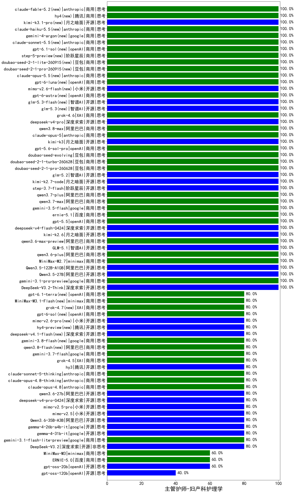

|类别|机构|大模型|【主管护师-妇产科护理学】准确率|平均耗时|平均消耗token|花费/千次（元）|排名（准确率）|
|---|---|-----|-------------------|-------|-----------|-----------|-----------|
|商用|google|gemini-4-argon(new)|100.0%|46s|465|51.8|1|
|商用|豆包|doubao-seed-2-1-pro-260915(new)|100.0%|39s|897|23.9|2|
|商用|阿里巴巴|qwen3.7-plus|100.0%|19s|943|7.0|3|
|开源|阶跃星辰|step-3.7-flash|100.0%|14s|1539|11.8|4|
|商用|openAI|gpt-6.1-sol(new)|100.0%|10s|291|14.0|5|
|开源|月之暗面|kimi-k2.7-code|100.0%|39s|1135|28.9|6|
|开源|智谱AI|glm-5.2|100.0%|97s|1930|52.2|7|
|商用|豆包|doubao-seed-2-1-pro-260628|100.0%|226s|7687|227.5|8|
|商用|豆包|doubao-seed-2-1-turbo-260628|100.0%|119s|5357|78.8|9|
|商用|豆包|doubao-seed-evolving|100.0%|121s|5664|166.8|10|
|商用|阶跃星辰|step-5-preview(new)|100.0%|42s|2273|44.3|11|
|商用|豆包|doubao-seed-2-1-lite-260915(new)|100.0%|11s|500|1.1|12|
|商用|openAI|gpt-5.6-sol-pro|100.0%|21s|3300|246.8|13|
|商用|阿里巴巴|qwen3.7-max|100.0%|27s|1142|39.0|14|
|开源|月之暗面|kimi-k3|100.0%|39s|913|78.4|15|
|商用|anthropic|claude-opus-5|100.0%|30s|961|148.0|16|
|商用|阿里巴巴|qwen3.8-max|100.0%|27s|1216|40.7|17|
|开源|深度求索|deepseek-v4-pro|100.0%|44s|1357|33.7|18|
|商用|XAI|grok-4.6|100.0%|1297s|2281|87.6|19|
|商用|anthropic|claude-opus-5.5(new)|100.0%|105s|728|85.6|20|
|开源|智谱AI|glm-5.3|100.0%|-644s|2683|73.3|21|
|开源|智谱AI|glm-5.3-flash|100.0%|47s|1631|4.4|22|
|商用|openAI|gpt-6-astra|100.0%|15s|309|76.3|23|
|商用|openAI|gpt-6-luna|100.0%|266s|562|1.6|24|
|商用|anthropic|claude-sonnet-5.5(new)|100.0%|367s|542|29.8|25|
|开源|小米|mimo-v2.6-flash|100.0%|38s|870|1.6|26|
|商用|anthropic|claude-fable-5.2(new)|100.0%|31s|491|104.8|27|
|开源|智谱AI|GLM-5.1|100.0%|237s|2004|46.5|28|
|商用|google|gemini-3.1-pro-preview|100.0%|43s|1642|133.2|29|
|开源|阿里巴巴|Qwen3.5-27B|100.0%|338s|2926|13.7|30|
|开源|阿里巴巴|Qwen3.5-122B-A10B|100.0%|199s|3544|22.2|31|
|商用|腾讯|hy4-flash(new)|100.0%|19s|1408|2.7|32|
|商用|minimax|MiniMax-M2.7|100.0%|52s|2057|16.5|33|
|商用|阿里巴巴|qwen3.6-plus|100.0%|35s|1627|18.6|34|
|商用|google|gemini-4-carbon(new)|100.0%|25s|1080|137.9|35|
|商用|google|gemini-3.5-flash|100.0%|8s|1481|88.3|36|
|商用|腾讯|hy4(new)|100.0%|72s|3578|63.2|37|
|商用|阿里巴巴|qwen3.6-max-preview|100.0%|59s|1905|98.8|38|
|开源|月之暗面|kimi-k2.6|100.0%|82s|2028|53.0|39|
|开源|深度求索|DeepSeek-V3.2-Think|100.0%|42s|1248|3.7|40|
|开源|月之暗面|kimi-k3.1-pro(new)|100.0%|34s|1200|72.7|41|
|开源|深度求索|deepseek-v4-flash-0424|100.0%|30s|1195|2.3|42|
|商用|openAI|gpt-5.5|100.0%|10s|548|95.2|43|
|商用|anthropic|claude-haiku-5.5(new)|100.0%|11s|895|2.7|44|
|商用|百度|ernie-5.1|100.0%|25s|984|16.5|45|
|商用|阿里巴巴|qwen4-max(new)|80.0%|78s|632|16.9|46|
|商用|openAI|gpt-6.2-astra(new)|80.0%|31s|227|38.0|47|
|商用|openAI|gpt-6-sol|80.0%|267s|264|12.1|48|
|开源|小米|mimo-v2.6-pro|80.0%|103s|1092|6.3|49|
|商用|XAI|grok-4.7|80.0%|94s|3902|126.7|50|
|商用|openAI|gpt-6.1-terra(new)|80.0%|5s|337|8.6|51|
|商用|minimax|MiniMax-M3.1-Flash(new)|80.0%|19s|1048|3.4|52|
|商用|XAI|grok-4.5|80.0%|95s|1794|67.1|53|
|商用|openAI|gpt-6.2-sol(new)|80.0%|19s|244|10.7|54|
|开源|腾讯|hy4-preview|80.0%|69s|3378|59.6|55|
|开源|深度求索|deepseek-v4.1-flash|80.0%|16s|1684|12.8|56|
|开源|深度求索|DeepSeek-V3.2|80.0%|32s|447|1.3|57|
|商用|google|gemini-3.1-flash-lite-preview|80.0%|5s|428|3.7|58|
|开源|google|gemma-4-31b-it|80.0%|88s|553|1.4|59|
|开源|google|gemma-4-26b-a4b-it|80.0%|94s|650|1.6|60|
|开源|阿里巴巴|Qwen3.6-35B-A3B|80.0%|13s|1850|19.2|61|
|开源|小米|mimo-v2.5|80.0%|23s|1281|14.2|62|
|开源|小米|mimo-v2.5-pro|80.0%|25s|1439|25.5|63|
|开源|深度求索|deepseek-v4-pro-0424|80.0%|51s|1492|34.8|64|
|开源|阿里巴巴|qwen3.6-27b|80.0%|29s|1821|31.4|65|
|商用|anthropic|claude-opus-4.8|80.0%|12s|616|87.7|66|
|商用|anthropic|claude-opus-4.8-thinking|80.0%|22s|854|129.3|67|
|商用|anthropic|claude-sonnet-5-thinking|80.0%|15s|1018|63.2|68|
|开源|腾讯|hy3|80.0%|50s|242|0.7|69|
|商用|google|gemini-3.7-flash|80.0%|6s|757|17.9|70|
|商用|阿里巴巴|qwen3.8-flash|80.0%|36s|1827|4.7|71|
|商用|google|gemini-3.8-flash|80.0%|13s|1042|50.7|72|
|商用|minimax|MiniMax-M3|60.0%|26s|662|8.0|73|
|开源|openAI|gpt-oss-20b|60.0%|74s|958|1.0|74|
|商用|百度|ERNIE-5.0|60.0%|220s|2581|60.6|75|
|开源|openAI|gpt-oss-120b|40.0%|4s|809|2.2|76|

