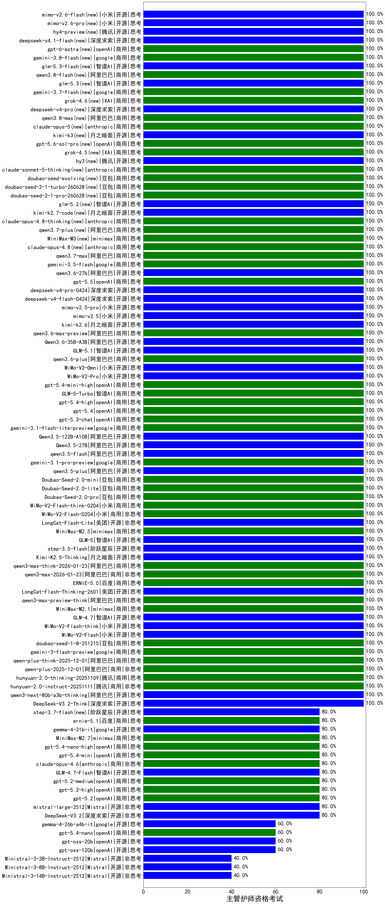

|类别|机构|大模型|【主管护师资格考试】准确率|平均耗时|平均消耗token|花费/千次（元）|排名（准确率）|
|---|---|-----|-------------------|-------|-----------|-----------|-----------|
|开源|月之暗面|kimi-k2.6|100.0%|63s|984|25.1|1|
|商用|minimax|MiniMax-M3|100.0%|24s|668|8.2|2|
|商用|豆包|doubao-seed-evolving|100.0%|149s|5037|148.5|3|
|商用|豆包|doubao-seed-2-1-turbo-260628|100.0%|148s|5566|82.2|4|
|商用|豆包|doubao-seed-2-1-pro-260628|100.0%|326s|5693|168.1|5|
|开源|智谱AI|glm-5.2|100.0%|28s|1229|32.8|6|
|开源|月之暗面|kimi-k2.7-code|100.0%|48s|462|11.0|7|
|商用|anthropic|claude-opus-4.8-thinking|100.0%|28s|721|110.7|8|
|商用|阿里巴巴|qwen3.7-plus|100.0%|20s|926|6.9|9|
|商用|anthropic|claude-opus-4.8|100.0%|12s|633|95.2|10|
|开源|腾讯|hy3|100.0%|50s|215|0.6|11|
|商用|阿里巴巴|qwen3.7-max|100.0%|24s|972|33.2|12|
|商用|google|gemini-3.5-flash|100.0%|8s|1276|76.4|13|
|开源|阿里巴巴|qwen3.6-27b|100.0%|28s|1670|28.9|14|
|商用|openAI|gpt-5.5|100.0%|7s|333|53.9|15|
|开源|深度求索|deepseek-v4-pro-0424|100.0%|22s|614|13.9|16|
|开源|深度求索|deepseek-v4-flash-0424|100.0%|14s|482|0.9|17|
|开源|小米|mimo-v2.5-pro|100.0%|16s|1120|19.0|18|
|商用|anthropic|claude-sonnet-5-thinking|100.0%|16s|748|46.1|19|
|商用|XAI|grok-4.5|100.0%|34s|1084|37.9|20|
|商用|阿里巴巴|qwen3.6-max-preview|100.0%|45s|1441|74.4|21|
|开源|智谱AI|glm-5.3-flash(new)|100.0%|36s|1360|3.7|22|
|商用|openAI|gpt-6-luna(new)|100.0%|622s|269|0.7|23|
|开源|小米|mimo-v2.6-flash(new)|100.0%|49s|1097|2.1|24|
|开源|小米|mimo-v2.6-pro(new)|100.0%|26s|911|5.2|25|
|开源|腾讯|hy4-preview(new)|100.0%|32s|2068|36.2|26|
|开源|深度求索|deepseek-v4.1-flash(new)|100.0%|6s|527|3.7|27|
|商用|openAI|gpt-6-astra(new)|100.0%|13s|256|64.2|28|
|商用|google|gemini-3.8-flash(new)|100.0%|11s|612|28.9|29|
|商用|阿里巴巴|qwen3.8-flash(new)|100.0%|137s|551|1.2|30|
|商用|openAI|gpt-5.6-sol-pro|100.0%|14s|3005|222.1|31|
|开源|智谱AI|glm-5.3(new)|100.0%|30s|1320|35.4|32|
|商用|google|gemini-3.7-flash(new)|100.0%|6s|738|17.8|33|
|商用|XAI|grok-4.6(new)|100.0%|16s|969|33.0|34|
|开源|深度求索|deepseek-v4-pro(new)|100.0%|626s|687|15.9|35|
|商用|阿里巴巴|qwen3.8-max(new)|100.0%|21s|595|18.7|36|
|商用|anthropic|claude-opus-5(new)|100.0%|15s|702|107.3|37|
|开源|月之暗面|kimi-k3(new)|100.0%|23s|560|44.1|38|
|开源|小米|mimo-v2.5|100.0%|8s|1083|11.6|39|
|商用|openAI|gpt-6-sol(new)|100.0%|145s|202|9.1|40|
|开源|阿里巴巴|Qwen3.6-35B-A3B|100.0%|8s|1508|15.6|41|
|开源|美团|LongCat-Flash-Lite|100.0%|364s|544|0.0|42|
|商用|google|gemini-3.1-pro-preview|100.0%|41s|1343|109.0|43|
|开源|阿里巴巴|qwen3.5-plus|100.0%|24s|1626|7.5|44|
|商用|豆包|Doubao-Seed-2.0-mini|100.0%|259s|1150|2.1|45|
|商用|豆包|Doubao-Seed-2.0-lite|100.0%|178s|791|2.5|46|
|商用|豆包|Doubao-Seed-2.0-pro|100.0%|230s|1071|15.7|47|
|商用|小米|MiMo-V2-Flash-think-0204|100.0%|268s|1577|3.2|48|
|商用|小米|MiMo-V2-Flash-0204|100.0%|309s|510|0.9|49|
|商用|minimax|MiniMax-M2.5|100.0%|30s|1148|9.0|50|
|开源|阿里巴巴|Qwen3.5-122B-A10B|100.0%|115s|1851|11.4|51|
|开源|智谱AI|GLM-5|100.0%|72s|1512|26.2|52|
|开源|阶跃星辰|step-3.5-flash|100.0%|13s|1109|2.2|53|
|开源|月之暗面|Kimi-K2.5-Thinking|100.0%|235s|1202|24.0|54|
|商用|阿里巴巴|qwen3-max-think-2026-01-23|100.0%|82s|2400|23.4|55|
|商用|阿里巴巴|qwen3-max-2026-01-23|100.0%|102s|489|4.3|56|
|商用|百度|ERNIE-5.0|100.0%|153s|1626|37.9|57|
|开源|深度求索|DeepSeek-V3.2-Think|100.0%|184s|611|1.8|58|
|开源|阿里巴巴|qwen3.5-flash|100.0%|281s|2051|4.0|59|
|开源|阿里巴巴|Qwen3.5-27B|100.0%|300s|2360|11.0|60|
|商用|google|gemini-3.1-flash-lite-preview|100.0%|3s|364|3.2|61|
|商用|openAI|gpt-5.3-chat|100.0%|51s|360|27.5|62|
|商用|openAI|gpt-5.4|100.0%|9s|347|28.4|63|
|商用|openAI|gpt-5.4-high|100.0%|25s|440|38.2|64|
|商用|智谱AI|GLM-5-Turbo|100.0%|27s|1362|28.7|65|
|开源|智谱AI|GLM-5.1|100.0%|112s|1144|26.2|66|
|商用|openAI|gpt-5.4-mini-high|100.0%|21s|674|18.8|67|
|商用|阿里巴巴|qwen3.6-plus|100.0%|27s|1668|19.2|68|
|开源|小米|MiMo-V2-Omni|100.0%|510s|1157|12.6|69|
|开源|小米|MiMo-V2-Pro|100.0%|231s|1245|21.7|70|
|商用|anthropic|claude-opus-4.6|80.0%|11s|673|102.0|71|
|开源|深度求索|DeepSeek-V3.2|80.0%|19s|332|0.9|72|
|开源|google|gemma-4-31b-it|80.0%|86s|541|1.4|73|
|商用|minimax|MiniMax-M2.7|80.0%|36s|1467|11.7|74|
|商用|百度|ernie-5.1|80.0%|24s|932|15.8|75|
|商用|openAI|gpt-5.4-nano-high|80.0%|62s|482|3.6|76|
|商用|openAI|gpt-5.4-mini|80.0%|22s|263|5.9|77|
|开源|阶跃星辰|step-3.7-flash|80.0%|13s|1307|10.1|78|
|开源|openAI|gpt-oss-20b|60.0%|10s|1394|1.5|79|
|商用|openAI|gpt-5.4-nano|60.0%|8s|235|1.4|80|
|开源|google|gemma-4-26b-a4b-it|60.0%|63s|738|1.9|81|
|开源|openAI|gpt-oss-120b|60.0%|198s|649|1.7|82|

