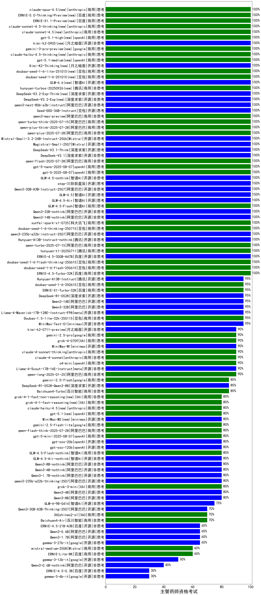

|类别|机构|大模型|【主管药师资格考试】准确率|平均耗时|平均消耗token|花费/千次（元）|排名（准确率）|
|---|---|-----|-------------------|-------|-----------|-----------|-----------|
|商用|阿里巴巴|qwen-plus-think-2025-12-01(new)|100.0%|45s|2238|17.4|1|
|商用|科大讯飞|xunfei-spark-x1-0725|100.0%|/|1357|16.3|2|
|开源|阿里巴巴|Qwen3-32B-nothink|100.0%|139s|468|1.7|3|
|开源|阿里巴巴|Qwen3-14B-nothink|100.0%|15s|576|1.0|4|
|开源|深度求索|DeepSeek-V3.2-Exp-Think(new)|100.0%|151s|1015|3.0|5|
|商用|腾讯|hunyuan-turbos-20250926(new)|100.0%|12s|514|0.9|6|
|开源|智谱AI|GLM-4.6(new)|100.0%|36s|2039|27.9|7|
|商用|豆包|doubao-seed-1-6-251015(new)|100.0%|16s|695|4.9|8|
|商用|豆包|doubao-seed-1-6-lite-251015(new)|100.0%|15s|599|1.3|9|
|开源|智谱AI|GLM-4.5-Air|100.0%|24s|1271|7.3|10|
|商用|豆包|doubao-seed-1-6-thinking-250715|100.0%|17s|813|6.1|11|
|开源|阿里巴巴|qwen3-235b-a22b-instruct-2507|100.0%|10s|418|2.9|12|
|开源|腾讯|Hunyuan-A13B-Instruct-nothink|100.0%|16s|337|1.2|13|
|商用|阿里巴巴|qwen-turbo-2025-07-15|100.0%|5s|301|0.2|14|
|商用|腾讯|hunyuan-t1-20250711|100.0%|17s|986|3.7|15|
|开源|月之暗面|Kimi-K2-Thinking(new)|100.0%|67s|1011|15.5|16|
|商用|智谱AI|GLM-4.5-Flash|100.0%|24s|1133|0.0|17|
|开源|智谱AI|GLM-4.5|100.0%|113s|2245|30.8|18|
|商用|anthropic|claude-haiku-4.5-thinking(new)|100.0%|37s|2761|96.3|19|
|商用|openAI|gpt-5-2025-08-07|100.0%|27s|193|9.7|20|
|开源|深度求索|DeepSeek-V3.1-Think|100.0%|59s|1134|13.2|21|
|开源|深度求索|DeepSeek-V3.1|100.0%|17s|330|3.5|22|
|商用|阿里巴巴|qwen-plus-2025-07-28|100.0%|10s|433|0.8|23|
|商用|阿里巴巴|qwen-flash-2025-07-28|100.0%|11s|579|0.8|24|
|商用|openAI|gpt-5-nano-2025-08-07|100.0%|122s|1777|5.0|25|
|商用|阿里巴巴|qwen-plus-think-2025-07-28|100.0%|/|2759|21.6|26|
|商用|阿里巴巴|qwen-turbo-think-2025-07-15|100.0%|/|1957|5.7|27|
|开源|阿里巴巴|Qwen3-30B-A3B-Instruct-2507|100.0%|9s|893|2.5|28|
|商用|阿里巴巴|qwen3-max-preview|100.0%|9s|365|7.6|29|
|开源|豆包|Seed-OSS-36B-Instruct|100.0%|93s|1725|6.7|30|
|开源|阿里巴巴|qwen3-next-80b-a3b-instruct|100.0%|6s|497|1.8|31|
|开源|智谱AI|GLM-4.5-nothink|100.0%|22s|714|9.3|32|
|开源|阶跃星辰|step-3|100.0%|99s|1930|7.6|33|
|开源|深度求索|DeepSeek-V3.2-Exp(new)|100.0%|112s|280|0.8|34|
|商用|openAI|gpt-5.1-medium(new)|100.0%|174s|340|19.5|35|
|商用|google|gemini-3-pro-preview(new)|100.0%|55s|1592|131.1|36|
|开源|Mistral|Magistral-Small-2507|100.0%|715s|2555|27.2|37|
|商用|阿里巴巴|qwen3-max-2025-09-23(new)|100.0%|166s|378|7.9|38|
|商用|阿里巴巴|qwen-plus-2025-12-01(new)|100.0%|20s|693|1.3|39|
|商用|阿里巴巴|qwen-plus-think-2025-12-01(new)|100.0%|45s|2238|17.4|40|
|商用|阿里巴巴|qwen-plus-2025-12-01(new)|100.0%|20s|693|1.3|41|
|商用|openAI|gpt-5.2(new)|100.0%|3s|155|9.0|42|
|商用|腾讯|hunyuan-2.0-thinking-20251109(new)|100.0%|9s|685|2.6|43|
|商用|腾讯|hunyuan-2.0-instruct-20251111(new)|100.0%|10s|382|0.6|44|
|开源|Mistral|mistral-large-2512(new)|100.0%|11s|475|4.5|45|
|开源|阿里巴巴|qwen3-next-80b-a3b-thinking(new)|100.0%|71s|3070|12.1|46|
|开源|深度求索|DeepSeek-V3.2-Think(new)|100.0%|189s|1269|3.8|47|
|开源|深度求索|DeepSeek-V3.2(new)|100.0%|13s|373|1.1|48|
|商用|openAI|gpt-5-nano-high(new)|100.0%|561s|3851|11.0|49|
|开源|月之暗面|kimi-k2-0905(new)|100.0%|95s|250|3.0|50|
|商用|openAI|gpt-5-mini-high(new)|100.0%|932s|1615|22.5|51|
|商用|豆包|doubao-seed-1-6-flash-thinking-250615|100.0%|6s|564|0.7|52|
|商用|豆包|doubao-seed-1-6-flash-250615|100.0%|3s|298|0.4|53|
|开源|百度|ERNIE-4.5-300B-A47B|100.0%|25s|319|2.1|54|
|商用|openAI|gpt-5.1-high(new)|100.0%|168s|744|48.2|55|
|商用|anthropic|claude-sonnet-4.5(new)|100.0%|9s|564|53.9|56|
|商用|anthropic|claude-sonnet-4.5-thinking(new)|100.0%|27s|1798|185.5|57|
|商用|百度|ERNIE-4.5-Turbo-32K|100.0%|22s|542|1.6|58|
|开源|Mistral|Mistral-Small-3.2-24B-Instruct-2506|100.0%|67s|434|0.8|59|
|商用|百度|ERNIE-X1.1-Preview(new)|100.0%|106s|489|1.8|60|
|商用|百度|ERNIE-5.0-Thinking-Preview(new)|100.0%|208s|1515|35.4|61|
|商用|anthropic|claude-opus-4.5(new)|100.0%|19s|616|97.4|62|
|开源|阿里巴巴|Qwen3-32B|95.0%|24s|771|2.9|63|
|开源|meta|Llama-4-Maverick-17B-128E-Instruct-FP8|95.0%|7s|505|2.0|64|
|开源|阿里巴巴|Qwen3-14B|95.0%|31s|1967|3.8|65|
|商用|豆包|doubao-seed-1-6-250615|95.0%|141s|427|2.7|66|
|商用|豆包|Doubao-1.5-lite-32k-250115|95.0%|4s|192|0.1|67|
|商用|百度|ERNIE-X1-Turbo-32K|95.0%|89s|1550|6.0|68|
|开源|minimax|MiniMax-Text-01|95.0%|9s|879|7.0|69|
|开源|腾讯|Hunyuan-A13B-Instruct|95.0%|108s|2278|8.9|70|
|开源|深度求索|DeepSeek-R1-0528|95.0%|229s|1668|26.0|71|
|商用|阿里巴巴|qwen-long-2025-01-25|90.0%|59s|274|0.5|72|
|商用|anthropic|claude-4-sonnet|90.0%|42s|469|41.1|73|
|商用|google|gemini-2.5-pro|90.0%|20s|1829|128.3|74|
|开源|月之暗面|kimi-k2-0711-preview|90.0%|25s|457|6.5|75|
|商用|XAI|grok-4-0709|90.0%|214s|1036|106.0|76|
|开源|meta|Llama-4-Scout-17B-16E-Instruct|90.0%|8s|477|0.9|77|
|开源|minimax|MiniMax-M1|90.0%|187s|2918|20.2|78|
|商用|anthropic|claude-4-sonnet-thinking|90.0%|51s|1282|129.6|79|
|商用|openAI|o4-mini|90.0%|25s|606|17.3|80|
|商用|google|gemini-2.5-flash|85.0%|8s|1364|23.6|81|
|开源|深度求索|DeepSeek-R1-0528-Qwen3-8B|85.0%|284s|1502|0.0|82|
|商用|百川智能|Baichuan4-Turbo|85.0%|/|/|/|83|
|商用|XAI|grok-3-mini|80.0%|230s|981|3.4|84|
|开源|阿里巴巴|Qwen3-4B|80.0%|27s|1298|3.7|85|
|开源|阿里巴巴|Qwen3-8B|80.0%|21s|957|0.0|86|
|商用|google|gemini-2.5-flash-lite|80.0%|5s|787|2.1|87|
|开源|Mistral|Ministral-3-14B-Instruct-2512(new)|80.0%|13s|405|0.6|88|
|开源|Mistral|Ministral-3-8B-Instruct-2512(new)|80.0%|16s|441|0.5|89|
|商用|XAI|grok-4-1-fast-non-reasoning(new)|80.0%|91s|620|1.7|90|
|商用|XAI|grok-4-1-fast-reasoning(new)|80.0%|19s|1823|6.0|91|
|开源|智谱AI|GLM-4.5-Air-nothink|80.0%|21s|889|5.0|92|
|商用|anthropic|claude-haiku-4.5(new)|80.0%|13s|596|18.7|93|
|商用|智谱AI|GLM-4.5-Flash-nothink|80.0%|17s|824|0.0|94|
|开源|minimax|MiniMax-M2(new)|80.0%|55s|2058|16.7|95|
|开源|阿里巴巴|qwen3-235b-a22b-thinking-2507|80.0%|154s|2601|50.8|96|
|商用|阿里巴巴|qwen-flash-think-2025-07-28|80.0%|28s|2558|3.7|97|
|商用|openAI|gpt-5-mini-2025-08-07|80.0%|29s|777|10.3|98|
|开源|阿里巴巴|Qwen3-1.7B-nothink|80.0%|12s|418|1.1|99|
|开源|阿里巴巴|Qwen3-4B-nothink|80.0%|9s|369|0.9|100|
|开源|阿里巴巴|Qwen3-8B-nothink|80.0%|26s|578|0.0|101|
|开源|openAI|gpt-oss-20b|80.0%|10s|1201|1.3|102|
|开源|openAI|gpt-oss-120b|80.0%|6s|475|1.2|103|
|商用|openAI|gpt-5.1(new)|80.0%|153s|151|6.2|104|
|开源|智谱AI|GLM-4-9B-0414|75.0%|12s|440|0.0|105|
|商用|360|360zhinao2-o1|70.0%|/|/|/|106|
|商用|百川智能|Baichuan4-Air|70.0%|/|/|/|107|
|开源|阿里巴巴|Qwen3-30B-A3B-Thinking-2507|70.0%|60s|2410|6.6|108|
|开源|阿里巴巴|Qwen3-1.7B|65.0%|37s|3514|10.4|109|
|开源|阿里巴巴|Qwen3-0.6B|65.0%|12s|1271|3.6|110|
|开源|google|gemma-3-27b-it|65.0%|/|/|/|111|
|开源|百度|ERNIE-4.5-21B-A3B|65.0%|7s|329|0.0|112|
|开源|Mistral|Ministral-3-3B-Instruct-2512(new)|60.0%|3s|592|0.4|113|
|商用|百度|ERNIE-Lite-8K|60.0%|/|/|/|114|
|商用|Mistral|mistral-medium-2508|60.0%|20s|415|5.1|115|
|开源|google|gemma-3-12b-it|50.0%|/|/|/|116|
|开源|阿里巴巴|Qwen3-0.6B-nothink|40.0%|9s|187|0.4|117|
|开源|google|gemma-3-4b-it|30.0%|/|/|/|118|
|开源|百度|ERNIE-4.5-0.3B|30.0%|7s|375|0.0|119|

