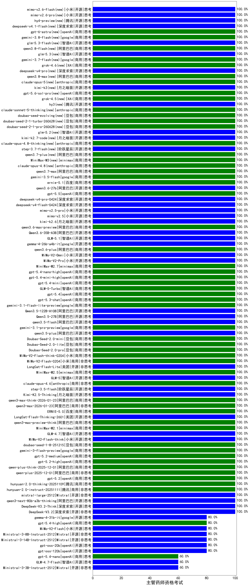

|类别|机构|大模型|【主管药师资格考试】准确率|平均耗时|平均消耗token|花费/千次（元）|排名（准确率）|
|---|---|-----|-------------------|-------|-----------|-----------|-----------|
|开源|月之暗面|kimi-k2.6|100.0%|69s|1222|31.8|1|
|开源|腾讯|hy3|100.0%|126s|163|0.5|2|
|商用|豆包|doubao-seed-evolving|100.0%|114s|3571|104.7|3|
|商用|豆包|doubao-seed-2-1-turbo-260628|100.0%|80s|3510|51.5|4|
|商用|豆包|doubao-seed-2-1-pro-260628|100.0%|149s|4704|138.7|5|
|开源|智谱AI|glm-5.2|100.0%|41s|1789|48.7|6|
|开源|月之暗面|kimi-k2.7-code|100.0%|18s|694|17.5|7|
|商用|anthropic|claude-opus-4.8-thinking|100.0%|13s|766|122.3|8|
|开源|阶跃星辰|step-3.7-flash|100.0%|17s|1361|10.6|9|
|商用|阿里巴巴|qwen3.7-plus|100.0%|19s|944|7.2|10|
|商用|minimax|MiniMax-M3|100.0%|25s|582|6.9|11|
|商用|anthropic|claude-opus-4.8|100.0%|8s|428|63.1|12|
|商用|阿里巴巴|qwen3.7-max|100.0%|25s|739|25.1|13|
|商用|google|gemini-3.5-flash|100.0%|13s|1369|82.9|14|
|商用|百度|ernie-5.1|100.0%|43s|740|12.5|15|
|开源|阿里巴巴|qwen3.6-27b|100.0%|27s|1565|27.2|16|
|商用|openAI|gpt-5.5|100.0%|7s|403|71.6|17|
|开源|深度求索|deepseek-v4-pro-0424|100.0%|29s|726|16.7|18|
|开源|深度求索|deepseek-v4-flash-0424|100.0%|27s|1204|2.4|19|
|商用|anthropic|claude-sonnet-5-thinking|100.0%|20s|838|53.9|20|
|商用|XAI|grok-4.5|100.0%|74s|1373|50.4|21|
|开源|小米|mimo-v2.5|100.0%|29s|1391|16.1|22|
|商用|openAI|gpt-5.6-sol-pro|100.0%|12s|3020|225.4|23|
|商用|openAI|gpt-6-sol(new)|100.0%|62s|204|10.2|24|
|商用|openAI|gpt-6-luna(new)|100.0%|276s|461|1.4|25|
|开源|小米|mimo-v2.6-flash(new)|100.0%|109s|674|1.3|26|
|开源|小米|mimo-v2.6-pro(new)|100.0%|27s|851|4.9|27|
|开源|腾讯|hy4-preview(new)|100.0%|71s|2967|52.5|28|
|开源|深度求索|deepseek-v4.1-flash(new)|100.0%|6s|1205|9.1|29|
|商用|openAI|gpt-6-astra(new)|100.0%|8s|235|61.6|30|
|商用|google|gemini-3.8-flash(new)|100.0%|11s|718|35.0|31|
|开源|智谱AI|glm-5.3-flash(new)|100.0%|26s|1030|2.7|32|
|商用|阿里巴巴|qwen3.8-flash(new)|100.0%|22s|1211|3.1|33|
|开源|智谱AI|glm-5.3(new)|100.0%|48s|1058|28.3|34|
|商用|google|gemini-3.7-flash(new)|100.0%|5s|785|19.3|35|
|商用|XAI|grok-4.6(new)|100.0%|21s|1180|42.2|36|
|开源|深度求索|deepseek-v4-pro(new)|100.0%|23s|775|18.5|37|
|商用|阿里巴巴|qwen3.8-max(new)|100.0%|23s|844|27.9|38|
|商用|anthropic|claude-opus-5(new)|100.0%|12s|632|98.8|39|
|开源|月之暗面|kimi-k3(new)|100.0%|35s|783|67.3|40|
|开源|小米|mimo-v2.5-pro|100.0%|26s|1167|20.2|41|
|商用|XAI|grok-4.7(new)|100.0%|59s|3702|119.2|42|
|开源|阿里巴巴|Qwen3.5-27B|100.0%|296s|1932|9.0|43|
|商用|阿里巴巴|qwen3-max-2026-01-23|100.0%|141s|401|3.5|44|
|商用|阿里巴巴|qwen3.6-max-preview|100.0%|47s|1354|70.2|45|
|开源|阿里巴巴|qwen3.5-flash|100.0%|95s|2309|4.5|46|
|商用|google|gemini-3.1-pro-preview|100.0%|69s|1210|98.5|47|
|开源|阿里巴巴|qwen3.5-plus|100.0%|27s|2281|10.7|48|
|商用|豆包|Doubao-Seed-2.0-mini|100.0%|268s|1205|2.2|49|
|商用|豆包|Doubao-Seed-2.0-lite|100.0%|142s|679|2.1|50|
|商用|豆包|Doubao-Seed-2.0-pro|100.0%|150s|713|10.1|51|
|商用|小米|MiMo-V2-Flash-think-0204|100.0%|200s|2352|4.8|52|
|商用|小米|MiMo-V2-Flash-0204|100.0%|237s|552|1.0|53|
|开源|美团|LongCat-Flash-Lite|100.0%|496s|543|0.0|54|
|商用|minimax|MiniMax-M2.5|100.0%|32s|1399|11.2|55|
|开源|智谱AI|GLM-5|100.0%|56s|2124|37.4|56|
|商用|anthropic|claude-opus-4.6|100.0%|11s|557|85.5|57|
|开源|阶跃星辰|step-3.5-flash|100.0%|20s|1815|3.7|58|
|开源|月之暗面|Kimi-K2.5-Thinking|100.0%|243s|1127|22.7|59|
|开源|阿里巴巴|Qwen3.5-122B-A10B|100.0%|324s|2384|14.9|60|
|商用|google|gemini-3.1-flash-lite-preview|100.0%|4s|301|2.6|61|
|商用|openAI|gpt-5.3-chat|100.0%|49s|327|25.7|62|
|开源|小米|MiMo-V2-Pro|100.0%|224s|1213|21.2|63|
|开源|阿里巴巴|Qwen3.6-35B-A3B|100.0%|107s|1422|14.8|64|
|开源|智谱AI|GLM-5.1|100.0%|204s|1880|44.0|65|
|开源|google|gemma-4-26b-a4b-it|100.0%|72s|555|1.4|66|
|开源|深度求索|DeepSeek-V3.2|100.0%|13s|373|1.1|67|
|商用|阿里巴巴|qwen3.6-plus|100.0%|27s|1515|17.5|68|
|开源|小米|MiMo-V2-Omni|100.0%|501s|1114|12.1|69|
|商用|minimax|MiniMax-M2.7|100.0%|30s|1114|8.8|70|
|商用|openAI|gpt-5.4|100.0%|17s|244|19.2|71|
|商用|openAI|gpt-5.4-nano-high|100.0%|74s|389|2.9|72|
|开源|深度求索|DeepSeek-V3.2-Think|100.0%|189s|1269|3.8|73|
|商用|openAI|gpt-5.4-mini-high|100.0%|17s|595|16.8|74|
|商用|openAI|gpt-5.4-mini|100.0%|16s|222|5.1|75|
|商用|智谱AI|GLM-5-Turbo|100.0%|91s|2107|45.3|76|
|商用|百度|ERNIE-5.0|100.0%|160s|1596|37.4|77|
|商用|阿里巴巴|qwen3-max-think-2026-01-23|100.0%|99s|2095|20.4|78|
|开源|openAI|gpt-oss-20b|80.0%|10s|1201|1.3|79|
|商用|openAI|gpt-5.4-high|80.0%|9s|522|48.4|80|
|开源|google|gemma-4-31b-it|80.0%|46s|445|1.1|81|
|开源|openAI|gpt-oss-120b|80.0%|6s|475|1.2|82|
|商用|openAI|gpt-5.4-nano|60.0%|10s|200|1.2|83|

